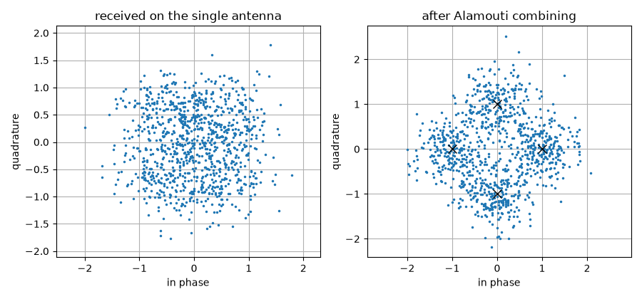
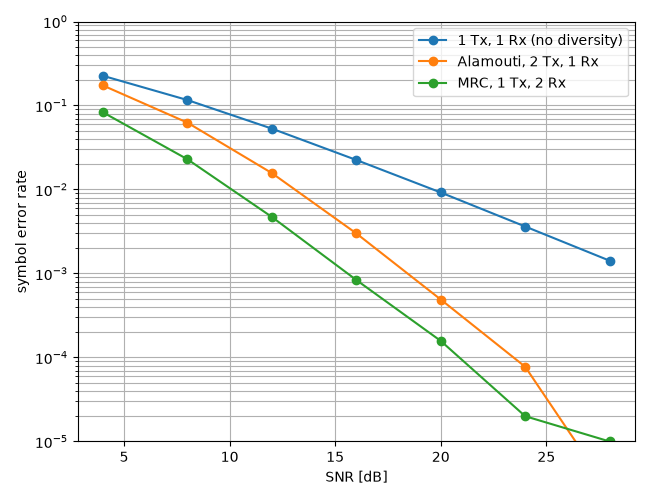

Alamouti Space-Time Coding Tutorial
===================================

This tutorial explains what a space-time code buys you, on the simplest and most widely deployed one: the Alamouti scheme.

**What you'll learn:**

- Why a fading channel is limited by its *deep fades*, not by its average.
- How to build a two-antenna Alamouti transmitter and its receiver with ``comnumpy``.
- Why the receiver needs only a matched filter, and why that is optimal.
- How to measure the diversity gain, and the 3 dB it costs against receive diversity.

This tutorial is suited for engineers and students learning about MIMO systems, combining practical examples with theoretical background.

Introduction
^^^^^^^^^^^^

Why diversity
"""""""""""""

Over a flat Rayleigh channel :math:`y[n] = h\,x[n] + b[n]`, the instantaneous signal-to-noise ratio is proportional to :math:`|h|^2`, which is exponentially distributed. The receiver is therefore not limited by the *average* channel: it is limited by the probability that the channel is nearly zero. That probability behaves as

.. math ::

   \mathbb{P}\left[|h|^2 < \epsilon\right] \simeq \epsilon

so the error rate decays only as :math:`1/\mathrm{SNR}` -- one decade per decade. Ten more decibels buy one decade of error rate, which is a poor exchange.

If instead the receiver observes the symbol through :math:`d` **independent** fading coefficients, all of them must be small at once for the link to fail, and

.. math ::

   \mathbb{P}\left[\text{all } d \text{ paths weak}\right] \simeq \epsilon^{d}
   \quad \Longrightarrow \quad
   P_e \propto \mathrm{SNR}^{-d}

The exponent :math:`d` is the **diversity order**, and it is the slope of the error curve on a log-log plot. Getting :math:`d = 2` with two receive antennas is easy -- that is maximum ratio combining (MRC). Getting it with two *transmit* antennas and a single receive antenna is the problem Alamouti solved, and it is the useful one: antennas are expensive on a handset and cheap on a base station.

The difficulty is that a transmitter has no channel knowledge. Sending the same symbol from both antennas gives :math:`y = (h_1 + h_2)x + b`, and :math:`h_1 + h_2` is one Gaussian coefficient: no diversity at all.

The Alamouti scheme
"""""""""""""""""""

The idea is to spread two symbols over two antennas **and** two time slots, in a pattern that makes the two observations orthogonal. Over one codeword the two antennas transmit

.. math ::

   \mathbf{G}\left(s_1, s_2\right) =
   \begin{bmatrix} s_1 & -s_2^{*} \\ s_2 & s_1^{*} \end{bmatrix}

the first column being the first time slot and the second column the second. With one receive antenna and a channel :math:`\mathbf{h} = \left[h_1, h_2\right]` constant over the two slots, the receiver observes

.. math ::

   y_1 &= h_1 s_1 + h_2 s_2 + b_1\\
   y_2 &= -h_1 s_2^{*} + h_2 s_1^{*} + b_2

Conjugating the second equation makes the pair *linear* in :math:`\left(s_1, s_2\right)`:

.. math ::

   \begin{bmatrix} y_1 \\ y_2^{*} \end{bmatrix}
   =
   \underbrace{\begin{bmatrix} h_1 & h_2 \\ h_2^{*} & -h_1^{*}\end{bmatrix}}_{\mathbf{H}_{\mathrm{eq}}}
   \begin{bmatrix} s_1 \\ s_2 \end{bmatrix}
   + \begin{bmatrix} b_1 \\ b_2^{*}\end{bmatrix}

and the matrix :math:`\mathbf{H}_{\mathrm{eq}}` is **orthogonal**:

.. math ::

   \mathbf{H}_{\mathrm{eq}}^{H}\mathbf{H}_{\mathrm{eq}}
   = \left(\left|h_1\right|^2 + \left|h_2\right|^2\right)\mathbf{I}_2

That single identity is the whole scheme. It means the two symbols do not interfere at all, so the maximum-likelihood detector is not a search but a **matched filter**,

.. math ::

   \begin{bmatrix} \widehat{s}_1 \\ \widehat{s}_2 \end{bmatrix}
   = \frac{\mathbf{H}_{\mathrm{eq}}^{H}}{\left|h_1\right|^2 + \left|h_2\right|^2}
     \begin{bmatrix} y_1 \\ y_2^{*} \end{bmatrix}

and each symbol comes out with its SNR multiplied by :math:`\left|h_1\right|^2 + \left|h_2\right|^2` -- the sum of two independent fadings, hence diversity order 2. The code carries two symbols in two slots, so its rate is 1 symbol per channel use: the diversity is free in bandwidth.

.. note ::

   ``comnumpy`` stores every space-time code by its *linear dispersion*
   matrices, :math:`\mathbf{G}(\mathbf{s}) = \sum_k \mathbf{A}_k s_k +
   \mathbf{B}_k s_k^{*}`, and builds the real equivalent channel from
   them. The orthogonality identity above is checked when the code
   object is created, so a code that declares itself orthogonal and is
   not cannot be used at all. The constant it is orthogonal *up to* is
   measured at the same time and reused by the decoder.

Prerequisites
"""""""""""""

Ensure you have the following Python libraries installed:

.. code::

   numpy
   matplotlib
   comnumpy

Simulation Setup
^^^^^^^^^^^^^^^^

Import Libraries
""""""""""""""""

.. literalinclude:: ../../examples/mimo/one_shot_alamouti.py
   :language: python
   :lines: 1-15

Define System Parameters
""""""""""""""""""""""""

The code is taken from the registry by name, exactly as the constellation is taken from ``get_alphabet``:

.. literalinclude:: ../../examples/mimo/one_shot_alamouti.py
   :language: python
   :lines: 19-24

The scaling by :math:`1/\sqrt{N_t}` matters for the comparison that follows. Two antennas each transmitting :math:`|s|^2` would spend twice the power of a single antenna, which is a 3 dB advantage that has nothing to do with coding. Splitting the power keeps the comparison about diversity alone.

Build the Alamouti Chain
""""""""""""""""""""""""

The whole link is **one** ``Sequential``: generator, mapper, power split, space-time encoder, channel, noise, decoder, and back to symbol indices. The encoder outputs ``(n_tx, N T / K)`` with antennas on axis -2, so it feeds ``FlatMIMOChannel`` directly, and the decoder gives the symbols back:

.. literalinclude:: ../../examples/mimo/one_shot_alamouti.py
   :language: python
   :lines: 26-42

Two chain services are used here rather than reimplemented. ``seed`` gives every stochastic block an independent child seed, so the run is reproducible; ``taps`` records the output of the named blocks without inserting anything into the chain.

The chain, as the chain itself describes it:

.. mermaid:: mermaid/alamouti.mmd

The diagram above is not drawn by hand. It is what the chain says about
itself -- ``chain.to_mermaid()`` (decision D33c) -- exported by the
script, so the block names are the ones the code uses and a dashed
outline marks a tapped block:

.. literalinclude:: ../../examples/mimo/one_shot_alamouti.py
   :language: python
   :lines: 183-189

One-Shot Simulation
^^^^^^^^^^^^^^^^^^^

What each block costs
"""""""""""""""""""""

``summary`` runs the chain and tabulates what every block hands to the next one, and what it cost:

.. literalinclude:: ../../examples/mimo/one_shot_alamouti.py
   :language: python
   :lines: 44-45

.. code::

   #    block                        id                   output shape       dtype         time ms
   0    SymbolGenerator              tx                   (1000,)            int64            0.03
   1    SymbolMapper                 symbol_mapper        (1000,)            complex128       0.00
   2    Amplifier                    signal_amplifier     (1000,)            complex128       0.00
   3    SpaceTimeEncoder             space_time_encoder   (2, 1000)          complex128       0.07
   4    FlatMIMOChannel              channel              (1, 1000)          complex128       0.01
   5    AWGN                         noise                (1, 1000)          complex128       0.04
   6    SpaceTimeDecoder             detector             (1000,)            complex128       0.08
   7    Amplifier                    signal_amplifier_2   (1000,)            complex128       0.00
   8    SymbolDemapper               symbol_demapper      (1000,)            int64            0.07

The shape column is the code at work: 1000 symbols enter, the encoder spreads them over ``(2, 1000)`` -- two antennas, one thousand channel uses, so rate 1 -- one antenna receives, and 1000 symbols come back.

Visualize the combining
"""""""""""""""""""""""

The two panels are two taps of the same run:

.. literalinclude:: ../../examples/mimo/one_shot_alamouti.py
   :language: python
   :lines: 47-62

The left panel is what the single receive antenna sees: two superimposed streams plus noise, with no constellation visible at all. The right panel is the same run after combining, and the four QPSK points are back. Nothing was estimated to get there -- only the two conjugations and the matched filter of the equations above.

Monte Carlo Evaluation
^^^^^^^^^^^^^^^^^^^^^^

Two references, as chains
"""""""""""""""""""""""""

The comparison needs a link without diversity and a link with receive diversity. Both are the same chain with different blocks, and one detector covers them: zero forcing on an :math:`(N_r, 1)` channel **is** maximum ratio combining, since the pseudo-inverse of a column vector is :math:`\mathbf{h}^{H}/\|\mathbf{h}\|^2`:

.. math ::

   \widehat{s} = \frac{\mathbf{h}^{H}\mathbf{y}}{\left\|\mathbf{h}\right\|^2},
   \qquad
   \mathrm{SNR}_{\mathrm{out}} = \frac{\left\|\mathbf{h}\right\|^2}{\sigma^2}

.. literalinclude:: ../../examples/mimo/one_shot_alamouti.py
   :language: python
   :lines: 64-85

Sweep the channel
"""""""""""""""""

Averaging over fading means running the chain once per channel realization, and that is a sweep like any other -- except that the parameter is the channel. :func:`~comnumpy.sweep.sweep` takes several dotted parameter names at once and zips them, so one sweep point sets the channel the signal goes through **and** the channel the detector inverts, which is exactly what a realization is:

.. literalinclude:: ../../examples/mimo/one_shot_alamouti.py
   :language: python
   :lines: 87-104

.. note ::

   The accuracy of an average over fading is set by the number of
   *channel* draws, not by the symbol count: the error rate is dominated
   by the rare deep fades, and an under-sampled tail reads
   systematically **low**. That is why the draw count grows with the
   SNR below, and why the confrontation at 18 dB with twenty times the
   draws lives in ``validation/mimo_diversity_ber.py`` rather than here.

.. literalinclude:: ../../examples/mimo/one_shot_alamouti.py
   :language: python
   :lines: 106-125

Plot the curves against their closed forms
""""""""""""""""""""""""""""""""""""""""""

The three schemes are three readings of **one** expression, :func:`~comnumpy.core.metrics.compute_ser_rayleigh_psk`: :math:`L` branches evaluated at the per-branch SNR, with a transmit scheme dividing that SNR by :math:`N_t` because it splits its power over the antennas.

============================  =====================  ============================
scheme                        :math:`L`              SNR per branch
============================  =====================  ============================
1 Tx, 1 Rx                    1                      :math:`\bar\gamma`
MRC, 1 Tx, :math:`N_r` Rx     :math:`N_r`            :math:`\bar\gamma`
Alamouti, :math:`N_t` Tx      :math:`N_t N_r`        :math:`\bar\gamma / N_t`
============================  =====================  ============================

``plot_error_rate`` draws measurements as hollow markers and their references as lines of the same colour, so a pair reads as one statement:

.. literalinclude:: ../../examples/mimo/one_shot_alamouti.py
   :language: python
   :lines: 127-144

Read the two numbers off the closed form
""""""""""""""""""""""""""""""""""""""""

The two statements the tutorial is about are exact, so they are taken from the expression rather than fitted to the points; the simulation is what confronts them:

.. literalinclude:: ../../examples/mimo/one_shot_alamouti.py
   :language: python
   :lines: 146-181

.. code::

   1 Tx, 1 Rx (no diversity)    measured / closed form  0.99 0.97 0.94 0.90 0.83 0.86
   Alamouti, 2 Tx, 1 Rx         measured / closed form  0.98 0.92 0.88 0.77 0.84 0.65
   MRC, 1 Tx, 2 Rx              measured / closed form  0.98 0.91 0.82 0.72 0.73 0.28
   1 Tx, 1 Rx (no diversity)    diversity order 1.00
   Alamouti, 2 Tx, 1 Rx         diversity order 2.00
   MRC, 1 Tx, 2 Rx              diversity order 2.00
   SNR for SER = 0.001: MRC 15.6 dB, Alamouti 18.6 dB, gap 3.01 dB (10log10(N_t) = 3.01 dB)

**The slope.** The single-antenna scheme has diversity order 1, the two others 2 -- the error rate falls twice as fast, which is the whole reason a space-time code exists. Read off the closed form the number is exact; read off a simulated curve it is a fit, and it converges to the same value.

**The 3 dB.** Reaching a symbol error rate of :math:`10^{-3}` costs 15.6 dB with two receive antennas and 18.6 dB with Alamouti: a gap of **3.01 dB**, against :math:`10\log_{10} N_t = 3.01` dB. That is the price of transmitting *blind* -- the receiver knows the channel and weights its branches by :math:`h_i^{*}`, the transmitter cannot and splits its power evenly. Alamouti buys the full diversity order anyway; it pays only in array gain, not in slope.

**And the ratios are the honest part.** The measurement tracks the closed form to a few percent at low SNR and drifts below it as the SNR grows, down to 0.28 for the steepest curve: 6000 channel draws no longer sample the deep fades that dominate the average there. Nothing is wrong with either side -- ``validation/mimo_diversity_ber.py`` runs the same three schemes with up to 80000 draws and lands within 4.4 % of the same curves, and measures the 3 dB gap at 3.0 dB.

.. note ::

   The comparison had to be made at equal total transmit power. Had each
   antenna transmitted the full power, the Alamouti curve would have
   landed on top of the MRC one and the figure would have proved
   nothing. That is the :math:`1/\sqrt{N_t}` in the chain, and the
   :math:`\bar\gamma/N_t` in the table.

Beyond two antennas
^^^^^^^^^^^^^^^^^^^

Alamouti is the only complex orthogonal design of rate 1. Beyond two transmit antennas, orthogonality survives only at a reduced rate -- ``comnumpy`` ships the designs of Tarokh, Jafarkhani and Calderbank at rates 1/2 and 3/4 for three and four antennas -- and above rate 1 nothing is orthogonal at all, so linear decoding is no longer optimal:

.. code:: python

   from comnumpy.mimo.coding import available_codes, get_code

   for name in available_codes():
       code = get_code(name)
       print(f"{name:22s} Nt={code.n_tx} rate={code.rate:4.2f} "
             f"orthogonal={code.is_orthogonal}")

The Golden code sits at the other end of the same trade: rate 2 on two antennas *and* full diversity, at the price of a decoder that has to search. ``SpaceTimeDecoder`` refuses it rather than returning a zero-forcing answer under a name that promises optimality; ``code.equivalent_channel(H)`` builds the equivalent channel to hand to one of the detectors of :doc:`../documentation/mimo/detectors`.

Conclusion
^^^^^^^^^^

This tutorial highlighted:

- Why a fading link is limited by its deep fades, and what diversity does about it.
- How the Alamouti codeword turns two transmit antennas into two independent observations, without any channel knowledge at the transmitter.
- Why the resulting receiver is a matched filter and why that is exactly maximum likelihood.
- That the measured slope doubles, and that Alamouti pays 3 dB against receive diversity for transmitting blind.

With ``comnumpy``, a space-time code is an object taken from a registry, its orthogonality is verified rather than assumed, and the encoder and decoder are ordinary chain blocks.
