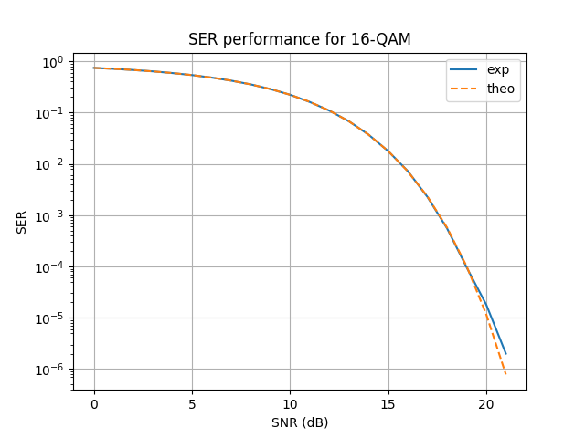

Monte Carlo Simulation over AWGN Channel
========================================

In this tutorial, we will simulate a communication chain with **comnumpy** 
and evaluate its Symbol Error Rate (SER) over a range of Signal-to-Noise Ratios (SNRs).  
This is done using a **Monte Carlo simulation**, where the chain is executed multiple times 
for different SNR values and the experimental results are compared with theoretical predictions.

Introduction
^^^^^^^^^^^^

Prerequisites
"""""""""""""

Make sure you have the following Python libraries installed:

.. code::

   numpy
   matplotlib
   comnumpy
   tqdm

Import Libraries
""""""""""""""""

We start by importing the necessary libraries:

.. literalinclude:: ../../examples/simple/monte_carlo_awgn.py
   :language: python
   :lines: 1-10

Define Parameters
"""""""""""""""""

Next, we set the simulation parameters: the modulation order, number of transmitted symbols, 
and the SNR range to evaluate.

.. literalinclude:: ../../examples/simple/monte_carlo_awgn.py
   :language: python
   :lines: 13-18

AWGN Communication Chain
^^^^^^^^^^^^^^^^^^^^^^^^

Define Chain
""""""""""""

We now define the communication chain using the ``Sequential`` object.  
The chain includes symbol generation, mapping, transmission over an AWGN channel, 
and symbol demapping.

.. literalinclude:: ../../examples/simple/monte_carlo_awgn.py
   :language: python
   :lines: 19-26

The processors are:

- ``SymbolGenerator``  
  Generates a stream of integer-valued symbols to transmit.

- ``Recorder``  
  Captures the transmitted symbols for later analysis.

- ``SymbolMapper``  
  Maps integers to QAM constellation points.

- ``AWGN``  
  Simulates the effect of noise for a given SNR value (here expressed in dB).

- ``SymbolDemapper``  
  Maps received noisy constellation points back to integers.

Monte Carlo Simulation
""""""""""""""""""""""

We perform a Monte Carlo simulation over the entire SNR range.  
At each iteration, we update the SNR value of the AWGN processor, run the chain, 
and compute the experimental SER.

.. literalinclude:: ../../examples/simple/monte_carlo_awgn.py
   :language: python
   :lines: 28-45

Theoretical SER
"""""""""""""""

For comparison, we also compute the theoretical SER curve for QAM modulation over AWGN.

.. literalinclude:: ../../examples/simple/monte_carlo_awgn.py
   :language: python
   :lines: 47-49

Results and Visualization
"""""""""""""""""""""""""

Finally, we plot the experimental and theoretical SER curves.  
A logarithmic (``semilogy``) scale is used for the SER axis, 
which is the standard way to represent error rate curves in digital communications.

.. literalinclude:: ../../examples/simple/monte_carlo_awgn.py
   :language: python
   :lines: 50-58

Conclusion
^^^^^^^^^^

Congratulations 🎉 You have completed a **Monte Carlo simulation of SER performance** 
for a QAM-modulated communication system over an AWGN channel.

You have learned how to:

- Define a chain with modulation, channel, and demodulation.
- Run Monte Carlo experiments for varying SNR values.
- Compare experimental performance with theoretical benchmarks.
- Plot standard SER performance curves.

From here, you may want to:

- Experiment with different modulation orders (e.g., 4-QAM, 64-QAM).
- Extend the chain with coding or more realistic channel models.
- Increase the number of transmitted symbols for more accurate SER estimation.

