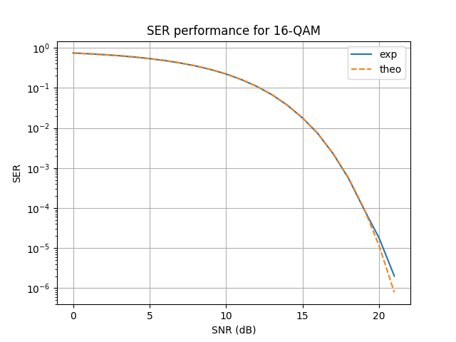

Monte Carlo Simulation over AWGN Channel
========================================

In this tutorial, we simulate a communication chain with **comnumpy**
and evaluate its Symbol Error Rate (SER) over a range of Signal-to-Noise Ratios (SNRs).
Using a **Monte Carlo simulation**, the chain is executed repeatedly at each SNR value
and the experimental results are compared with theoretical predictions.

**What you'll learn:**

- How to run a Monte Carlo simulation over a range of SNR values.
- How to compute experimental and theoretical SER for QAM over AWGN.
- How to plot standard SER performance curves on a logarithmic scale.

Introduction
^^^^^^^^^^^^

Prerequisites
"""""""""""""

Make sure you have the following Python libraries installed:

.. code::

   numpy
   matplotlib
   comnumpy

Import Libraries
""""""""""""""""

We start by importing the necessary libraries:

.. literalinclude:: ../../examples/simple/monte_carlo_awgn.py
   :language: python
   :lines: 1-10

Define Parameters
"""""""""""""""""

Next, we set the simulation parameters: modulation order, number of transmitted symbols,
and the SNR range to sweep.

.. literalinclude:: ../../examples/simple/monte_carlo_awgn.py
   :language: python
   :lines: 13-18

AWGN Communication Chain
^^^^^^^^^^^^^^^^^^^^^^^^

Define Chain
""""""""""""

We define the communication chain using the ``Sequential`` object.
The chain includes symbol generation, mapping, transmission over an AWGN channel,
and symbol demapping.

.. literalinclude:: ../../examples/simple/monte_carlo_awgn.py
   :language: python
   :lines: 19-26

The processors are:

- ``SymbolGenerator``  
  Generates a stream of integer-valued symbols to transmit. It is named
  ``"tx"`` so the sweep can compare the chain output against the
  transmitted symbols (see ``reference="tx"`` below).

- ``SymbolMapper``  
  Maps integers to QAM constellation points.

- ``AWGN``  
  Simulates the effect of noise for a given SNR value (here expressed in dB).

- ``SymbolDemapper``  
  Maps received noisy constellation points back to integers.

Monte Carlo Simulation
""""""""""""""""""""""

We perform a Monte Carlo simulation over the entire SNR range with
``sweep()``: at each SNR value it reconfigures the AWGN processor,
reseeds the chain, runs it, and compares the output with the transmitted
symbols recorded at the ``"tx"`` tap.

.. literalinclude:: ../../examples/simple/monte_carlo_awgn.py
   :language: python
   :lines: 28-36

The three services this uses are the ones a study is made of: ``seed`` makes every point reproducible, ``set_params`` addresses the block by the name it was given, and the tap returns what the transmitter produced so the metric has something to compare against. Note the ordering -- the chain has to *run* before its tap holds anything.

That loop is what :func:`~comnumpy.sweep.sweep` does, over every point, in one call:

.. literalinclude:: ../../examples/simple/monte_carlo_awgn.py
   :language: python
   :lines: 38-44

.. code::

   loop  : 7.406e-01 3.535e-01 7.237e-03
   sweep : 7.410e-01 3.533e-01 7.117e-03

The two are the same computation. They do not print the same digits because ``sweep`` gives each point its own child seed rather than reseeding to the same value, so the noise differs; the gap is the Monte-Carlo error of a million symbols, not a difference of method.

Theoretical SER
"""""""""""""""

For comparison, we also compute the theoretical SER curve for QAM modulation over AWGN.

.. literalinclude:: ../../examples/simple/monte_carlo_awgn.py
   :language: python
   :lines: 46-48

Results and Visualization
"""""""""""""""""""""""""

Finally, we plot the experimental and theoretical SER curves.
``plot_error_rate`` is the library's figure for this: measurements as hollow
markers, the closed form as a line of the same colour, a logarithmic ordinate
and a grid on both decades -- the standard representation for error rate curves
in digital communications.

.. literalinclude:: ../../examples/simple/monte_carlo_awgn.py
   :language: python
   :lines: 50-55

Conclusion
^^^^^^^^^^

You have completed a **Monte Carlo simulation of SER performance**
for a QAM-modulated communication system over an AWGN channel.

You have learned how to:

- Build a chain with modulation, channel, and demodulation.
- Run Monte Carlo experiments over a range of SNR values.
- Compare experimental results with theoretical benchmarks.
- Plot standard SER performance curves.

From here, you can:

- Experiment with different modulation orders (e.g., 4-QAM, 64-QAM).
- Extend the chain with channel coding or more realistic channel models.
- Increase the number of transmitted symbols to improve SER estimation accuracy.

