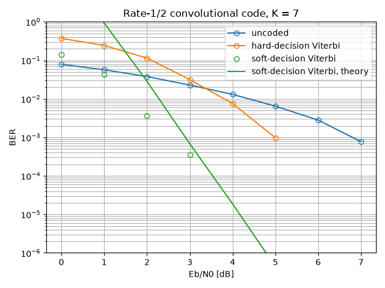
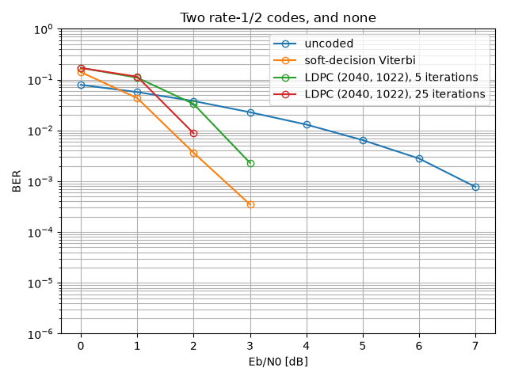

Channel Coding
==============

Every tutorial so far has read the received signal as well as it could and
accepted the errors that remained. This one refuses them. A **channel code**
adds redundancy at the transmitter so that the receiver can tell, from the
structure of what it received, that a particular decision must be wrong -- and
correct it.

The trade is explicit and it is not free: to send :math:`k` useful bits the
transmitter emits :math:`n > k` of them, so at constant symbol rate the useful
throughput drops by the **code rate** :math:`R = k/n`. What one buys in
exchange is a **coding gain**: the same error rate at a lower
:math:`E_b/N_0`, where :math:`E_b` is the energy per *useful* bit -- which is
the only comparison that means anything, and the reason every curve in this
tutorial is plotted against :math:`E_b/N_0` rather than SNR.

.. note::

   **Before you start.** :doc:`awgn` introduced ``sweep`` and
   ``plot_error_rate``, both used here without comment. Nothing else is
   assumed: the codes are built from scratch.

**What you'll learn:**

- How a convolutional encoder works, and what its generator polynomials mean.
- What the Viterbi algorithm decides, and why *soft* decisions are worth
  2 dB over *hard* ones.
- How to bound the error rate of a code analytically, from its distance
  spectrum alone -- no simulation.
- How an LDPC code differs, and what its iterations buy.
- Why a simulated BER of exactly zero is not a result.

Introduction
^^^^^^^^^^^^

Prerequisites
"""""""""""""

Make sure you have the following Python libraries installed:

.. code::

   numpy
   matplotlib
   comnumpy

Import Libraries
""""""""""""""""

.. literalinclude:: ../../examples/simple/channel_coding.py
   :language: python
   :lines: 1-16

Define Parameters
"""""""""""""""""

The modulation is BPSK -- one bit per symbol, which keeps the accounting
simple -- and the codes below all have rate 1/2.

.. literalinclude:: ../../examples/simple/channel_coding.py
   :language: python
   :lines: 18-28

That helper deserves a line of its own, because it is where most coded
simulations go wrong. The channel sees *symbols*, so it is parameterized by
:math:`E_s/N_0`; a code changes how many useful bits a symbol carries, so at
constant :math:`E_b/N_0`

.. math::

   \frac{E_s}{N_0} = R \, \frac{E_b}{N_0}
   \qquad\Longrightarrow\qquad
   \left(\frac{E_s}{N_0}\right)_{\mathrm{dB}}
   = \left(\frac{E_b}{N_0}\right)_{\mathrm{dB}} + 10\log_{10} R

A rate-1/2 code therefore runs the channel **3 dB colder** than the uncoded
link it is compared with. Forget that shift and the code appears to gain
3 dB it has not earned.

The Convolutional Encoder
^^^^^^^^^^^^^^^^^^^^^^^^^

A convolutional encoder has no block structure: it slides a window of
:math:`K` bits -- the **constraint length** -- along the input and emits, for
each input bit, :math:`n` modulo-2 sums of the bits in that window,

.. math::

   y_i[m] = \bigoplus_{l=0}^{K-1} g_i[l] \; x[m-l],
   \qquad i = 1, \ldots, n

The masks :math:`g_i` are the **generator polynomials**, written in octal by
convention. The pair :math:`(133, 171)_8` with :math:`K = 7` is the one NASA
standardized and every textbook tabulates, so it is the default here:

.. math::

   g_1 = 133_8 = 1011011_2, \qquad g_2 = 171_8 = 1111001_2

The window is the state: the encoder remembers :math:`K-1 = 6` past bits, so
it has :math:`2^6 = 64` states, and the sequence of states it walks through is
a path in a **trellis**. That trellis is the object the decoder searches.

.. literalinclude:: ../../examples/simple/channel_coding.py
   :language: python
   :lines: 30-41

.. code::

   generators ('0o133', '0o171')  K = 7  states = 64  rate = 0.5
   4 bits in -> [1 1 0 1 0 0 0 1 1 0 1 0 0 0 1 0 0 1 1 1] (with the tail)
   free distance d_free = 10
   d           10     11     12     13     14     15
   a_d         11      0     38      0    193      0
   beta_d      36      0    211      0   1404      0

Four input bits produced twenty output bits rather than eight: the encoder is
**terminated**, so :math:`K - 1 = 6` zero bits are appended to flush the
register and bring it back to the all-zero state. On a short block that
overhead is visible; on a realistic one it is not.

The last three lines are the code's **distance spectrum**, and they are worth
more than they look. :math:`d_{\mathrm{free}} = 10` is the smallest Hamming
distance between two distinct code sequences; :math:`a_d` counts the error
events at distance :math:`d`, and :math:`\beta_d` counts the *information*
bits those events get wrong. They come from an enumeration of the trellis, not
from a simulation, and the last section of this tutorial turns them into a
bound.

The Viterbi Decoder
^^^^^^^^^^^^^^^^^^^

The optimal decoder returns the code sequence closest to what was received --
over sequences, not over bits. Written naively that is a search over
:math:`2^k` paths, which is hopeless. Viterbi's observation is that the metric
is *additive along the trellis*, so at each state only the best path arriving
there can ever survive:

.. math::

   \Lambda_t(s) = \min_{s' \to s}
   \Big[ \Lambda_{t-1}(s') + \lambda_t\big(s' \to s\big) \Big]

Sixty-four numbers are carried from one trellis step to the next, whatever the
length of the message: **add, compare, select**. The decoder is exact -- it is
maximum likelihood over sequences -- and its cost is linear in the block
length.

Everything hinges on the branch metric :math:`\lambda_t`, and this is where
the two flavours part:

.. math::

   \lambda_t^{\mathrm{hard}} = d_H\big(\hat{\mathbf{b}}_t, \mathbf{c}_t\big),
   \qquad
   \lambda_t^{\mathrm{soft}} = \big\| \mathbf{r}_t - \mathbf{c}_t \big\|^2

The **hard** decoder is given bits: the demapper has already decided, and the
metric can only count disagreements. The **soft** decoder is given the
demapper's log-likelihood ratios, so a sample that fell halfway between the
two constellation points weighs less than one that landed squarely on the
wrong side. The information thrown away by deciding too early is worth about
2 dB, and the simulation below measures exactly that.

.. literalinclude:: ../../examples/simple/channel_coding.py
   :language: python
   :lines: 43-73

The chain, as the chain itself describes it:

.. mermaid:: mermaid/channel_coding.mmd

.. code::

   uncoded                  7.86e-02 5.68e-02 3.79e-02 2.28e-02 1.31e-02 6.45e-03 2.80e-03 7.75e-04   (0.0 s)
   hard-decision Viterbi    3.71e-01 2.43e-01 1.14e-01 3.15e-02 7.52e-03 9.75e-04 0.00e+00 0.00e+00   (9.3 s)
   soft-decision Viterbi    1.40e-01 4.32e-02 3.63e-03 3.50e-04 0.00e+00 0.00e+00 0.00e+00 0.00e+00   (10.4 s)

Three readings, and the first one is a warning.

**A code can make things worse.** At 0 dB the hard-decision decoder is at
0.371 where the uncoded link is at 0.079 -- almost five times worse. This is
not a bug: below a threshold the channel produces more errors than
:math:`d_{\mathrm{free}}` allows the code to correct, the decoder picks the
wrong path, and a single wrong path corrupts a whole run of information bits.
The two curves cross around 3 dB, and only above that crossing does the code
earn its name.

**Soft decisions are worth about 2 dB.** At :math:`10^{-3}`, hard decoding
needs 5 dB and soft decoding a little under 3 -- the classic figure for this
code. Nothing was added to the receiver except *not throwing information
away*: the same trellis, the same recursion, a different branch metric.

**And the last two columns are not results.** Zero errors in 40 000 bits does
not mean the BER is zero; it means it is somewhere below roughly
:math:`1/40000 = 2.5 \times 10^{-5}` and this simulation cannot see it. The
figure drops those points rather than drawing them at zero on a logarithmic
axis. Which is exactly why the next section exists.

The Union Bound
^^^^^^^^^^^^^^^

Where the simulation runs out of symbols, analysis takes over. An error event
is a path that leaves the correct one and merges back into it; if such an
event is at Hamming distance :math:`d`, the noise must have pushed the
received sequence closer to it than to the truth, which for BPSK over AWGN has
probability :math:`Q\big(\sqrt{2Rd\,E_b/N_0}\big)`. Summing over every error
event -- counting each one as if it acted alone, hence a bound rather than an
identity -- gives

.. math::

   P_b \;\leq\; \sum_{d \geq d_{\mathrm{free}}} \beta_d \;
   Q\left(\sqrt{2 R \, d \, \frac{E_b}{N_0}}\right)

with :math:`\beta_d` the information-weight spectrum printed above. This is a
closed form: no simulation, no random draw, and no floor at
:math:`2.5\times10^{-5}`.

.. literalinclude:: ../../examples/simple/channel_coding.py
   :language: python
   :lines: 75-82

.. code::

   union bound              1.82e+01 9.32e-01 2.85e-02 6.81e-04 1.87e-05 4.43e-07 5.61e-09 2.70e-11

At low :math:`E_b/N_0` the bound is above 1, which is true and useless -- a
union bound counts overlapping events several times, and at 0 dB there are
many. It becomes informative around 2 dB and tight from 3 dB on: at 3 dB it
gives :math:`6.8 \times 10^{-4}` against a measured
:math:`3.5\times 10^{-4}`, a factor of two, and the gap keeps closing because
the :math:`d_{\mathrm{free}}` term comes to dominate the sum. From there the
bound *is* the curve, and it costs nothing to evaluate.

That is the practical division of labour: simulate where a simulation can
resolve the error rate, bound where it cannot.

An LDPC Code, at the Same Rate
^^^^^^^^^^^^^^^^^^^^^^^^^^^^^^

A convolutional code has memory but no block structure. A **low-density
parity-check** code is the opposite: a block of :math:`n` bits is a codeword
if and only if

.. math::

   \mathbf{H}\mathbf{c} = \mathbf{0} \pmod 2

for a parity-check matrix :math:`\mathbf{H}` that is *sparse* -- Gallager's
regular construction puts exactly :math:`d_v` ones per column and :math:`d_c`
per row, here 3 and 6, which fixes the rate at :math:`1 - d_v/d_c = 1/2`.

Sparsity is what makes decoding possible. Read :math:`\mathbf{H}` as a
bipartite graph -- one node per bit, one node per parity check, an edge for
each one -- and decode by passing messages along its edges: each check tells
each bit what the other bits in that check imply about it, each bit collects
what its checks say, and the process repeats. The **min-sum** rule used here
approximates the exact update by

.. math::

   L_{c \to b} \;\approx\;
   \Big(\prod_{b' \in \mathcal{N}(c)\setminus b} \mathrm{sign}\, L_{b' \to c}\Big)
   \cdot \min_{b' \in \mathcal{N}(c)\setminus b} \left|L_{b' \to c}\right|

which is why the decoder needs the demapper's LLRs: an LDPC decoder is soft
by construction, there is no hard-decision variant of it.

.. literalinclude:: ../../examples/simple/channel_coding.py
   :language: python
   :lines: 84-107

.. code::

   LDPC: H is 1020 x 2040, k = 1022 information bits, rate = 0.501, column weight 3, row weight 6
   LDPC  5 iterations       1.70e-01 1.09e-01 3.31e-02 2.30e-03 0.00e+00 0.00e+00 0.00e+00 0.00e+00
   LDPC 25 iterations       1.70e-01 1.14e-01 8.78e-03 0.00e+00 0.00e+00 0.00e+00 0.00e+00 0.00e+00

.. literalinclude:: ../../examples/simple/channel_coding.py
   :language: python
   :lines: 109-122

The shape of the curve is what distinguishes the two families. The
convolutional code improves steadily; the LDPC code does almost nothing until
about 2 dB and then falls off a cliff -- the **waterfall**. That threshold
behaviour is the point of the construction, and it is why long LDPC codes get
within a fraction of a decibel of capacity where a convolutional code cannot.

The iterations show the mechanism at work: at 2 dB, five iterations leave
:math:`3.3\times10^{-2}` and twenty-five leave :math:`8.8\times10^{-3}`.
Below the threshold, more iterations change nothing -- messages circulate
without converging; above it, they are what carries the decoder to the
codeword. At 0 dB the two curves are the same number to three digits, which
says exactly that.

When the Sweep Is Too Slow
^^^^^^^^^^^^^^^^^^^^^^^^^^

The two Viterbi sweeps took about ten seconds each, and a coded simulation
that has to resolve :math:`10^{-6}` takes minutes. The points of a sweep are
independent, so they can be run at the same time:

.. code:: python

   results = sweep(chain, "noise.snr_dB", snr_dB(ebn0_dB, rate),
                   {"ber": compute_ser}, n_bits, reference="tx", seed=4,
                   n_jobs=4)

The curve is **identical**, value for value, not merely statistically
equivalent: every point already draws from its own child seed, so which
worker runs it changes nothing. That is also why ``seed=`` becomes mandatory
when ``n_jobs`` is not 1.

Two practical points. Workers are processes, so the chain and the metrics are
pickled into them -- a metric written as a ``lambda`` cannot make the trip,
and must be a module-level function. And a script that calls a parallel sweep
must guard its body:

.. code:: python

   if __name__ == "__main__":
       main()

without which each worker re-imports the script and runs it again. Both cases
raise an error that says so.

It is not free either: starting a worker costs about 130 ms, so a sweep whose
points take a millisecond will be *slower* in parallel. Around 200 ms a point,
four cores return about 2.7x.

Conclusion
^^^^^^^^^^

You have coded a link, decoded it two ways, bounded what it can do, and
compared it with a code built on an entirely different principle.

You have learned how to:

- Read generator polynomials, and what the constraint length costs and buys.
- Tell what the Viterbi recursion computes, and why soft decisions are worth
  2 dB.
- Turn a distance spectrum into a union bound, and use it where simulation
  cannot reach.
- Decode an LDPC code by message passing, and recognize a waterfall.
- Run a sweep in parallel without changing its result.

From here, you can:

- Put this code in front of one of the earlier channels -- the OFDM link of
  :doc:`ofdm` is exactly the case where coding *across* the subcarriers
  repairs the ones a notch destroyed.
- Change the constraint length and watch :math:`d_{\mathrm{free}}` and the
  decoder cost grow together.
- Increase the LDPC blocklength and see the waterfall sharpen.
