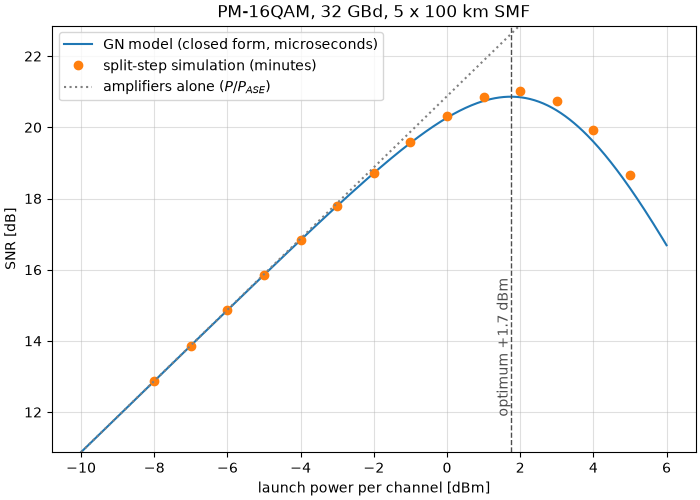
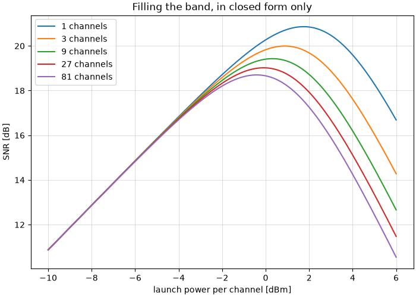

The Gaussian Noise Model
========================

In this tutorial we answer the question every optical link designer has to
answer -- **how much power should I launch?** -- twice. Once by simulating
the fibre, which takes minutes, and once with a closed-form expression that
takes microseconds. Then we put the two on the same axes and look at how
close they land.

.. note::

   **Before you start.** :doc:`optical_fiber_nonlinearity` propagated a
   signal through fibre with the split-step method and undid the damage with
   digital back-propagation. This tutorial keeps the same propagation and
   asks a different question: not *how do I repair the nonlinearity*, but
   *how much of it will there be*, and what launch power minimizes the total
   damage.

**What you'll learn:**

- Why an optical link has an *optimum* launch power, and why turning the
  laser up eventually makes things worse.
- What the Gaussian Noise (GN) model is, in one equation, and how to use it.
- How to read the model's three characteristic behaviours: the cube law, the
  half-the-ASE rule, and the logarithmic price of bandwidth.
- How well a closed form can replace a split-step simulation -- measured, on
  the same figure.
- The one thing the model cannot see, and how big it is.

Introduction
^^^^^^^^^^^^

A fibre span attenuates. An amplifier puts the power back and adds
spontaneous-emission noise, so over :math:`N_s` spans the receiver sees a
fixed noise power :math:`P_{\mathrm{ASE}}`. That alone would say: launch as
much power as the laser can give, since the signal grows and the noise does
not.

The fibre disagrees. Its refractive index depends on the intensity travelling
through it -- the Kerr effect -- so the signal distorts *itself*, and the
distortion grows faster than the signal does. After enough uncompensated
dispersion the propagating waveform looks like Gaussian noise to itself, and
the distortion it produces behaves like one more additive noise. That is the
whole content of the **GN model**, and it makes the link an additive-noise
channel with two terms:

.. math::

   \mathrm{SNR}(P) = \frac{P}{P_{\mathrm{ASE}} + \eta P^3}

The numerator is linear in the launch power and the second term of the
denominator is *cubic*, so there is a best :math:`P` and it is not the
largest one. Everything below follows from that single expression.

Prerequisites
"""""""""""""

Make sure you have the following Python libraries installed:

.. code::

   numpy
   matplotlib
   comnumpy

Import Libraries
""""""""""""""""

.. literalinclude:: ../../examples/optical/gn_model.py
   :language: python
   :lines: 1-14

Define Parameters
"""""""""""""""""

Five 100 km spans of standard single-mode fibre, PM-16QAM at 32 GBd. The
signal has **two polarizations**: this is not decoration, it is the case the
model is written for, and the next section explains what happens if you
forget it.

.. literalinclude:: ../../examples/optical/gn_model.py
   :language: python
   :lines: 16-32

The chain
^^^^^^^^^

The transmitter and receiver are the ones from the previous tutorial, with
one change worth stopping on.

.. literalinclude:: ../../examples/optical/gn_model.py
   :language: python
   :lines: 35-67

.. mermaid:: mermaid/gn_model.mmd

The diagram is generated by the chain itself -- ``chain.to_mermaid()``
(decision D33c) -- so it cannot drift from the code.

.. warning::

   **The 3 dB that becomes 9 dB.** ``power_W`` is the power of the *channel*,
   summed over both polarizations, because that is the convention the GN
   model uses. Each polarization therefore carries half of it, hence
   ``Amplifier(np.sqrt(power_W / 2))``. Give each polarization the full
   ``power_W`` instead and you launch 3 dB more than you think; since the
   nonlinear interference goes as the cube of the power, your simulation then
   reports **9 dB** more of it than the model predicts, and the model looks
   broken when it is not.

   The same trap has a second door. ``FiberLink`` reads the *shape* of the
   field to decide which equation to integrate: a field ``(..., 2, N)`` gets
   the Manakov equation, which is what a real fibre with random birefringence
   does and what the model's 16/27 coefficient assumes; a one-dimensional
   field gets the scalar equation instead, which produces 27/8 -- **5.3 dB**
   -- more interference at the same total power. If you must compare against
   a scalar simulation, tell the model so with
   ``gn_model_nli_power(..., polarizations=1)``.

One number for the whole link
^^^^^^^^^^^^^^^^^^^^^^^^^^^^^

:func:`~comnumpy.optical.gn_model.gn_model_nli_power` collapses the fibre,
the span count and the comb into a single coefficient :math:`\eta`, defined
by :math:`P_{\mathrm{NLI}} = \eta P^3`.

.. literalinclude:: ../../examples/optical/gn_model.py
   :language: python
   :lines: 95-113

The model predicts the *fibre's* noise. The amplifiers' noise is not its
business, so we measure that once -- it does not depend on the launch power,
which is exactly why the two terms compete.

.. code::

   GN model: eta = 1223 /W^2 (-29.12 dB in mW^-2)
   measured ASE over 5 spans at NF = 6 dB: -23.89 dBm

With both numbers in hand the design point is a one-liner. Setting the
derivative of :math:`P/(P_{\mathrm{ASE}} + \eta P^3)` to zero gives a rule
worth remembering in words -- **the optimum is where the fibre's noise is
half the amplifiers'**:

.. math::

   \eta P_{\mathrm{opt}}^3 = \frac{P_{\mathrm{ASE}}}{2},
   \qquad
   P_{\mathrm{opt}} = \left(\frac{P_{\mathrm{ASE}}}{2\eta}\right)^{1/3},
   \qquad
   \mathrm{SNR}_{\mathrm{max}} = \frac{2}{3}\frac{P_{\mathrm{opt}}}
                                                 {P_{\mathrm{ASE}}}

.. literalinclude:: ../../examples/optical/gn_model.py
   :language: python
   :lines: 115-120

.. code::

   optimum: +1.75 dBm, SNR = 20.86 dB
   check: eta*P^3 / (P_ASE/2) = 1.000000

The last line is the rule checked rather than asserted. Two consequences fall
out of the same expression. The peak is **asymmetric** -- one side of it is
governed by a linear term, the other by a cubic one -- so missing the optimum
by 1 dB costs 0.24 dB of SNR upwards but only 0.21 dB downwards, and by 3 dB
it is 2.20 dB against 1.50 dB. Operators consequently run slightly *under*
the optimum, where a power error is the cheaper kind. And since
:math:`P_{\mathrm{opt}}` grows only as the cube root of the accumulated ASE,
ten times the spans moves the optimum by 3.3 dB, not by 10.

Now the expensive way
^^^^^^^^^^^^^^^^^^^^^

None of the above propagated a single sample. Let us do that too, at fourteen
launch powers, and measure the SNR the receiver actually gets.

.. literalinclude:: ../../examples/optical/gn_model.py
   :language: python
   :lines: 122-135

.. note::

   **Why this is a ``for`` loop and not a** :func:`~comnumpy.sweep`. The
   sweep of :doc:`awgn` drives one chain and reads one metric off it. Here
   every point is a *comparison* between two runs -- the propagated signal
   and a noiseless linear reference -- which is one shape too many for the
   sweep. When the measurement is not a metric of a single chain, the loop
   stays a loop.

The measurement itself is worth a sentence, because "how much noise is
there?" has a subtle answer when part of the damage is a phase rotation. One
complex scalar is fitted between the received symbols and the reference; it
absorbs the gain and the mean nonlinear phase, which is precisely what a
carrier-phase estimator removes in a real receiver. Whatever is left over is
noise, and the model does not get to argue about where it came from.

.. literalinclude:: ../../examples/optical/gn_model.py
   :language: python
   :lines: 70-92

A few of the fourteen points, and the two lines that follow the loop:

.. code::

     -8.0 dBm -> SNR 12.87 dB
     -5.0 dBm -> SNR 15.85 dB
     -2.0 dBm -> SNR 18.73 dB
     +1.0 dBm -> SNR 20.85 dB
     +2.0 dBm -> SNR 21.03 dB
     +3.0 dBm -> SNR 20.74 dB
     +5.0 dBm -> SNR 18.67 dB
   (17 s of split-step propagation)
   optimum: +1.75 dBm predicted, +2.0 dBm measured; peak SNR 20.86 dB predicted, 21.03 dB measured

And the two on the same axes:

.. literalinclude:: ../../examples/optical/gn_model.py
   :language: python
   :lines: 137-163

Three things to read off it. The dotted line is what the link would do if the
fibre were linear -- straight, rising for ever, which is the answer that made
the question interesting. The measured points leave it at around -2 dBm and
turn over. And the solid line, computed in microseconds from four fibre
parameters, passes through the measured points. The predicted optimum is +1.75 dBm and
the simulated curve peaks at +2.0 dBm -- the nearest point of a 1 dB grid --
with **0.17 dB** between the two peak SNRs, for a simulation that took a
hundred thousand times longer.

That is the whole value proposition of the model. It is not a substitute for
the split step when you need waveforms, constellations or a bit error rate.
It is what lets you ask a thousand *design* questions before you simulate
one.

What the closed form buys
^^^^^^^^^^^^^^^^^^^^^^^^^

Here is a question the simulation cannot afford: what happens when the
channel is not alone, but sits in the middle of a comb filling the amplifier
band? Eighty-one channels at 32 GBd is 4 THz of bandwidth; simulating that
means a sample rate in the terahertz, and the split step would run for days.
The closed form does not care.

.. literalinclude:: ../../examples/optical/gn_model.py
   :language: python
   :lines: 166-184

.. code::

   channels   NLI at 0 dBm   optimum   peak SNR
          1     -29.12 dBm    +1.75 dBm    20.86 dB
          3     -26.52 dBm    +0.88 dBm    19.99 dB
          9     -24.83 dBm    +0.31 dBm    19.43 dB
         27     -23.60 dBm    -0.09 dBm    19.02 dB
         81     -22.65 dBm    -0.41 dBm    18.70 dB

.. literalinclude:: ../../examples/optical/gn_model.py
   :language: python
   :lines: 186-194

Read the first column carefully: eighty-one times the bandwidth costs
**6.5 dB** of nonlinear interference, not the 19 dB that a proportional
penalty would give. The reason is one function. The GN model's kernel
integrates to an :math:`\mathrm{asinh}`, and :math:`\mathrm{asinh}` grows
logarithmically, so each doubling of the comb costs a bounded and shrinking
amount. The whole viability of wideband optical transmission is in that
:math:`\mathrm{asinh}`, and the peak SNR falls by only 2.2 dB while the link
carries eighty-one times as many channels.

What the model cannot see
^^^^^^^^^^^^^^^^^^^^^^^^^

The GN model has one assumption in its name: it treats the transmitted signal
as Gaussian. A real constellation is not Gaussian. Its fourth moment is
smaller, and a signal with a smaller fourth moment generates *less* nonlinear
interference -- so the model is systematically **pessimistic**, and the
smaller the constellation the more pessimistic it is.

The model cannot tell us by how much, since it never sees the constellation.
So we measure it: the same link, the same launch power, three different
things modulated onto the carrier, against one prediction.

.. literalinclude:: ../../examples/optical/gn_model.py
   :language: python
   :lines: 197-231

.. code::

   The GN model predicts a_NL = -29.12 dB whatever is modulated onto the carrier.
   stimulus    measured a_NL   vs the model   vs Gaussian
   Gaussian         -28.56 dB       +0.56 dB      +0.00 dB
   16QAM            -30.06 dB       -0.93 dB      -1.49 dB
   QPSK             -30.83 dB       -1.71 dB      -2.27 dB

.. literalinclude:: ../../examples/optical/gn_model.py
   :language: python
   :lines: 232-236

Every row is a sanity check on the section before it. A Gaussian stimulus
lands on the prediction, as it must -- the 0.56 dB left over is the model's
other approximation, that spans accumulate incoherently, and it grows with
the number of spans. Both real constellations land below, and QPSK, the
smallest, lands furthest below.

Closing that last gap is the job of the **EGN model** (Carena *et al.*, 2014;
Serena and Bononi, 2015), which carries the fourth and sixth moments of the
constellation through the same perturbation analysis. It is **not implemented
in this library**, and the table above is the honest substitute: the effect
measured rather than predicted, so that nobody reads the GN curve as an exact
answer for a modulated signal. Read it as what it is -- a pessimistic bound
that is tight for large constellations, worth about a decibel for PM-16QAM.

Is it right?
^^^^^^^^^^^^

A closed form that agrees with the simulation in the same library proves less
than it looks: both could share a mistake. ``validation/optical_gn_model.py``
therefore confronts it with things outside the library, and prints what it
finds:

- Serena and Bononi (JLT 33(7), 2015) published the normalized NLI
  coefficient of a 15-channel, 5 x 100 km link, measured with *their*
  split-step simulator: :math:`a_{\mathrm{NL}} = -23.5` dB. This module
  returns **-23.30 dB** for the same link.
- The same closed form re-transcribed from GNPy -- the Telecom Infra
  Project's open-source planning tool, which works in metres and s²/m where
  this library works in kilometres and ps²/km -- agrees to **twelve digits**
  (``tests/optical/test_gn_model.py``).
- This library's own split-step solver, on a five-channel WDM link where
  cross-phase modulation dominates, agrees to **0.01 dB**.
- The 27/8 polarization factor of the warning above, measured by simulating
  the same link twice, comes out at **5.29 dB** against the 5.28 dB of
  Table I of the paper.

.. literalinclude:: ../../examples/optical/gn_model.py
   :language: python
   :lines: 238-245

Conclusion
^^^^^^^^^^

You have designed an optical link twice, and the two answers agree.

You have learned how to:

- Turn a fibre link into one coefficient :math:`\eta` with
  :func:`~comnumpy.optical.gn_model.gn_model_nli_power`, and read an SNR off
  :func:`~comnumpy.optical.gn_model.gn_model_snr`.
- Find the optimal launch power in closed form with
  :func:`~comnumpy.optical.gn_model.optimal_launch_power`, and remember the
  rule behind it -- the fibre's noise is half the amplifiers'.
- Measure nonlinear interference from a split-step run, by fitting one
  complex scalar and calling the rest noise.
- Keep the polarization and power conventions straight, which is worth 9 dB and
  5.3 dB of not being confused.
- Recognize where the model is a bound rather than an answer.

From here, you can:

- Put digital back-propagation back in the receiver (:doc:`the previous
  tutorial <optical_fiber_nonlinearity>`) and watch the optimum move to
  higher power as the nonlinearity is partly undone.
- Sweep the span length at fixed total distance: the GN model will tell you,
  in milliseconds, why shorter spans buy reach.
- Add a Raman amplifier and recompute :math:`P_{\mathrm{ASE}}`: the optimum
  moves as its cube root, and no fibre needs to be re-simulated.

This is the last tutorial of the course. If you have read them in order you
have built, measured and validated a chain in every regime the library
covers -- additive noise, multipath, multiple antennas, coding, shaping and
nonlinear fibre -- and each time against something that could have said no.
