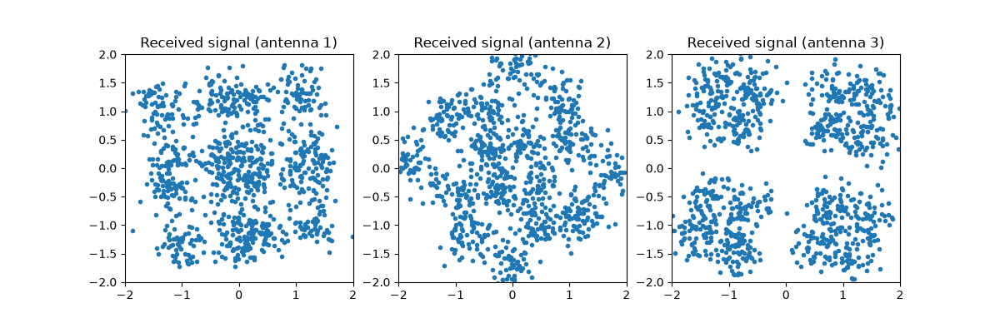
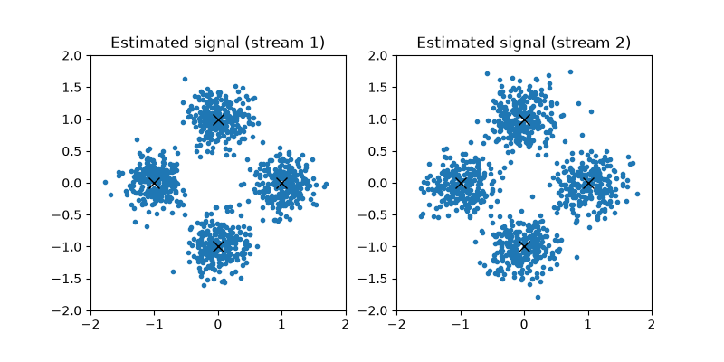
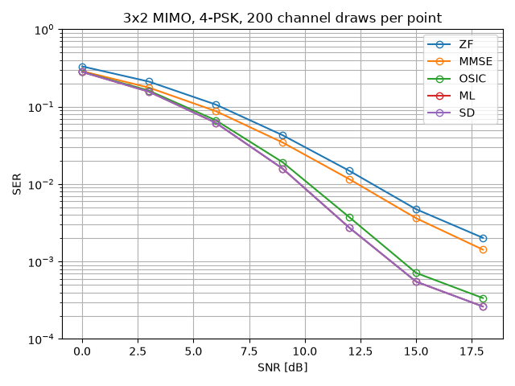

MIMO Chain Tutorial
===================

This tutorial demonstrates how to simulate a MIMO (Multiple-Input Multiple-Output) communication system using the ``comnumpy`` library.

.. note::

   **Before you start.** :doc:`awgn` introduced ``sweep``, which is used
   here to average over channel realizations rather than over noise. The
   chain is the same object; only the number of antennas changes.

**What you'll learn:**

- How to build a MIMO simulation chain with Rayleigh fading.
- How to visualize received and equalized signals.
- How ZF, MMSE, OSIC, ML and sphere decoding differ, and what each one costs.
- How to run a Monte Carlo evaluation of the Symbol Error Rate (SER) with ``sweep``.

This tutorial is suited for engineers and students learning about MIMO systems, combining practical examples with theoretical background.

Introduction
^^^^^^^^^^^^

Prerequisites
"""""""""""""

Ensure you have the following Python libraries installed:

.. code::

   numpy
   matplotlib
   comnumpy

Simulation Setup
^^^^^^^^^^^^^^^^

Import Libraries
""""""""""""""""

We start by importing the required libraries and ``comnumpy`` components:

.. literalinclude:: ../../examples/mimo/one_shot_mimo.py
   :language: python
   :lines: 1-15

Define System Parameters
""""""""""""""""""""""""

We define the number of transmit/receive antennas, the modulation order (PSK), and the noise variance. The channel is drawn once, with a seed: the whole first half of the tutorial is about **one** realization, so it must be the same one on every run.

.. literalinclude:: ../../examples/mimo/one_shot_mimo.py
   :language: python
   :lines: 17-24

Build the MIMO Chain
""""""""""""""""""""

The link is one ``Sequential``: symbol generator, mapper, flat MIMO channel, noise, and a detector. The detector is the **last block of the chain**, not something applied to its output, so comparing five detectors is comparing five chains that differ by one block:

.. literalinclude:: ../../examples/mimo/one_shot_mimo.py
   :language: python
   :lines: 27-52

This simulates a MIMO transmission over a flat-fading channel with additive Gaussian noise. The received signal is described by:

.. math ::

   \mathbf{y}[n] = \mathbf{H}\mathbf{x}[n] + \mathbf{b}[n]

The chain, as the chain itself describes it:

.. mermaid:: mermaid/mimo_zf.mmd

The diagram above is not drawn by hand. It is what the chain says about
itself -- ``chain.to_mermaid()`` (decision D33c) -- exported by the
script, so the block names are the ones the code uses and a dashed
outline marks a tapped block:

.. literalinclude:: ../../examples/mimo/one_shot_mimo.py
   :language: python
   :lines: 139-156

One-Shot Simulation
^^^^^^^^^^^^^^^^^^^

Run the five chains
"""""""""""""""""""

Each chain is given the same seed before running, so the five numbers below differ by the detector alone -- same symbols, same noise, same channel:

.. literalinclude:: ../../examples/mimo/one_shot_mimo.py
   :language: python
   :lines: 54-57

.. code::

   * detector ZF   : ser=0.0025
   * detector MMSE : ser=0.0025
   * detector OSIC : ser=0.0010
   * detector ML   : ser=0.0005
   * detector SD   : ser=0.0005

Visualize the Received Signal
"""""""""""""""""""""""""""""

Let's inspect what each receive antenna sees, read from the ``"noise"`` tap:

.. literalinclude:: ../../examples/mimo/one_shot_mimo.py
   :language: python
   :lines: 59-67

Each antenna receives a noisy superposition of the two transmitted streams, and no constellation is visible on any of them.

Zero-Forcing Equalization
"""""""""""""""""""""""""

Zero forcing separates the streams with the pseudo-inverse of the channel matrix,

.. math ::

   \mathbf{z}[n] = \mathbf{H}^{\dagger}\mathbf{y}[n]

assuming perfect channel knowledge and ignoring the noise enhancement this causes. That equalization is the first step of ``LinearDetector``, which then decides; ``linear_estimator`` is that step alone, which is what a constellation plot needs:

.. literalinclude:: ../../examples/mimo/one_shot_mimo.py
   :language: python
   :lines: 69-78

The estimated points cluster around the ideal constellation points (black crosses), although residual noise remains visible -- and it is *larger* than the channel noise, because inverting a badly conditioned matrix amplifies it.

Detection Comparison
^^^^^^^^^^^^^^^^^^^^

Five detectors are compared here, and they are five answers to one question: what to do with the interference the other streams put on top of the one being read.

Zero forcing: cancel it exactly
"""""""""""""""""""""""""""""""

The most direct answer is to invert the channel. With :math:`N_r \geq N_t` the pseudo-inverse :math:`\mathbf{H}^{\dagger} = (\mathbf{H}^H\mathbf{H})^{-1}\mathbf{H}^H` is a left inverse, so

.. math ::

   \widehat{\mathbf{x}}_{ZF}[n] &= \boldsymbol \Pi_{\mathcal{M}}(\mathbf{z}[n])\\
   \mathbf{z}[n] &= \mathbf{H}^{\dagger}\mathbf{y}[n]
   = \mathbf{x}[n] + \mathbf{H}^{\dagger}\mathbf{b}[n]

and the interference is gone -- **exactly**, whatever the SNR. What is left is the second term, and it is the whole story of this detector. The noise on stream :math:`i` comes out with variance

.. math ::

   \sigma_i^2 = \sigma^2 \left[\left(\mathbf{H}^H\mathbf{H}\right)^{-1}\right]_{ii}
   \;\geq\; \frac{\sigma^2}{\left\|\mathbf{h}_i\right\|^2}

with equality only when the columns of :math:`\mathbf{H}` are orthogonal. Two nearly parallel columns make :math:`\mathbf{H}^H\mathbf{H}` nearly singular and that diagonal entry explodes: this is **noise enhancement**, and it is the price of insisting on exact cancellation. It also costs diversity -- each stream spends :math:`N_t - 1` of its :math:`N_r` degrees of freedom cancelling the others, leaving

.. math ::

   d_{ZF} = N_r - N_t + 1

against the :math:`N_r` a maximum-likelihood receiver keeps. With the :math:`3 \times 2` channel of this tutorial that is 2 against 3.

MMSE: stop insisting
""""""""""""""""""""

If exact cancellation is what costs, then buy less of it. The MMSE receiver minimizes :math:`\mathbb{E}\left[\|\mathbf{x} - \mathbf{W}\mathbf{y}\|^2\right]` rather than the interference alone:

.. math ::

   \widehat{\mathbf{x}}_{MMSE}[n] &= \boldsymbol \Pi_{\mathcal{M}}(\mathbf{z}[n])\\
   \mathbf{z}[n] &= \left(\mathbf{H}^H\mathbf{H} + \sigma^2 \mathbf{I}_{N_t}\right)^{-1}\mathbf{H}^H\mathbf{y}[n]

The only difference is the :math:`\sigma^2 \mathbf{I}` added before inverting, and it is exactly the regularization that keeps the inverse bounded when the channel is ill conditioned. The two limits say what it does: as :math:`\sigma^2 \to 0` it *is* zero forcing, and as :math:`\sigma^2 \to \infty` it becomes the matched filter :math:`\mathbf{H}^H`, which ignores the interference entirely and just collects energy. In between it accepts a little residual interference -- the estimate is biased -- in exchange for much less amplified noise. That trade is worth a few tenths of a decibel here and much more on a badly conditioned channel; it does not buy diversity, which is why the MMSE and ZF curves run parallel.

Maximum likelihood: do not separate the streams at all
""""""""""""""""""""""""""""""""""""""""""""""""""""""

Both linear detectors treat the streams one at a time. The optimal receiver refuses that split and scores the vectors jointly:

.. math ::

   \widehat{\mathbf{x}}_{ML}[n] = \arg \min_{\mathbf{x}\in \mathcal{M}^{N_t}}\|\mathbf{y}[n] - \mathbf{H}\mathbf{x}\|^2_2

Nothing is inverted, so nothing is amplified, and every receive antenna contributes to every stream: the diversity order is :math:`N_r`. The cost is that the minimum is taken over :math:`|\mathcal{M}|^{N_t}` vectors.

OSIC: separate them, but in the right order
"""""""""""""""""""""""""""""""""""""""""""

Between the two lies successive cancellation. Detect the stream with the best post-detection SNR, subtract its contribution :math:`\mathbf{h}_i \widehat{x}_i` from the observation, and repeat on a channel with one column fewer -- so the second stream is detected on a system with one interferer less, the third with two less, and so on. The last stream detected enjoys the full :math:`N_r` diversity; the first only :math:`N_r - N_t + 1`, which is why the *ordering* matters and why ``osic_type="sinr"`` sorts by post-detection SNR (the V-BLAST rule). The price is error propagation: a wrong decision is subtracted as if it were right, and it corrupts everything after it.

Sphere decoding: the same decision, not the same cost
"""""""""""""""""""""""""""""""""""""""""""""""""""""

The ML detector is exhaustive: :math:`|\mathcal{M}|^{N_t}` candidates per symbol, 16 here and 65 536 for 16-QAM on four streams. The sphere decoder returns the *same* vector without visiting them all, and the reason is a factorization.

Write the thin QR decomposition of the channel, :math:`\mathbf{H} = \mathbf{Q}\mathbf{R}` with :math:`\mathbf{Q}^H\mathbf{Q} = \mathbf{I}_{N_t}` and :math:`\mathbf{R}` upper triangular, and project the observation on :math:`\mathbf{z} = \mathbf{Q}^H\mathbf{y}`:

.. math ::

   \left\|\mathbf{y} - \mathbf{H}\mathbf{x}\right\|^2 =
   \left\|\mathbf{z} - \mathbf{R}\mathbf{x}\right\|^2
   + \left\|\left(\mathbf{I} - \mathbf{Q}\mathbf{Q}^H\right)\mathbf{y}\right\|^2

The second term does not depend on :math:`\mathbf{x}`, so minimizing the first **is** maximum likelihood -- nothing has been approximated. And because :math:`\mathbf{R}` is triangular, that first term is a sum whose :math:`k`-th layer only involves the layers already decided:

.. math ::

   \left\|\mathbf{z} - \mathbf{R}\mathbf{x}\right\|^2 =
   \sum_{k=N_t-1}^{0} \left|R_{kk}\right|^2
   \left|c_k - x_k\right|^2,
   \qquad
   c_k = \frac{z_k - \sum_{i>k} R_{ki}\, x_i}{R_{kk}}

Every term is non-negative, so a partial sum can only grow. The moment it exceeds the best complete metric found so far, **the entire subtree below it can be discarded** -- it cannot contain the minimum. That is the sphere: only the lattice points inside a ball are ever visited, and the ball shrinks each time a better solution is found.

One detail makes it work without tuning. Within a layer, the alphabet is enumerated by increasing :math:`|c_k - a|` (the Schnorr-Euchner order), so the first leaf the search reaches is the successive-cancellation solution: a finite radius is available immediately, and no initial radius has to be guessed. It also means the first candidate that exceeds the bound ends the layer -- everything after it is worse.

The five in one table
"""""""""""""""""""""

============  ==========================================  ===========================  =========================
detector      what it does                                cost per vector              diversity order
============  ==========================================  ===========================  =========================
ZF            inverts the channel                         :math:`O(N_t^3)` once,       :math:`N_r - N_t + 1`
                                                          then a product
MMSE          inverts it with :math:`\sigma^2` added      same                         :math:`N_r - N_t + 1`
OSIC          detects, subtracts, repeats                 :math:`N_t` inversions       :math:`N_r - N_t + 1`
                                                          of shrinking size            (first stream)
ML            scores every vector                         :math:`|\mathcal{M}|^{N_t}`  :math:`N_r`
SD            scores the vectors inside a sphere          data dependent, same         :math:`N_r`
                                                          decision as ML
============  ==========================================  ===========================  =========================

The last column is the one that orders the curves at high SNR, and the third is the one that orders the bill. Note that ZF and MMSE share a diversity order: the regularization buys array gain, not slope, which is why their curves are parallel in the figure below and never converge.

.. note ::

   The SNR range simulated here stops at 18 dB, which is *not* the
   asymptotic regime: reading exponents off these curves would give
   1.4 and 1.6 rather than 2 and 3. Diversity orders are claims about a
   limit, so they are checked where a limit can be reached --
   ``validation/mimo_zf_ml_ber.py`` confirms diversity 1 for zero
   forcing and 2 for maximum likelihood on a 2x2 channel, against the
   closed forms of :mod:`comnumpy.core.metrics` (decision D7).

Monte Carlo Evaluation
^^^^^^^^^^^^^^^^^^^^^^

A single channel realization proves nothing: over fading, the error rate is an *average*, and it is dominated by the rare draws where the matrix is nearly singular. Averaging therefore means running the chain once per realization -- which is a sweep whose parameter is the channel. :func:`~comnumpy.sweep.sweep` takes several dotted parameter names at once and zips them, so one sweep point sets the matrix the signal goes through **and** the one the detector inverts:

.. literalinclude:: ../../examples/mimo/one_shot_mimo.py
   :language: python
   :lines: 80-107

.. code::

   ZF    0.3313 0.2106 0.1065 0.0428 0.0148 0.0047 0.0020
   MMSE  0.2871 0.1762 0.0876 0.0345 0.0116 0.0036 0.0014
   OSIC  0.2826 0.1610 0.0668 0.0192 0.0037 0.0007 0.0003
   ML    0.2807 0.1560 0.0620 0.0159 0.0027 0.0006 0.0003

Note which detectors are told the noise variance and which are not: MMSE and OSIC weight by :math:`\sigma^2`, ZF ignores the noise by construction, and ML only compares distances -- so neither of the last two has that parameter at all, and ``set_params`` says so if you try.

Plot SER vs SNR
"""""""""""""""

``plot_error_rate`` is the library's figure for error-rate curves: hollow markers, logarithmic ordinate, a grid on both decades. Here it carries measurements only -- ZF over Rayleigh has a closed form (see the :doc:`Alamouti tutorial <alamouti>`), the three others do not.

.. literalinclude:: ../../examples/mimo/one_shot_mimo.py
   :language: python
   :lines: 109-114

The ordering is the textbook one and it holds at every SNR: ML is the best, OSIC follows it closely, MMSE beats ZF everywhere, and the gap widens with the SNR -- at 18 dB, ML is an order of magnitude below ZF. The reason is in the slope: with :math:`N_r = 3` receive antennas and :math:`N_t = 2` streams, ML enjoys the full receive diversity while a linear detector spends part of it cancelling the other stream.

And the sphere decoder's row is **the ML row, digit for digit** -- ``0.2807 0.1560 0.0620 0.0159 0.0027 0.0006 0.0003`` in both. That is the claim it has to make: a pruning that changed a single decision would not be maximum likelihood any more.

What the pruning removes
""""""""""""""""""""""""

The 4-PSK link above has 16 candidates, and an exhaustive search scores them in one matrix product -- there the sphere decoder is *slower*, because a tree walked in Python costs more per node than a BLAS call costs per candidate. The regime it exists for is the one where that product no longer fits, so the last section moves to 16-QAM on four streams: 65 536 candidates per symbol.

.. literalinclude:: ../../examples/mimo/one_shot_mimo.py
   :language: python
   :lines: 116-137

.. code::

   visited nodes per detected vector (16-QAM, 4x4)
      0 dB       91.8 nodes   1.40e-03 of the exhaustive search   SER 0.7900
      3 dB       51.3 nodes   7.82e-04 of the exhaustive search   SER 0.7288
      6 dB       29.8 nodes   4.55e-04 of the exhaustive search   SER 0.6369
      9 dB       19.2 nodes   2.94e-04 of the exhaustive search   SER 0.5044
     12 dB       12.8 nodes   1.95e-04 of the exhaustive search   SER 0.3381
     15 dB        8.6 nodes   1.31e-04 of the exhaustive search   SER 0.1256
     18 dB        5.8 nodes   8.78e-05 of the exhaustive search   SER 0.0112

.. image:: img/monte_carlo_mimo_fig4.png
   :width: 100%
   :align: center

Read the last column against the first. At 18 dB the search visits **5.8 nodes** where the exhaustive one scores 65 536 candidates -- and 4 of those nodes are the single path down the tree that successive cancellation would have taken, so barely two branches are ever explored. At 0 dB it visits 92, still three orders of magnitude below the exhaustive count, but sixteen times more than at 18 dB: the noisier the observation, the wider the sphere has to stay.

That data dependence is the whole character of the algorithm. Its worst case *is* the exhaustive search -- there is no bound to hide behind -- but its expected complexity is polynomial over the range of SNRs where a link is actually operated (Hassibi and Vikalo, 2005). Which is why 64-QAM on four streams, 16.7 million candidates, is out of reach for the exhaustive detector and takes this one about 5 nodes per vector at 25 dB.

Conclusion
^^^^^^^^^^

This tutorial highlighted:

- How to simulate a MIMO transmission with ``comnumpy``, as a chain whose last block is the receiver.
- How ZF equalization recovers the streams from a multi-antenna mixture, and what it costs in noise.
- How the five detectors compare, on one realization and on average.
- Why ML and OSIC outperform linear detection, why that difference grows with the SNR, and why a sphere decoder reaches the ML decision without paying the ML price.

With ``comnumpy``, you can rapidly prototype, test, and visualize MIMO systems for research, teaching, or self-study.

Every detector here assumed the *receiver* knows the channel and the
transmitter knows nothing. :doc:`alamouti` asks what the transmitter can do
anyway -- and answers with a code that buys diversity without a single bit of
feedback.
