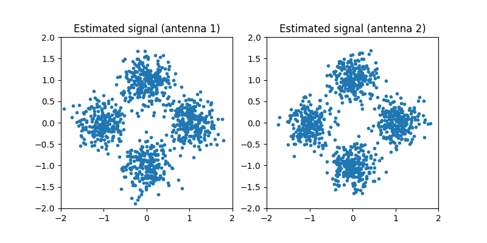

MIMO Chain Tutorial
===================

This tutorial demonstrates how to simulate a basic MIMO (Multiple-Input Multiple-Output) communication system using the ``comnumpy`` library. You will learn how to:

- Build a MIMO simulation chain with Rayleigh fading.
- Visualize received and equalized signals.
- Compare detection algorithms (ZF, MMSE, OSIC, ML).
- Perform a Monte Carlo evaluation of Symbol Error Rate (SER).

This tutorial is ideal for engineers or students learning about MIMO systems, and offers both practical insights and theoretical understanding.

Prerequisites
^^^^^^^^^^^^^

Ensure you have the following Python libraries installed:

- ``numpy``
- ``matplotlib``
- ``comnumpy``
- ``tqdm``

Simulation Setup
^^^^^^^^^^^^^^^^

1. Import Libraries
^^^^^^^^^^^^^^^^^^^

We start by importing the required Python libraries and `comnumpy` components:

.. literalinclude:: ../../examples/mimo/one_shot_mimo.py
   :language: python
   :lines: 1-14

2. Define System Parameters
^^^^^^^^^^^^^^^^^^^^^^^^^^^

We define the number of transmit/receive antennas, the modulation order (PSK), and the noise variance:

.. literalinclude:: ../../examples/mimo/one_shot_mimo.py
   :language: python
   :lines: 16-22

The modulation alphabet is automatically generated from the given parameters.

3. Build the MIMO Chain
^^^^^^^^^^^^^^^^^^^^^^^

We create a transmission chain consisting of a symbol generator, symbol mapper, and Rayleigh fading channel:

.. literalinclude:: ../../examples/mimo/one_shot_mimo.py
   :language: python
   :lines: 24-30

This simulates a MIMO transmission over a flat-fading channel with additive Gaussian noise.

4. Visualize the Received Signal
^^^^^^^^^^^^^^^^^^^^^^^^^^^^^^^^

Let's inspect the received signal on each receive antenna:

.. literalinclude:: ../../examples/mimo/one_shot_mimo.py
   :language: python
   :lines: 31-43

.. image:: img/monte_carlo_mimo_fig1.png
   :width: 100%
   :align: center

You should observe that the received signal consists of noisy superpositions of multiple transmitted streams.

5. Zero-Forcing Equalization
^^^^^^^^^^^^^^^^^^^^^^^^^^^^

We now apply Zero-Forcing (ZF) equalization using the pseudo-inverse of the channel matrix:

.. literalinclude:: ../../examples/mimo/one_shot_mimo.py
   :language: python
   :lines: 47-50

This separates the transmitted streams assuming ideal channel knowledge and no noise amplification.

6. Visualize the Estimated Symbols
^^^^^^^^^^^^^^^^^^^^^^^^^^^^^^^^^^

We plot the ZF-equalized symbols:

.. literalinclude:: ../../examples/mimo/one_shot_mimo.py
   :language: python
   :lines: 51-61

The estimated points should cluster near the ideal constellation points, although some noise remains.

7. Compare Detection Algorithms
^^^^^^^^^^^^^^^^^^^^^^^^^^^^^^^

We now compare four MIMO detection strategies:

- **ZF**: Zero-Forcing
- **MMSE**: Minimum Mean Square Error
- **OSIC**: Ordered Successive Interference Cancellation
- **ML**: Maximum Likelihood

.. literalinclude:: ../../examples/mimo/one_shot_mimo.py
   :language: python
   :lines: 63-76

Each detector is tested on the same channel realization, and the Symbol Error Rate (SER) is printed. We obtain the following 
outputs:

* detector ZF: ser=0.005
* detector MMSE: ser=0.004
* detector OSIC: ser=0.001
* detector ML: ser=0.0005

8. Monte Carlo Evaluation
^^^^^^^^^^^^^^^^^^^^^^^^^

To get a more reliable estimate of the SER, we run a Monte Carlo simulation.

.. literalinclude:: ../../examples/mimo/one_shot_mimo.py
   :language: python
   :lines: 81-111

This simulates multiple random channels and noise realizations for a range of SNR values.

9. Plot SER vs SNR
^^^^^^^^^^^^^^^^^^

Finally, we plot the SER for each detection scheme as a function of SNR:

.. literalinclude:: ../../examples/mimo/one_shot_mimo.py
   :language: python
   :lines: 113-124

.. image:: img/monte_carlo_mimo_fig3.png
   :width: 100%
   :align: center

This figure illustrates how different detection methods perform as the channel becomes cleaner (higher SNR).

Conclusion
^^^^^^^^^^

This tutorial highlighted:

- How to simulate a MIMO transmission with `comnumpy`.
- How ZF equalization recovers the signal from a multi-stream mixture.
- How various MIMO detectors behave under different SNR conditions.
- Why advanced detection schemes like OSIC and ML outperform linear methods in difficult channel conditions.

With `comnumpy`, you can rapidly prototype, test, and visualize MIMO systems — whether for research, teaching, or personal learning.
