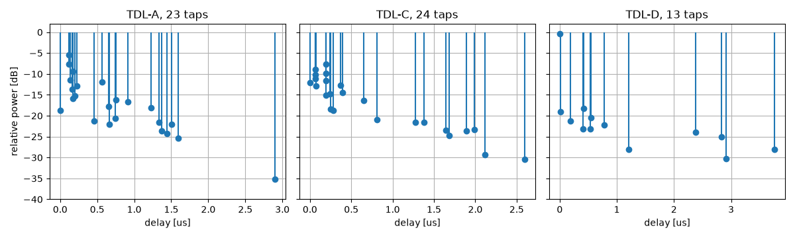
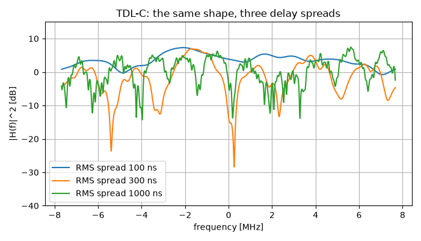
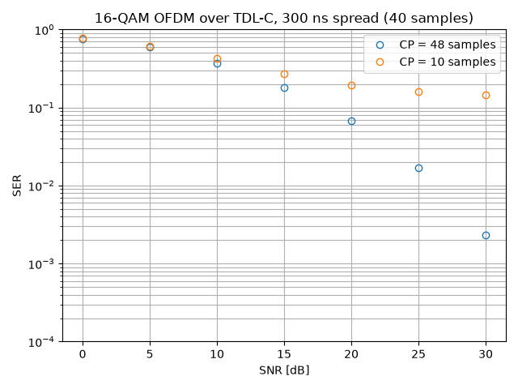

Multipath Fading Channels
=========================

In this tutorial, we transmit through a **tapped delay line**: the standard
model of a radio channel where the signal arrives several times, along paths
of different lengths. The 3GPP catalogue of such channels -- the LTE profiles
and the 5G NR ones of TR 38.901 -- ships with the library, and the tutorial
ends on the one design rule they exist to settle: how long the cyclic prefix
of an OFDM symbol has to be.

**What you'll learn:**

- What a power delay profile is, and why a 5G TDL model is a *shape* rather
  than a channel.
- How the delay spread and the coherence bandwidth are two readings of the
  same object.
- How to put a standardized fading channel in a chain.
- Why an OFDM link with too short a cyclic prefix hits an error floor that no
  SNR removes.

Introduction
^^^^^^^^^^^^

Prerequisites
"""""""""""""

Make sure you have the following Python libraries installed:

.. code::

   numpy
   matplotlib
   comnumpy

Import Libraries
""""""""""""""""

.. literalinclude:: ../../examples/simple/multipath_channels.py
   :language: python
   :lines: 1-13

Define Parameters
"""""""""""""""""

The sampling rate is what turns delays in nanoseconds into delays in samples,
so it belongs with the channel and not with the modulation. At the LTE rate of
15.36 MHz one sample lasts 65 ns.

.. literalinclude:: ../../examples/simple/multipath_channels.py
   :language: python
   :lines: 17-22

The Power Delay Profile
^^^^^^^^^^^^^^^^^^^^^^^

A multipath channel is a sum of resolvable paths, each with its own delay and
its own fading coefficient:

.. math::

   y[n] = \sum_{l=0}^{L-1} a_l[n] \, x[n - d_l],
   \qquad \mathbb{E}\left[\left|a_l[n]\right|^2\right] = \gamma_l,
   \qquad d_l = \mathrm{round}\left(\tau_l f_s\right)

The pairs :math:`(\tau_l, \gamma_l)` are the **power delay profile**. Its
summary figure is the RMS delay spread, the standard deviation of the delay
weighted by the power:

.. math::

   \sigma_\tau = \sqrt{\sum_l \gamma_l \tau_l^2
                       - \left(\sum_l \gamma_l \tau_l\right)^2}

Two families are in the catalogue, and they differ in a way worth knowing.
The **LTE** profiles of TS 36.101 -- EPA, EVA, ETU -- give delays in
nanoseconds: they *are* channels, one per environment. The **5G NR** profiles
of TR 38.901 -- TDL-A to TDL-E -- give delays normalized by the delay spread
(its equation 7.7-1), so a TDL model is a *shape* and the scenario supplies
the scale:

.. literalinclude:: ../../examples/simple/multipath_channels.py
   :language: python
   :lines: 24-37

.. code::

   profile   taps  rms [ns]  max [ns]  K [dB]  taps at 15.36 MHz
   TDL-A       23     300.0    2897.6       -  16 (longest at sample 45)
   TDL-C       24     300.0    2595.7       -  15 (longest at sample 40)
   TDL-D       13     298.1    3757.5    13.3  10 (longest at sample 58)
   EVA          9     356.7    2510.0       -  8 (longest at sample 39)
   ETU          9     990.9    5000.0       -  9 (longest at sample 77)
   catalog: EPA, ETU, EVA, TDL-A, TDL-B, TDL-C, TDL-D, TDL-E

Three things to read there.

The **RMS spread column is the parameter that was asked for** -- 300 ns for
the three TDL entries, because that is what ``delay_spread_ns=300`` means.
It is not a property of the table but a consequence of its normalization, and
:mod:`comnumpy.core.fading` checks it at construction: an entry whose spread
does not come out where the standard says is a mistyped entry (decision D20).

The **last column is smaller than the second**. TDL-A publishes 23 paths but
only 16 land on distinct samples at 15.36 MHz: paths closer together than
65 ns are one resolvable tap, and their powers add. Sampling faster resolves
more of them, which is a statement about the receiver, not about the channel.

**TDL-D has a Rice factor.** Its first tap carries a specular component --
a line of sight -- 13.3 dB above the diffuse part of the same tap:

.. math::

   a_0[n] = \sqrt{\frac{K}{K+1}}\, e^{j\phi}
          + \sqrt{\frac{1}{K+1}}\, g[n]

.. literalinclude:: ../../examples/simple/multipath_channels.py
   :language: python
   :lines: 39-50

The shapes say what the environments are: TDL-A spreads its energy over the
whole window, TDL-C concentrates it in two clusters, and TDL-D is a spike
followed by 30 dB of scatter.

Delay Spread and Coherence Bandwidth
^^^^^^^^^^^^^^^^^^^^^^^^^^^^^^^^^^^^

The delay profile is one side of a Fourier pair; the other is the frequency
correlation of the channel,

.. math::

   R(\Delta f) = \mathbb{E}\left[H(f) H^{*}(f + \Delta f)\right]
               = \sum_l \gamma_l \, e^{-j 2 \pi \Delta f \tau_l}

The width of :math:`R` is the **coherence bandwidth** :math:`B_c`: two
frequencies further apart than that fade independently. Since :math:`R` is
the transform of the profile, stretching the delays by a factor compresses
:math:`R` by the same factor -- the product :math:`B_c \sigma_\tau` is a
constant of the profile's *shape*.

.. literalinclude:: ../../examples/simple/multipath_channels.py
   :language: python
   :lines: 52-86

.. code::

   delay spread -> coherence bandwidth
      100 ns   B_c =  3.29 MHz   B_c x sigma = 0.329   1/(5 sigma) =  2.00 MHz
      300 ns   B_c =  1.10 MHz   B_c x sigma = 0.329   1/(5 sigma) =  0.67 MHz
     1000 ns   B_c =  0.33 MHz   B_c x sigma = 0.329   1/(5 sigma) =  0.20 MHz

The middle column is the point: **0.329 at all three spreads**, to three
digits. The scaling law is exact, and it comes from the normalization rather
than from any approximation. The last column is the textbook rule of thumb
:math:`B_c \approx 1/(5\sigma_\tau)`, i.e. a constant of 0.2 against this
profile's 0.329 -- the same law with a different constant, which is what a
rule of thumb is: the constant depends on the shape of the profile and on
where one decides the correlation has "fallen off".

The figure is the same statement in one realization. At 100 ns the response
is gently sloped over the 15 MHz band; at 1 us it is cut by notches 20 dB
deep, a few hundred kilohertz apart. A single-carrier receiver has to
equalize that; an OFDM receiver only has to survive it, one subcarrier at a
time.

What the Cyclic Prefix Is For
^^^^^^^^^^^^^^^^^^^^^^^^^^^^^

The cyclic prefix exists to turn the channel's **linear** convolution into a
**circular** one, because only the circular one diagonalizes in the DFT
basis:

.. math::

   \mathrm{DFT}\left\{h \circledast x\right\}[k] = H[k] \, X[k]

Copying the last :math:`N_{cp}` samples of a block to its front achieves that
-- but only if the channel is shorter than the copy. The condition is exactly

.. math::

   N_{cp} \;\geq\; \max_l d_l = \max_l \mathrm{round}\left(\tau_l f_s\right)

Below it, the tail of the previous OFDM symbol is still arriving when the FFT
window opens: inter-symbol interference, and with it a loss of orthogonality
between subcarriers. The example runs the same link twice, once on each side
of that condition:

.. literalinclude:: ../../examples/simple/multipath_channels.py
   :language: python
   :lines: 88-134

.. code::

   TDL-C at 300 ns: longest path at sample 40
     CP =  48 samples (3.12 us): 0.761 0.594 0.369 0.181 0.068 0.017 0.002
     CP =  10 samples (0.65 us): 0.770 0.616 0.425 0.274 0.192 0.159 0.145

With 48 samples of prefix -- eight more than the longest path -- the curve
falls like an ordinary fading curve, reaching :math:`2 \times 10^{-3}` at
30 dB. With 10 samples it **stops falling at 0.145**. The last three points
are 0.192, 0.159, 0.145: fifteen more decibels of transmit power buy nothing,
because what limits the link is no longer the noise but the part of the
channel that the prefix failed to cover. That is an error floor, and the only
things that remove it are a longer prefix or a receiver that equalizes across
symbols.

Two remarks on the code. The channel is an ordinary chain block, configured
by a profile and a sampling rate. And the receiver is a *second* chain,
because it needs something the transmitter does not have: the channel it is
inverting. Here it reads what the fading block actually realized -- ``h_``
and ``delays_``, the estimated attributes of decision D23 -- which is the
simulation's way of saying "assume perfect channel knowledge"; a real
receiver estimates them from pilots.

The chain, as the chain itself describes it:

.. mermaid:: mermaid/multipath.mmd

.. literalinclude:: ../../examples/simple/multipath_channels.py
   :language: python
   :lines: 136-142

Conclusion
^^^^^^^^^^

You have transmitted through the standardized fading channels of 3GPP.

You have learned how to:

- Read a power delay profile, and take one from the catalogue by name.
- Scale a normalized 5G TDL model to the delay spread of a scenario.
- Convert a delay spread into a coherence bandwidth, and see the constant
  that links them.
- Size the cyclic prefix of an OFDM symbol, and recognize the error floor of
  a prefix that is too short.

From here, you can:

- Set ``f_doppler`` on the channel: the taps then vary *within* a block, and
  the same link starts to lose orthogonality for a second reason.
- Compare a single-carrier receiver on the same channel (see the
  :doc:`OFDM tutorial <ofdm>`).
- Replace the perfect channel knowledge by an estimate from the pilot
  subcarriers of a real allocation.
