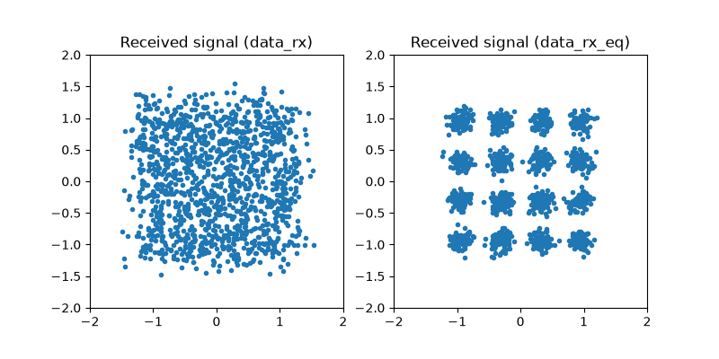
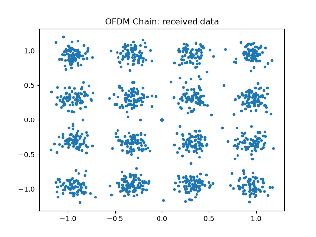

OFDM Tutorial
=============

In this tutorial, we compare the performance of a **Single Carrier (SC)** system
and an **OFDM** system over a **frequency-selective multipath channel** using the ``comnumpy`` library.

**What you'll learn:**

- How to define and simulate a frequency-selective channel.
- How to evaluate performance using the Symbol Error Rate (SER) and the runtime.
- What OFDM actually buys against single-carrier equalization -- and what it costs.

This tutorial is suitable for engineers and students interested in digital communications,
combining practical examples with theoretical insights.

Introduction
^^^^^^^^^^^^

Import Libraries
""""""""""""""""

We start by importing the necessary libraries:

.. literalinclude:: ../../examples/ofdm/one_shot_ofdm.py
   :language: python
   :lines: 1-11

Simulation Parameters
"""""""""""""""""""""

Next, we define the parameters of the communication chain,
including the modulation order and the channel impulse response for a frequency-selective channel:

.. literalinclude:: ../../examples/ofdm/one_shot_ofdm.py
   :language: python
   :lines: 15-26

Here, ``h`` represents the channel impulse response.
The first tap is normalized to 1 to preserve the overall channel energy.
The generator is seeded: the two chains below are compared on **one**
realization of that channel, so it has to be the same one on every run.

Frequency-Selective Channel
^^^^^^^^^^^^^^^^^^^^^^^^^^^

The input-output relation of a frequency-selective channel is:

.. math::

   z[n] = \sum_{l=0}^{L-1} h[l]\,x[n-l] + b[n]

where :math:`h[l]` are the channel taps and :math:`b[n]` is the noise.  
This is also called a Finite Impulse Response (FIR) channel.

Stacking :math:`N` samples into a vector form:

.. math::

   \mathbf{z} = \mathbf{H}\mathbf{x} + \mathbf{b}

where :math:`\mathbf{H}` is a Toeplitz convolution matrix constructed from the taps.  
This formulation highlights that **ISI (Inter-Symbol Interference)** is unavoidable in SC systems.  

Single-Carrier Communication Chain
^^^^^^^^^^^^^^^^^^^^^^^^^^^^^^^^^^

The SC chain is defined as:

.. mermaid::

   graph LR;
      A[Generator] --> B[Mapper];
      B --> C[Channel];
      C --> D[AWGN];
      D --> E[Equalizer];
      E --> F[Demapper];

At the receiver, we apply a **Zero-Forcing (ZF) equalizer**:

.. math::

   \widehat{\mathbf{x}} = \mathbf{H}^{\dagger}\mathbf{z}

where :math:`\mathbf{H}^{\dagger}` is the pseudo-inverse of :math:`\mathbf{H}`.

Implementation
""""""""""""""

The chain is implemented in **comnumpy** as follows:

.. literalinclude:: ../../examples/ofdm/one_shot_ofdm.py
   :language: python
   :lines: 28-41

Results
"""""""

We evaluate the performance by computing the SER and the execution time,
then plot the constellation before and after equalization:

.. literalinclude:: ../../examples/ofdm/one_shot_ofdm.py
   :language: python
   :lines: 43-60

For the SC chain, we obtain:

.. code::

   SER: 0.0
   elapsed time: 1.21 s

Not a single symbol error -- and more than a second of computation for 1280
symbols. Both numbers matter, and the second is the one to keep in mind:
the ZF equalizer builds the :math:`N \times N` convolution matrix and
pseudo-inverts it, which costs :math:`O(N^3)`.

OFDM Communication Chain
^^^^^^^^^^^^^^^^^^^^^^^^

In SC systems, equalization requires matrix inversion, which is computationally expensive.
OFDM transforms the channel into a set of parallel flat-fading subchannels,
each equalized with a **simple one-tap filter**.
This drastically reduces computational complexity and improves performance.

The OFDM chain can be visualized as:

.. mermaid::

   graph LR;
      A[Generator] --> B[Mapper];
      B --> C[OFDM Tx];
      C --> D[Channel];
      D --> E[AWGN];
      E --> F[OFDM Rx];
      F --> G[Demapper];

* Transmitter (TX)

.. mermaid::

   graph LR;
      A[Mapper] --> B[S2P];
      B --> C[IDFT];
      C --> D[CP add];
      D --> E[P2S];

* Receiver (RX)

.. mermaid::

   graph LR;
      A[P2S] --> B[CP del];
      B --> C[DFT];
      C --> D[Equalizer];
      D --> E[P2S];

Key blocks:

- **S2P / P2S**: Serial-to-Parallel and Parallel-to-Serial converters.  
- **IDFT / DFT**: Transform between frequency and time domains.  
- **CP add / CP del**: Insert/remove Cyclic Prefix to handle ISI.  
- **Equalizer**: One-tap equalization per subcarrier.  

Mathematically, the received vector is:

.. math::

   \mathbf{z} = \mathbf{D}\mathbf{x} + \mathbf{n}

with :math:`\mathbf{D} = \mathrm{diag}(H[0], H[1], \dots, H[N-1])`,  
where :math:`H[k]` is the channel frequency response.  
Thus, OFDM reduces equalization to a **diagonal system**.

Implementation
""""""""""""""

The OFDM chain in **comnumpy** is implemented as:

.. literalinclude:: ../../examples/ofdm/one_shot_ofdm.py
   :language: python
   :lines: 62-78

Results
"""""""

We compute the SER and runtime, then plot the received constellation:

.. literalinclude:: ../../examples/ofdm/one_shot_ofdm.py
   :language: python
   :lines: 80-92

For the OFDM chain, we obtain:

.. code::

   SER: 0.00546875
   elapsed time: 0.0010 s

Read the two lines together, because the honest conclusion is not the one
usually advertised. On **this** channel and uncoded, OFDM is *worse* in raw
symbol error rate: block ZF inverts the whole convolution matrix at once and
handles every frequency optimally, while OFDM equalizes each subcarrier on its
own and amplifies the noise on those that happen to fall in a spectral notch.
There is no coding across subcarriers here to repair them.

What changes by **three orders of magnitude** is the cost: 1.21 s against
1.0 ms for the same 1280 symbols. And that ratio is not a constant -- the SC
equalizer grows as :math:`N^3` while OFDM grows as :math:`N \log N`, so the
comparison only gets more lopsided with the block size. This is why real
systems are OFDM *plus* a code spread over the subcarriers: the code buys back
the error rate, and the FFT keeps the receiver affordable.

Conclusion
^^^^^^^^^^

You have compared **Single Carrier** and **OFDM** systems over a multipath channel.

You have learned how to:

- Model a frequency-selective FIR channel in ``comnumpy``.
- Simulate both SC and OFDM systems on the same channel realization.
- Apply ZF equalization (SC) vs. one-tap equalization (OFDM).
- Compare the two in symbol error rate *and* in computational cost, and see
  that the second is where the difference lies.

Key takeaway:
**OFDM turns a frequency-selective channel into a set of flat subchannels, so
equalization becomes one complex division per subcarrier instead of an**
:math:`N \times N` **matrix inversion. That is what makes wideband receivers
affordable; the per-subcarrier error rate it gives up is bought back by coding
across the subcarriers.**

