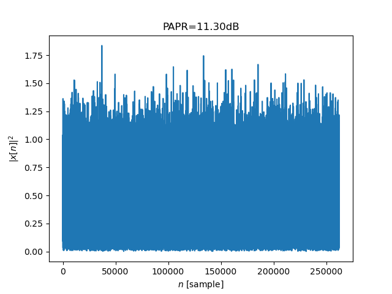
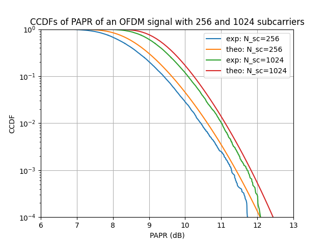

PAPR in OFDM Communication
==========================

In this tutorial, we will compute the **Peak-to-Average Power Ratio (PAPR)** 
of an OFDM signal using the ``comnumpy`` library.  
We will reproduce the first figure from the article:

* "An overview of peak-to-average power ratio reduction techniques for multicarrier transmission"  
  by Han and Lee (2005).

You will learn how to:

- Build an OFDM chain with multiple subcarriers.
- Compute the PAPR of a single OFDM signal.
- Evaluate the **Complementary Cumulative Distribution Function (CCDF)** of PAPR.
- Compare simulation results with theoretical curves.

Introduction
^^^^^^^^^^^^

Import Libraries
""""""""""""""""

We start by importing the necessary libraries:

.. literalinclude:: ../../examples/ofdm/monte_carlo_ofdm_papr.py
   :language: python
   :lines: 1-13

Define Parameters
"""""""""""""""""

Next, we define the simulation parameters:  
the number of subcarriers, modulation, oversampling factor, and thresholds for PAPR analysis.

.. literalinclude:: ../../examples/ofdm/monte_carlo_ofdm_papr.py
   :language: python
   :lines: 16-25

Here:

- ``N_sc``: number of subcarriers (1024 by default).  
- ``L``: number of OFDM symbols to generate.  
- ``os``: oversampling factor, used to better approximate the continuous-time signal.  
- ``papr_dB_threshold``: thresholds (in dB) for computing theoretical CCDF curves.  

OFDM Communication Chain
^^^^^^^^^^^^^^^^^^^^^^^^

We now build an OFDM transmission chain using ``Sequential``.  
It includes symbol generation, mapping, serial-to-parallel conversion, 
carrier allocation, and IFFT processing.

.. literalinclude:: ../../examples/ofdm/monte_carlo_ofdm_papr.py
   :language: python
   :lines: 29-40

PAPR metric
"""""""""""

When applying the Inverse Fourier Transform, we don't control the signal amplitude of the transformed signal. This can 
be challenging for communications sensible non-linearities.

To evaluate the amplitude of the generated signal, one popular metric is the Peak-to-Average Power Ratio (PAPR).
Mathematically, the PAPR is defined as:

.. math::

   \mathrm{PAPR} = \frac{\max{|x[n]|^2}}{\mathbb{E}[|x[n]|^2]}

where :math:`x[n]` is the transmitted OFDM signal.

One Shot Signal
"""""""""""""""

Before running Monte Carlo simulations, we can evaluate the PAPR of a **single OFDM signal** 
and plot its instantaneous power.   The computed PAPR value is displayed in the title of the figure.

.. literalinclude:: ../../examples/ofdm/monte_carlo_ofdm_papr.py
   :language: python
   :lines: 42-51

This produces a figure similar to:

Monte Carlo Simulation of CCDF
^^^^^^^^^^^^^^^^^^^^^^^^^^^^^^

We now perform a Monte Carlo simulation to estimate the **CCDF of the PAPR** 
for two configurations (256 and 1024 subcarriers).  
For each case, we also compare the results with the theoretical CCDF:

.. literalinclude:: ../../examples/ofdm/monte_carlo_ofdm_papr.py
   :language: python
   :lines: 54-88

The theoretical CCDF is given by:

.. math::

   \mathrm{CCDF} = 1 - \big(1 - e^{-\gamma}\big)^{N_{sc} \cdot os}

where :math:`\gamma` is the normalized PAPR threshold.  

The final figure displays both the experimental and theoretical CCDFs for 
``N_sc = 256`` and ``N_sc = 1024`` subcarriers.

As expected, the probability of large PAPR values increases with the number of subcarriers.  
For example, with 1024 subcarriers and an oversampling factor of 4, 
a **PAPR around 12 dB** is typically observed at CCDF = 10⁻³.

7. Conclusion
^^^^^^^^^^^^^

Congratulations 🎉 You have successfully simulated the **PAPR of an OFDM signal** 
and compared experimental results with theoretical CCDFs.  

You have learned how to:

- Define an OFDM chain with adjustable parameters.  
- Compute the PAPR of a single OFDM waveform.  
- Estimate the CCDF of the PAPR through Monte Carlo simulation.  
- Compare simulation results with theoretical benchmarks.  

Key takeaway:  
**OFDM signals exhibit high PAPR (≈10–13 dB depending on system size), 
which motivates PAPR reduction techniques such as clipping, coding, or tone reservation.**
