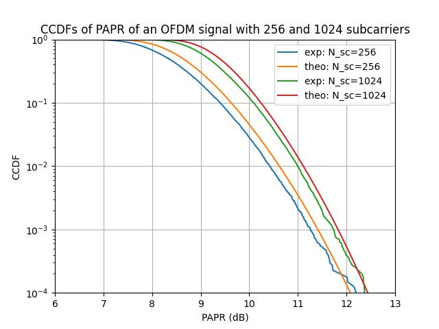

PAPR in OFDM Communication
==========================

This tutorial guides you through computing the Peak-to-Average Power Ratio (PAPR) of an Orthogonal Frequency-Division Multiplexing (OFDM) signal using the ``comnumpy`` library. We will reproduce the first figure from the following article :

* "An overview of peak-to-average power ratio reduction techniques for multicarrier transmission" by Han and Lee (2005).

Prerequisites
-------------

Ensure you have the following Python libraries installed:
- ``numpy``
- ``matplotlib``
- ``tqdm``
- ``comnumpy``

You can install any missing libraries using pip:

.. code-block:: bash

    pip install numpy matplotlib tqdm

Simulation Setup
----------------

1. Import Libraries
^^^^^^^^^^^^^^^^^^^

Begin by importing the necessary libraries:

.. code-block:: python

    import numpy as np
    import matplotlib.pyplot as plt
    from tqdm import tqdm
    from comnumpy.core import Sequential
    from comnumpy.core.generators import SymbolGenerator
    from comnumpy.core.mappers import SymbolMapper
    from comnumpy.core.processors import Serial2Parallel
    from comnumpy.core.utils import get_alphabet
    from comnumpy.core.metrics import compute_ccdf
    from comnumpy.ofdm.processors import CarrierAllocator, IFFTProcessor
    from comnumpy.ofdm.metrics import compute_PAPR

2. Define Parameters
^^^^^^^^^^^^^^^^^^^^

Set the parameters for the simulation:

.. code-block:: python

    N_cp = 0  # No cyclic prefix
    N_sc_list = [256, 1024]  # Number of subcarriers to test
    L = 10000  # Number of OFDM symbols
    type, M = "PSK", 4  # Modulation type and order
    alphabet = get_alphabet(type, M)
    alphabet_generator = np.arange(M)
    papr_dB_threshold = np.arange(4, 13, 0.1)
    gamma = 10**(papr_dB_threshold/10)
    os = 4  # Oversampling factor

3. Create Communication Chain
^^^^^^^^^^^^^^^^^^^^^^^^^^^^^

Define the OFDM communication chain using the ``Sequential`` class:

.. code-block:: python

    chain = Sequential([
        SymbolGenerator(M),
        SymbolMapper(alphabet),
        Serial2Parallel(N_sc_list[0], name="s2p"),
        CarrierAllocator(carrier_type=[], name="carrier_allocator"),
        IFFTProcessor(),
    ])

4. Perform Simulation
^^^^^^^^^^^^^^^^^^^^^

Run the simulation for each number of subcarriers:

.. code-block:: python

    for N_sc in tqdm(N_sc_list):
        # Set Serial2Parallel and Carrier Allocation
        carrier_type = np.zeros(os * N_sc)
        carrier_type[:N_sc] = 1

        chain["s2p"].set_N_sub(N_sc)
        chain["carrier_allocator"].set_carrier_type(carrier_type)

        # Generate data
        N = N_sc * os * L
        y = chain(N)

        # Compute PAPR
        papr_dB_array = compute_PAPR(y, unit="dB", axis=0)

        # Compute and plot CCDF
        papr_dB, ccdf = compute_ccdf(papr_dB_array)
        plt.semilogy(papr_dB, ccdf, label=f"exp: N_sc={N_sc}")

        # Plot theoretical CCDF
        ccdf_theo = 1 - (1 - np.exp(-gamma))**(N_sc * os)
        plt.semilogy(papr_dB_threshold, ccdf_theo, label=f"theo: N_sc={N_sc}")

5. Plot Results
^^^^^^^^^^^^^^^

Visualize the Complementary Cumulative Distribution Function (CCDF) of the PAPR:

.. code-block:: python

    plt.ylim([1e-4, 1])
    plt.xlim([6, 13])
    plt.xlabel("PAPR (dB)")
    plt.ylabel("CCDF")
    plt.title("CCDFs of PAPR of an OFDM signal with 256 and 1024 subcarriers")
    plt.grid()
    plt.legend()
    plt.show()

Conclusion
----------

This tutorial demonstrated how to compute and visualize the PAPR of an OFDM signal using the ``comnumpy`` library. You learned how to set up the simulation parameters, create the OFDM communication chain, compute the PAPR, and plot the CCDF. The results were compared with theoretical CCDF curves to validate the implementation.

Complete Code
-------------

.. literalinclude:: ../../examples/ofdm/monte_carlo_ofdm_papr.py
   :language: python
   :caption: PAPR Computation in OFDM Communication
