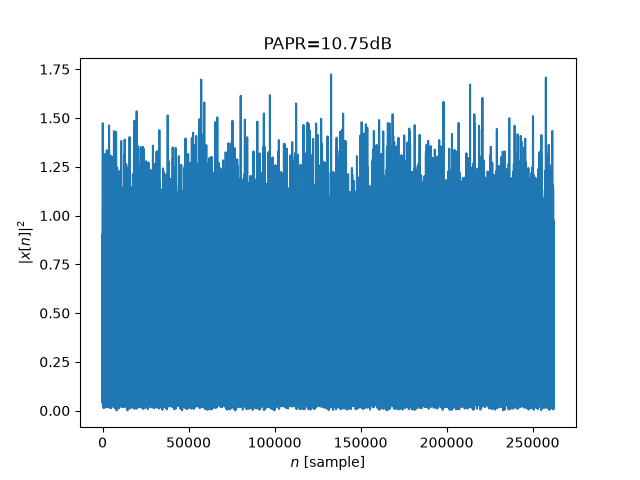
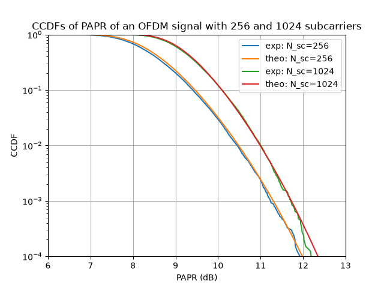

PAPR in OFDM Communication
==========================

The previous tutorial ended well for OFDM: one division per subcarrier
instead of a matrix inversion. This one is the bill.

An OFDM symbol is the sum of :math:`N` subcarriers. Most of the time they
interfere every which way and the sum stays moderate -- but occasionally they
align, and the waveform produces a peak far above its average power. The
amplifier has to be sized for that peak while being paid for the average,
which is the single most quoted drawback of the format.

The metric that quantifies it is the **peak-to-average power ratio**, and
what matters is not its typical value but how often it is exceeded -- a
distribution, not a number. We reproduce the first figure of:

* "An overview of peak-to-average power ratio reduction techniques for multicarrier transmission"  
  by Han and Lee (2005).

.. note::

   **Before you start.** :doc:`ofdm` built the OFDM transmitter this
   tutorial reuses. Here we do not look at the error rate at all, but at the
   shape of the waveform itself.

**What you'll learn:**

- How to build an OFDM chain with multiple subcarriers.
- How to compute the PAPR of a single OFDM signal.
- How to evaluate the **Complementary Cumulative Distribution Function (CCDF)** of the PAPR.
- How to compare simulation results with theoretical curves.

Introduction
^^^^^^^^^^^^

Import Libraries
""""""""""""""""

We start by importing the necessary libraries:

.. literalinclude:: ../../examples/ofdm/monte_carlo_ofdm_papr.py
   :language: python
   :lines: 1-13

Define Parameters
"""""""""""""""""

Next, we define the simulation parameters:  
the number of subcarriers, modulation, oversampling factor, and thresholds for PAPR analysis.

.. literalinclude:: ../../examples/ofdm/monte_carlo_ofdm_papr.py
   :language: python
   :lines: 16-26

Here:

- ``N_sc``: number of subcarriers (1024 by default).  
- ``L``: number of OFDM symbols to generate.  
- ``os``: oversampling factor, used to better approximate the continuous-time signal.  
- ``papr_dB_threshold``: thresholds (in dB) for computing theoretical CCDF curves.  

OFDM Communication Chain
^^^^^^^^^^^^^^^^^^^^^^^^

We now build an OFDM transmission chain using ``Sequential``.  
It includes symbol generation, mapping, serial-to-parallel conversion, 
carrier allocation, and IFFT processing.

.. literalinclude:: ../../examples/ofdm/monte_carlo_ofdm_papr.py
   :language: python
   :lines: 29-40

PAPR metric
"""""""""""

After the Inverse Fourier Transform, the resulting time-domain signal can exhibit large amplitude peaks.
This is problematic for systems sensitive to nonlinearities (e.g., power amplifiers).

A widely used metric to quantify this effect is the Peak-to-Average Power Ratio (PAPR),
defined as:

.. math::

   \mathrm{PAPR} = \frac{\max{|x[n]|^2}}{\mathbb{E}[|x[n]|^2]}

where :math:`x[n]` is the transmitted OFDM signal.

One Shot Signal
"""""""""""""""

Before running Monte Carlo simulations, we evaluate the PAPR of a **single OFDM signal**
and plot its instantaneous power. The computed PAPR value is displayed in the figure title.

.. literalinclude:: ../../examples/ofdm/monte_carlo_ofdm_papr.py
   :language: python
   :lines: 42-51

This produces a figure similar to:

Monte Carlo Simulation of CCDF
^^^^^^^^^^^^^^^^^^^^^^^^^^^^^^

We now perform a Monte Carlo simulation to estimate the **CCDF of the PAPR**
for two configurations (256 and 1024 subcarriers).
For each case, we compare the simulation results with the theoretical CCDF:

.. literalinclude:: ../../examples/ofdm/monte_carlo_ofdm_papr.py
   :language: python
   :lines: 54-88

The theoretical CCDF is given by:

.. math::

   \mathrm{CCDF} = 1 - \big(1 - e^{-\gamma}\big)^{N_{sc} \cdot os}

where :math:`\gamma` is the normalized PAPR threshold.  

The resulting figure displays both the experimental and theoretical CCDFs for
``N_sc = 256`` and ``N_sc = 1024`` subcarriers.

As expected, the probability of large PAPR values increases with the number of
subcarriers. Solving the expression above for :math:`\mathrm{CCDF} = 10^{-3}`
gives **11.41 dB** for 256 subcarriers and **11.83 dB** for 1024, both at
oversampling 4 -- and the simulated curves sit on them. Four times as many
subcarriers cost only 0.4 dB, because the number of samples enters through a
logarithm: the peak of a sum of many independent terms grows very slowly with
how many there are.

Conclusion
^^^^^^^^^^

You have successfully simulated the **PAPR of an OFDM signal**
and compared experimental results with theoretical CCDFs.

You have learned how to:

- Define an OFDM chain with adjustable parameters.
- Compute the PAPR of a single OFDM waveform.
- Estimate the CCDF of the PAPR through Monte Carlo simulation.
- Compare simulation results with theoretical benchmarks.

Key takeaway:
**OFDM signals exhibit high PAPR (around 10-13 dB depending on system size),
which motivates PAPR reduction techniques such as clipping, coding, or tone
reservation.** The library ships several of them, in
``examples/ofdm/one_shot_ofdm_papr_reduction.py``.

Next, :doc:`multipath` goes back to the channel and settles the number the
OFDM tutorial took for granted: how long the cyclic prefix has to be.
