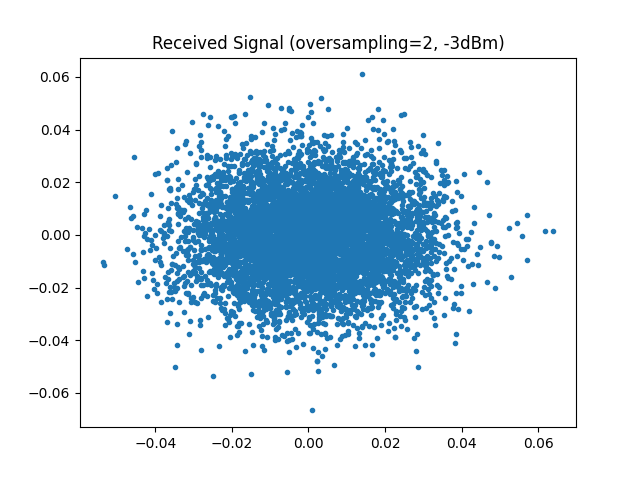
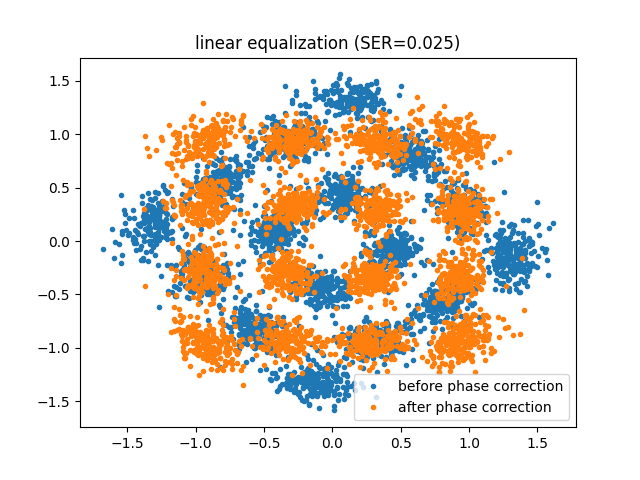
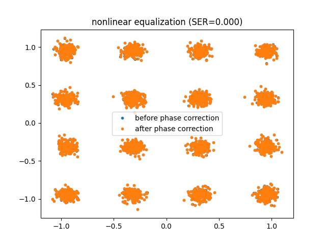

Optical Fiber Link Simulation Tutorial
======================================

This tutorial demonstrates how to simulate a nonlinear optical fiber communication system using the ``comnumpy`` library. You will learn how to:

- Build a simulation chain with QAM modulation, pulse shaping, and fiber propagation.
- Visualize received signals before and after linear and nonlinear equalization.
- Apply digital back-propagation (DBP) for nonlinear compensation.
- Compute Symbol Error Rate (SER) to quantify performance.

This tutorial is ideal for engineers or students interested in optical communications and nonlinear fiber effects.

1. Introduction
^^^^^^^^^^^^^^^

Prerequisites
"""""""""""""

Ensure you have the following Python libraries installed:

.. code::

   numpy
   matplotlib
   comnumpy

Note that the simulation can be computationally intensive and may take some time to run depending on your machine.

Simulation Setup
^^^^^^^^^^^^^^^^

1. Import Libraries
^^^^^^^^^^^^^^^^^^^

First, import necessary Python libraries and components from ``comnumpy``:

.. literalinclude:: ../../examples/optical/one_shot_NLI.py
   :language: python
   :lines: 1-13

2. Define System Parameters
^^^^^^^^^^^^^^^^^^^^^^^^^^^

Set key parameters such as modulation order, oversampling factors, fiber link properties, and noise figure:

.. literalinclude:: ../../examples/optical/one_shot_NLI.py
   :language: python
   :lines: 16-37

3. Create Communication Chain
^^^^^^^^^^^^^^^^^^^^^^^^^^^^^

Build a processing chain consisting of symbol generation, mapping, pulse shaping (SRRC filter), amplification, fiber propagation via ``FiberLink``, and final filtering/downsampling:

.. literalinclude:: ../../examples/optical/one_shot_NLI.py
   :language: python
   :lines: 39-51

This simulates the full transmission over an optical fiber with nonlinear effects and noise.

The optical channel (``Fiber_Link``) is modeled as a concatenation of multiple spans of standard single-mode fiber (SMF), denoted by ``N_span``. Each span has a fixed length ``L_span`` (typically 80 km) and is followed by an Erbium-Doped Fiber Amplifier (EDFA) which compensates for the fiber loss and introduces amplified spontaneous emission noise (characterized by the noise figure ``NF_dB``). 

Within each fiber span, the signal undergoes chromatic dispersion as well as nonlinear Kerr effects (simulated using Split Step Fourier Method), which distort the signal amplitude and phase. This complex interplay between dispersion and nonlinearity significantly affects system performance and motivates the use of advanced digital signal processing techniques.

4. Run Simulation and Extract Signals
^^^^^^^^^^^^^^^^^^^^^^^^^^^^^^^^^^^^^

Execute the chain to obtain the received signal. Extract transmitted data and signal for analysis. Then, plot the received constellation diagram to inspect signal quality at the receiver input.

.. literalinclude:: ../../examples/optical/one_shot_NLI.py
   :language: python
   :lines: 53-65

5. Visualize Received Signal
^^^^^^^^^^^^^^^^^^^^^^^^^^^^^

6. Perform Linear and Nonlinear Compensation
^^^^^^^^^^^^^^^^^^^^^^^^^^^^^^^^^^^^^^^^^^^^^

Apply two compensation strategies using Digital Back-Propagation (DBP):

- Linear equalization only : compensates for linear impairments such as chromatic dispersion and attenuation.
- Nonlinear equalization with Digital Back Propagation (DBP): performs full Digital Back-Propagation (DBP), which mitigates nonlinear fiber effects by numerically inverting the propagation through the fiber using a reversed Split-Step Fourier Method..

Note that after compensation, the received signal may experience a residual phase rotation. Therefore, for each compensation technique, phase correction is applied before computing the Symbol Error Rate (SER).

.. literalinclude:: ../../examples/optical/one_shot_NLI.py
   :language: python
   :lines: 65-98

Conclusion
^^^^^^^^^^

This tutorial showed how to:

- Model an optical fiber communication system with nonlinear effects.
- Use SRRC filtering and oversampling to shape signals.
- Simulate fiber propagation with noise and nonlinearities.
- Apply linear and nonlinear compensation techniques (DBP).
- Quantify performance improvements via SER metrics.

The simulation provides valuable insights into advanced fiber-optic communication design and compensation methods using the ``comnumpy`` framework.
