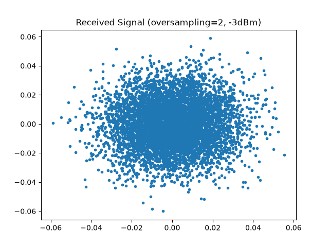
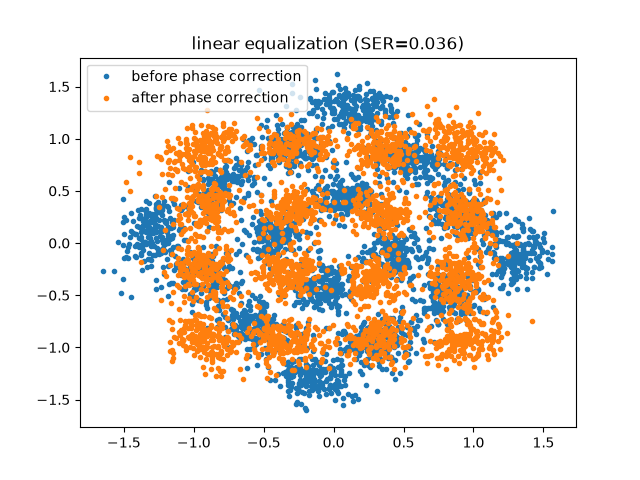
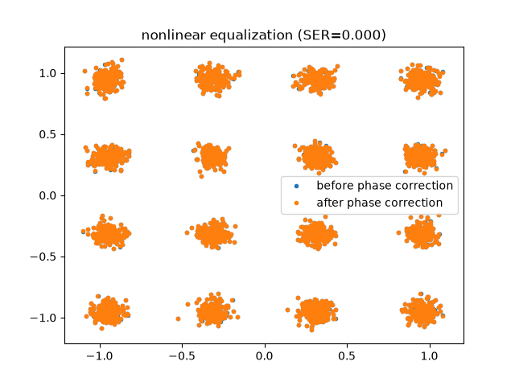

Optical Fiber Link Simulation Tutorial
======================================

This tutorial demonstrates how to simulate a nonlinear optical fiber communication system using ``comnumpy``.

**What you'll learn:**

- How to build a simulation chain with QAM modulation, pulse shaping, and fiber propagation.
- How to visualize received signals before and after linear and nonlinear equalization.
- How to apply digital back-propagation (DBP) for nonlinear compensation.
- How to compute the Symbol Error Rate (SER) to quantify what each stage recovers.

This tutorial is suited for engineers and students interested in optical communications and nonlinear fiber effects.

Introduction
^^^^^^^^^^^^

Prerequisites
"""""""""""""

Ensure you have the following Python libraries installed:

.. code::

   numpy
   matplotlib
   comnumpy

Note that the simulation can be computationally intensive and may take some time to run depending on your machine.

Simulation Setup
^^^^^^^^^^^^^^^^

Import Libraries
""""""""""""""""

First, import the necessary libraries and ``comnumpy`` components:

.. literalinclude:: ../../examples/optical/one_shot_NLI.py
   :language: python
   :lines: 1-13

Define System Parameters
""""""""""""""""""""""""

Set key parameters such as modulation order, oversampling factors, fiber link properties, and noise figure:

.. literalinclude:: ../../examples/optical/one_shot_NLI.py
   :language: python
   :lines: 16-37

Create Communication Chain
""""""""""""""""""""""""""

Build a processing chain consisting of symbol generation, mapping, pulse shaping (SRRC filter), amplification, fiber propagation via ``FiberLink``, and matched filtering with downsampling:

.. literalinclude:: ../../examples/optical/one_shot_NLI.py
   :language: python
   :lines: 39-51

This simulates the full transmission over an optical fiber with nonlinear effects and noise.

The optical channel (``FiberLink``) is modeled as a concatenation of ``N_span`` spans of standard single-mode fiber (SMF). Each span has a fixed length ``L_span`` (typically 80 km) and is followed by an Erbium-Doped Fiber Amplifier (EDFA), which compensates for fiber loss while introducing amplified spontaneous emission (ASE) noise (characterized by the noise figure ``NF_dB``).

Within each span, the signal undergoes chromatic dispersion and nonlinear Kerr effects, simulated using the Split-Step Fourier Method (SSFM). The interplay between dispersion and nonlinearity distorts the signal amplitude and phase, motivating the use of advanced digital signal processing techniques at the receiver.

Run Simulation and Extract Signals
"""""""""""""""""""""""""""""""""""

Execute the chain and extract the transmitted and received signals. Then, plot the received constellation diagram to inspect signal quality at the receiver.

.. literalinclude:: ../../examples/optical/one_shot_NLI.py
   :language: python
   :lines: 51-62

Received Signal
^^^^^^^^^^^^^^^

Linear and Nonlinear Compensation
^^^^^^^^^^^^^^^^^^^^^^^^^^^^^^^^^^

We apply two compensation strategies:

- **Linear equalization**: compensates for linear impairments such as chromatic dispersion and attenuation.
- **Nonlinear equalization (DBP)**: performs full Digital Back-Propagation, which mitigates nonlinear fiber effects by numerically inverting the propagation using a reversed Split-Step Fourier Method.

After compensation, the received signal may exhibit a residual phase rotation. Therefore, phase correction is applied before computing the Symbol Error Rate (SER).

.. literalinclude:: ../../examples/optical/one_shot_NLI.py
   :language: python
   :lines: 64-100

.. code::

   linear equalization      SER=0.0361  residual phase=-38.8 deg
   nonlinear equalization   SER=0.0000  residual phase=-0.9 deg

The residual phase is the reading that names the culprit. Linear equalization
undoes the dispersion and the loss, and leaves a **38.8 degree** rotation of
the whole constellation: that is self-phase modulation, the Kerr effect
turning average power into phase, which no linear filter can undo. Correcting
that rotation is not enough either -- the remaining scatter still costs 3.6 %
of the symbols, because the nonlinearity acts *along* the fibre, interleaved
with the dispersion, and not as one rotation at the end.

Digital back-propagation inverts that interleaving: it propagates the received
signal back through the same split-step model with the signs of the dispersion
and the nonlinearity reversed. The residual rotation falls to a degree and not
a single symbol error is left.

Conclusion
^^^^^^^^^^

This tutorial showed how to:

- Model an optical fiber communication system with nonlinear effects.
- Use SRRC filtering and oversampling to shape signals.
- Simulate fiber propagation with noise and nonlinearities.
- Apply linear and nonlinear compensation techniques (DBP).
- Quantify performance improvements via SER metrics.

This simulation illustrates how ``comnumpy`` can be used to study advanced fiber-optic communication design and compensation techniques.
