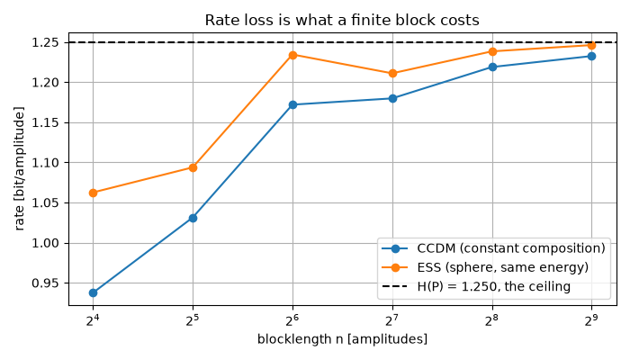
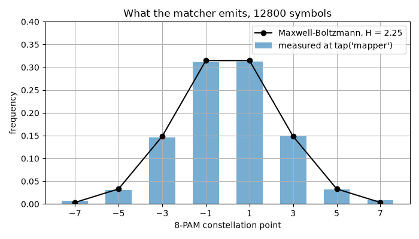

Probabilistic Shaping
=====================

In this tutorial, we send some constellation points more often than others.
A uniform QAM or PAM constellation is not the best a Gaussian channel can do:
it loses up to **1.53 dB** against a Gaussian input, and that loss is recovered
by choosing *how often* each point is transmitted rather than by changing the
points themselves.

**What you'll learn:**

- Why the shaped distribution is Maxwell-Boltzmann, and nothing else.
- How a *distribution matcher* turns uniform data bits into shaped symbols,
  exactly and invertibly (CCDM and ESS).
- How to assemble a probabilistic amplitude shaping (PAS) transmitter as a
  ``Sequential`` chain, and why the FEC decoder belongs *before* the dematcher.
- How to measure what shaping actually buys, in bit/symbol and in dB.

Introduction
^^^^^^^^^^^^

Prerequisites
"""""""""""""

Make sure you have the following Python libraries installed:

.. code::

   numpy
   matplotlib
   comnumpy

Import Libraries
""""""""""""""""

.. literalinclude:: ../../examples/simple/probabilistic_shaping.py
   :language: python
   :lines: 1-14

Define Parameters
"""""""""""""""""

We work on 8-PAM written on its natural odd-integer grid. Shaping is a
one-dimensional operation -- a square QAM constellation is the product of two
PAM axes, so shaping the axis shapes the QAM -- and a matcher only ever sees
the **positive half** of the grid, for a reason explained in the PAS section
below.

.. literalinclude:: ../../examples/simple/probabilistic_shaping.py
   :language: python
   :lines: 16-21

The Law: Maxwell-Boltzmann
^^^^^^^^^^^^^^^^^^^^^^^^^^

The shaped distribution is not a modelling choice. Among all distributions on
a fixed constellation with a given average energy, the one of maximum entropy
is

.. math::

   p_i = \frac{e^{-\lambda \left|a_i\right|^2}}
              {\sum_j e^{-\lambda \left|a_j\right|^2}},
   \qquad \lambda \geq 0

where :math:`\lambda` is the Lagrange multiplier of the power constraint.
:math:`\lambda = 0` gives the uniform distribution; growing :math:`\lambda`
moves probability mass onto the inner points, lowering the energy *and* the
entropy. Since the entropy is strictly decreasing in :math:`\lambda`, asking
for a target entropy determines :math:`\lambda` uniquely -- and that is the
useful parameterization, because the entropy

.. math::

   H(P) = -\sum_i p_i \log_2 p_i

*is* the rate the constellation carries. This is what
:func:`~comnumpy.core.shaping.maxwell_boltzmann` computes, by bisection on
:math:`\lambda`.

What is gained is measured at **equal rate**, which is the only fair
comparison: a source of entropy :math:`H` spread uniformly over a grid of
spacing :math:`\Delta` would occupy an interval of width :math:`2^H \Delta`
and cost :math:`E_{\mathrm{unif}} = (2^H \Delta)^2 / 12`, against the
:math:`E_P = \sum_i p_i a_i^2` the shaped law actually costs:

.. math::

   G_s = 10 \log_{10} \frac{E_{\mathrm{unif}}}{E_P}

.. literalinclude:: ../../examples/simple/probabilistic_shaping.py
   :language: python
   :lines: 23-31

.. code::

   H = 3.00 bit/symbol    energy  21.000    shaping gain 0.068 dB
   H = 2.50 bit/symbol    energy   7.542    shaping gain 1.505 dB
   H = 2.00 bit/symbol    energy   3.747    shaping gain 1.533 dB
   H = 1.50 bit/symbol    energy   1.874    shaping gain 1.531 dB
   ultimate gain 10log10(pi e / 6) = 1.533 dB

Read the first line as the calibration: the uniform distribution scores
0.068 dB, i.e. essentially nothing, which is what a definition of "shaping
gain" must give if it is worth anything. The last lines reach
:math:`10\log_{10}(\pi e/6) = 1.53` dB, the supremum over *all*
one-dimensional distributions (Forney and Wei, 1989) -- but at 2 bit/symbol,
not at 3: an 8-point constellation asked to carry 3 bit/symbol has no freedom
left, so there is nothing to shape. **Shaping gain is bought with rate**, and
that trade is the subject of the last section.

.. literalinclude:: ../../examples/simple/probabilistic_shaping.py
   :language: python
   :lines: 33-43

.. image:: img/probabilistic_shaping_fig1.png
   :width: 100%
   :align: center

The Matchers: CCDM and ESS
^^^^^^^^^^^^^^^^^^^^^^^^^^

Data is uniform. A **distribution matcher** is an invertible map from uniform
bit strings onto sequences with the wanted distribution -- and "invertible"
here is exact, not approximate: both constructions below are *enumerative
codes*, which rank and unrank a finite set of blocks with integer arithmetic,
so ``decode(encode(bits)) == bits`` holds by construction.

They differ in which set they enumerate.

**CCDM** fixes the composition. Every output block contains exactly
:math:`n_i` copies of amplitude :math:`i`, and there are

.. math::

   N = \binom{n}{n_1, \ldots, n_M} = \frac{n!}{n_1! \, n_2! \cdots n_M!}

such blocks, so the matcher carries
:math:`k = \lfloor \log_2 N \rfloor` bits. Every block has the target
empirical distribution *exactly*, at any blocklength. What a finite block
costs is rate:

.. math::

   R_{\mathrm{loss}} = H\left(\frac{n_i}{n}\right) - \frac{k}{n}
   \;\xrightarrow[n \to \infty]{}\; 0

**ESS** fixes an energy budget instead. With an integer energy :math:`e_i`
attached to each amplitude, the code is

.. math::

   \mathcal{C} = \left\{ (s_1, \ldots, s_n) :
   \sum_{j=1}^{n} e_{s_j} \leq E_{\max} \right\}

and counting it is a one-dimensional recursion over the remaining budget,

.. math::

   N_t(E) = \sum_{i} N_{t-1}\left(E - e_i\right), \qquad
   N_0(E) = 1 \;\; \text{for } E \geq 0

from which unranking follows exactly as for CCDM.

The comparison below is not a benchmark, it is an inclusion. Every CCDM block
costs exactly :math:`E = \sum_i n_i e_i`, so if the sphere is given
:math:`E_{\max} = E` then **every CCDM block is in the sphere**:
:math:`\mathcal{C}_{\mathrm{CCDM}} \subset \mathcal{C}_{\mathrm{ESS}}`. The
sphere therefore carries at least as many bits at the same energy, and its
blocks are on average *cheaper*, since it also contains the blocks that spend
less. The script measures both readings -- same energy, and same rate:

.. literalinclude:: ../../examples/simple/probabilistic_shaping.py
   :language: python
   :lines: 45-67

.. code::

   n =   16   composition (10, 5, 1, 0)   rate 0.9375 vs 1.0625 bit/amplitude   energy    8 vs    7 at equal rate
   n =   32   composition (20, 10, 2, 0)   rate 1.0312 vs 1.0938 bit/amplitude   energy   16 vs   14 at equal rate
   n =   64   composition (40, 19, 4, 1)   rate 1.1719 vs 1.2344 bit/amplitude   energy   37 vs   33 at equal rate
   n =  128   composition (81, 38, 8, 1)   rate 1.1797 vs 1.2109 bit/amplitude   energy   68 vs   65 at equal rate
   n =  256   composition (161, 76, 17, 2)   rate 1.2188 vs 1.2383 bit/amplitude   energy  139 vs  135 at equal rate
   n =  512   composition (322, 152, 34, 4)   rate 1.2324 vs 1.2461 bit/amplitude   energy  278 vs  272 at equal rate

At :math:`n = 16` the sphere carries 13 % more bits than the constant
composition; at :math:`n = 512` the two have nearly converged to the entropy
of the law, 1.25 bit/amplitude. That is the whole reason ESS exists: CCDM
needs thousands of symbols to be efficient, ESS is already good at a few
dozen, which is the regime of a short packet. What ESS gives up is the exact
per-block distribution -- it only reproduces the law on average.

.. literalinclude:: ../../examples/simple/probabilistic_shaping.py
   :language: python
   :lines: 69-80

The convergence is not monotone, and the dip at :math:`n = 128` is not noise:
the composition is a *rounding* of the law
(:func:`~comnumpy.core.shaping.composition_from_distribution`, largest
remainder), so its own entropy wobbles around :math:`H(P)` as :math:`n` grows.
A finite block loses rate twice -- once by quantizing the law, once by taking
the floor of :math:`\log_2 N`.

The Transmitter: a PAS Chain
^^^^^^^^^^^^^^^^^^^^^^^^^^^^

The standard architecture is **probabilistic amplitude shaping**: the matcher
shapes the amplitudes, a systematic FEC encoder produces the parity bits, and
those parity bits -- which are uniform -- become the **signs**. A sign is
equiprobable, so it costs nothing in shaping:

.. math::

   P_Y(\pm a_i) = \tfrac{1}{2} P_A(a_i)

The composite constellation keeps the symmetric Maxwell-Boltzmann law at the
same energy, and gains exactly one bit per symbol. This is why the matchers
work on non-negative amplitudes, and why a target of 2.25 bit/symbol on 8-PAM
is a target of 1.25 bit/amplitude on the four amplitudes.

As a chain, that is six blocks -- and the receiver is the transmitter read
backwards:

The chain, as the chain itself describes it:

.. mermaid:: mermaid/shaping_pas.mmd

The diagram above is not drawn by hand. It is what the chain says about
itself -- ``chain.to_mermaid()`` (decision D33c) -- exported by the
script, so the block names are the ones the code uses and a dashed
outline marks a tapped block:

.. literalinclude:: ../../examples/simple/probabilistic_shaping.py
   :language: python
   :lines: 201-207

.. literalinclude:: ../../examples/simple/probabilistic_shaping.py
   :language: python
   :lines: 82-102

.. code::

   75 bits -> 64 amplitudes per block, recovered exactly: True
   #    block                        id                   output shape       dtype         time ms
   -----------------------------------------------------------------------------------------------
   0    SymbolGenerator              bits                 (15000,)           int64            0.13
   1    DistributionMatcher          matcher              (12800,)           int64           18.62
   2    AmplitudeMapper              mapper               (12800,)           float64          0.20
   3    AWGN                         noise                (12800,)           float64          0.25
   4    AmplitudeDemapper            amplitude_demapper   (12800,)           int64            1.62
   5    DistributionDematcher        distribution_dematcher (15000,)           int64            9.82

``summary()`` shows where the rate conversion happens -- 15000 bits in, 12800
amplitudes out -- and where the time goes: the enumerative code costs some
seventy times the channel it feeds, because ranking and unranking are exact
integer arithmetic done one symbol at a time.

The distribution the chain actually emits is read at the ``"mapper"`` tap and
laid over the law it was built from:

.. literalinclude:: ../../examples/simple/probabilistic_shaping.py
   :language: python
   :lines: 104-118

Where the FEC decoder goes
""""""""""""""""""""""""""

A matcher is a *code*, and that has a consequence worth meeting head on. Lower
the SNR and a symbol error takes the received block **outside** the code: it
is no longer a permutation of the composition, so there is no index to read
back and the dematcher says so rather than returning silent nonsense.

.. literalinclude:: ../../examples/simple/probabilistic_shaping.py
   :language: python
   :lines: 120-127

.. code::

   at 12 dB -- the block has composition (40, 17, 6, 1) but this matcher
   enumerates (40, 19, 4, 1). A detector error can produce such a block: it
   is not in the code, so there is no index to read.

This is not a limitation of the implementation, it is the reason PAS is built
the way it is: in a real receiver the FEC decoder sits **between** the
demapper and the dematcher, and the dematcher only ever sees corrected
amplitudes. It also explains why shaping and coding cannot be designed
separately -- an uncorrected error does not cost one symbol, it costs the
whole block.

What Shaping Buys
^^^^^^^^^^^^^^^^^

The last question is the one that justifies the rest: how many bits per symbol
does the shaped constellation carry, against the uniform one, at the same
power? The quantity is the mutual information

.. math::

   I(X;Y) \approx \frac{1}{n_s} \sum_{n=1}^{n_s}
       \log_2 \frac{f_{Y|X}(y[n] \mid x[n])}
                   {\sum_{a \in \mathcal{X}} P_X(a) f_{Y|X}(y[n]|a)}

estimated on the received samples by :func:`~comnumpy.core.information.compute_mi`,
which takes the input law :math:`P_X` as an argument -- the shaped case is not
the uniform formula with different symbols, the denominator changes too.

Two remarks on the setup. The source draws from the law directly, with
``SymbolGenerator(distribution=...)``, rather than through a matcher: an
i.i.d. draw is the idealization a matcher approaches, and using it isolates
what the *law* is worth from what a finite block costs (which the previous
section already measured). And ``AWGN(snr_dB=...)`` derives its variance from
the power of the signal it is given, so the shaped and the uniform chain are
compared at the same SNR by construction -- the shaped one simply spends that
power better.

.. literalinclude:: ../../examples/simple/probabilistic_shaping.py
   :language: python
   :lines: 129-153

The metric is a closure over the chain: ``noise.sigma2_`` is the variance the
run that has just finished actually applied (a data-dependent attribute, hence
the trailing underscore), and the factor :math:`1/(2\sigma^2)` is the real
channel's -- a real Gaussian puts its variance on one dimension, a complex one
spreads it over two.

.. literalinclude:: ../../examples/simple/probabilistic_shaping.py
   :language: python
   :lines: 156-166

The third curve is the point. :math:`\lambda` is not a constant of the system:
the entropy that maximizes the rate depends on the SNR, and a *fixed*
:math:`\lambda` eventually loses to no shaping at all -- the fixed
:math:`H = 2.25` curve saturates at 2.25 bit/symbol while the uniform one
keeps climbing to 3.

.. literalinclude:: ../../examples/simple/probabilistic_shaping.py
   :language: python
   :lines: 168-192

.. image:: img/probabilistic_shaping_fig4.png
   :width: 100%
   :align: center

.. literalinclude:: ../../examples/simple/probabilistic_shaping.py
   :language: python
   :lines: 194-199

.. code::

   best entropy per SNR point: [1.65 2.4  1.95 2.25 2.4  2.55 2.7  2.7  2.85 2.85 3.   3.   3.  ]
   rate 1.5 bit/symbol: uniform needs 9.06 dB, shaped 8.50 dB -- 0.56 dB saved
   rate 2.0 bit/symbol: uniform needs 12.57 dB, shaped 11.80 dB -- 0.76 dB saved
   rate 2.5 bit/symbol: uniform needs 16.16 dB, shaped 15.47 dB -- 0.69 dB saved

Three things to read here, and one to distrust.

- The gain is real but **modest: 0.8 dB at its best**, not 1.53 dB. The
  ultimate gain is the limit of an infinitely fine, infinitely wide grid;
  8 points cannot get there. A 64-QAM or 256-QAM constellation, with more
  points to redistribute, gets closer -- which is exactly why shaping is
  deployed on high-order formats and nowhere else.
- The gain **vanishes at both ends**, and the right-hand panel shows it: at
  low rate there is little to gain, and at 3 bit/symbol the constellation is
  saturated and the only law carrying that rate is the uniform one.
- The optimal entropy **grows with the SNR**, from about 2 bit/symbol at
  6 dB to the full 3 at 20 dB, which is the rate adaptation a real system
  performs by changing :math:`\lambda`.
- The first two entries of ``best_H`` are noise. Below 4 dB the curves are
  within the Monte-Carlo error of each other (60000 symbols estimate the
  mutual information to a few thousandths of a bit), so the argmax picks an
  arbitrary winner. That is not a defect of the measurement: it *is* the
  result -- at low SNR, shaping buys nothing worth having.

Conclusion
^^^^^^^^^^

You have built a **probabilistic amplitude shaping transmitter** and measured
what it is worth.

You have learned how to:

- Compute the Maxwell-Boltzmann law for a target entropy, and the shaping gain
  it delivers at equal rate.
- Choose between the two classical matchers -- CCDM for exact per-block
  statistics, ESS for short blocks -- and see why one contains the other.
- Assemble the shaped transmitter and its receiver as a ``Sequential`` chain,
  and where the FEC decoder must sit in it.
- Measure the achievable rate of a non-uniform input with ``compute_mi``, and
  convert the vertical gap into the dB an engineer budgets.

From here, you can:

- Move to 64-QAM by shaping one PAM axis and taking the product of the two.
- Put a real code in the loop: :mod:`comnumpy.fec` provides the systematic
  encoder whose parity bits PAS spends on the signs.
- Replace the i.i.d. source of the last section by the matcher itself, and
  measure how much of the shaping gain a finite blocklength gives back.
