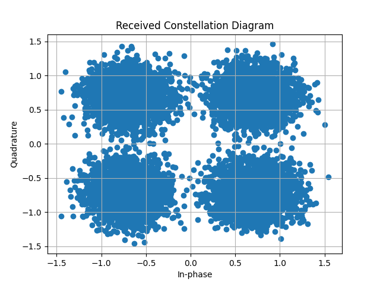

First Simulation
================

This tutorial will guide you through running a simple communication simulation using **comnumpy**.
You will build a basic QAM communication chain, transmit symbols through an AWGN channel, 
and evaluate the Symbol Error Rate (SER).

Introduction
^^^^^^^^^^^^

Prerequisites
"""""""""""""

Make sure you have the following Python libraries installed:

.. code::

   numpy
   matplotlib
   comnumpy

Import Libraries
""""""""""""""""

We start by importing the necessary libraries and defining the simulation parameters:

.. literalinclude:: ../../examples/simple/one_shot_awgn.py
   :language: python
   :lines: 1-8

Define Parameters
"""""""""""""""""

Next, we define some communication parameters such as the modulation order, 
the number of transmitted symbols, and the signal-to-noise ratio (SNR):

.. literalinclude:: ../../examples/simple/one_shot_awgn.py
   :language: python
   :lines: 12-19

AWGN Communication Chain
^^^^^^^^^^^^^^^^^^^^^^^^

Define the Chain
""""""""""""""""

To create a communication chain, we use the ``Sequential`` object.  
A ``Sequential`` object takes a list of processor objects as input.  
The **comnumpy** library provides a wide range of processors for modulation, 
coding, channel modeling, and more.

.. literalinclude:: ../../examples/simple/one_shot_awgn.py
   :language: python
   :lines: 20-28

In this simulation, the communication chain is composed of **six processor objects**:

.. mermaid::

   graph LR;
      A[Generator] --> B[Recorder];
      B --> C[Mapper];
      C --> D[AWGN];
      D --> E[Recorder];
      E --> F[Demapper];

- ``SymbolGenerator``  
  Generates a sequence of integers in the range :math:`[0, M-1]`. Each integer represents a symbol to be transmitted.

- ``Recorder``  
  Records an input signal at a specific point in the chain.  
  This class is particularly useful for extracting signals for analysis (e.g., transmitted or received data).

- ``SymbolMapper``  
  Maps each integer symbol to a corresponding point in the complex constellation (e.g., QAM symbols).

- ``AWGN``  
  Simulates an **Additive White Gaussian Noise** channel, modeling the effect of thermal noise on the transmitted signal.

- ``SymbolDemapper``  
  Performs the inverse mapping operation by associating each received point with the nearest constellation symbol.

- ``Recorder`` (again)  
  A second recorder can be inserted after the channel to capture the noisy received symbols for further analysis (e.g., plotting constellations).

Simulate the Chain
""""""""""""""""""

To run the simulation, simply call the ``Sequential`` object with the desired number of symbols:

.. literalinclude:: ../../examples/simple/one_shot_awgn.py
   :language: python
   :lines: 30-31

Evaluate Performance
""""""""""""""""""""

Next, we evaluate the performance of the communication system using standard metrics.  
Here, we compute the **Symbol Error Rate (SER)**, estimated from the transmitted and detected symbols.  
This estimated SER is then compared with the theoretical value.  

To extract the transmitted symbols, we use the method ``get_data()`` of the ``Recorder`` object.  
A ``Recorder`` can be placed at different locations in the chain depending on your needs.

.. literalinclude:: ../../examples/simple/one_shot_awgn.py
   :language: python
   :lines: 33-43

For this simulation, we obtain for example:

.. code::

   SER (simu) = 0.0013
   SER (theo) = 0.0015647896369451741

Note: for small SER values, it is often recommended to increase ``N`` 
(the number of transmitted symbols) in order to improve the estimation accuracy.

Plot the Constellation
""""""""""""""""""""""

Visualizing the constellation of the received data can also be insightful.  
We again use a ``Recorder`` object to capture the received symbols and then 
plot them with ``matplotlib``:

.. literalinclude:: ../../examples/simple/one_shot_awgn.py
   :language: python
   :lines: 45-52

Conclusion
^^^^^^^^^^

Congratulations on completing your first steps with the **comnumpy** library! 🎉

From here, you may want to explore:

- **OFDM and MIMO tutorials** for more advanced communication techniques.
- The full **comnumpy documentation** for a detailed API reference.
- Experiments with different modulation orders, SNR values, and channel models.
