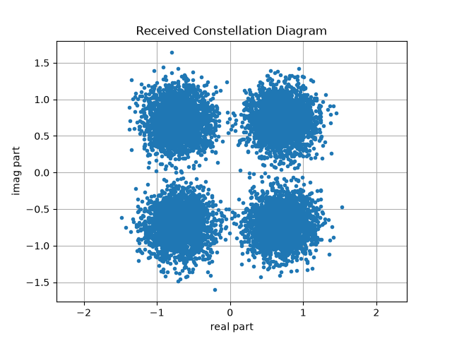

First Simulation
================

A communication system is a series of operations applied to a signal, one
after the other: generate symbols, map them onto a constellation, send them
through a channel, decide what was sent. You can write that down with plain
NumPy in twenty lines, and this page starts by doing exactly that -- because
those twenty lines are what the library has to earn its place against.

It then writes the same simulation with **comnumpy**, gets the same answer,
and shows what the second version has that the first does not.

**What you'll learn:**

- What a one-shot AWGN simulation is, written out by hand.
- Which parts of it are conventions you have to keep consistent yourself.
- How to assemble the same thing as a ``Sequential`` chain, and how to look
  inside it with a tap.
- What a ``Constellation`` knows about itself, and why that matters more than
  it looks.

Prerequisites
^^^^^^^^^^^^^

.. code::

   numpy
   scipy
   matplotlib
   comnumpy

.. literalinclude:: ../../examples/simple/one_shot_awgn.py
   :language: python
   :lines: 1-21

By Hand
^^^^^^^

Nothing in this section needs a library. A 4-QAM alphabet is four points of
the complex plane; symbols are indices into it; the channel adds a complex
Gaussian; the receiver keeps the nearest point.

.. literalinclude:: ../../examples/simple/one_shot_awgn.py
   :language: python
   :lines: 23-46

That works, and it is worth being able to write. But look at what had to be
kept consistent, by you, across those twenty lines:

- **The normalization.** The alphabet was rescaled to unit average energy.
  That is a convention, and the noise variance on the next line assumes it.
  Change one without the other and the SNR silently means something else.
- **The SNR convention.** ``sigma2 = 10 ** (-snr_dB / 10)`` is the *symbol*
  SNR. The closed form below is quoted against :math:`E_b/N_0`, so a division
  by :math:`k` appears -- and forgetting it moves the theoretical curve by
  :math:`10\log_{10} k` dB, which on a 16-QAM is 6 dB of a lie that still
  looks like a plot.
- **The decision rule**, written out again each time it is needed.
- **The modulation, described twice.** The alphabet says 4-QAM once; the
  closed form says it again, with the order appearing three more times inside
  a formula that has to have been got right.

.. literalinclude:: ../../examples/simple/one_shot_awgn.py
   :language: python
   :lines: 48-56

None of this is hard. All of it is a place where a study drifts as it grows:
change the modulation and four independent lines have to change together,
with nothing checking that they did.

The Same Thing, as a Chain
^^^^^^^^^^^^^^^^^^^^^^^^^^

.. literalinclude:: ../../examples/simple/one_shot_awgn.py
   :language: python
   :lines: 58-79

.. mermaid:: mermaid/first_simulation.mmd

The diagram is not drawn by hand: it is what the chain says about itself,
``chain.to_mermaid()``, so the block names are the ones the code uses and a
dashed outline marks a tapped block.

Four processors, and each one is worth a sentence -- these four come back in
every tutorial that follows:

- ``SymbolGenerator``
  Draws random integers in :math:`[0, M-1]`, one per symbol to transmit.

- ``SymbolMapper``
  Maps each integer onto a point of the constellation.

- ``AWGN``
  Adds white Gaussian noise at the requested SNR.

- ``SymbolDemapper``
  Decides, by minimum distance, which symbol was sent.

Three things in that block deserve a second look.

**The modulation is named once.**
:class:`~comnumpy.core.utils.Constellation` holds the alphabet the mapper
needs, the order the generator needs, and the closed form the comparison
needs. The theory cannot describe a different modulation from the one the
chain transmits, because there is only one object to change.

**The SNR conversion moved into the object.**
``constellation.metrics(snr_dB, per="symbol")`` says which SNR is being
passed, and the factor :math:`k` is applied where :math:`k` is known rather
than in the caller's head.

**Nothing in the chain records, displays or measures.** A chain contains
communication blocks only. To see a signal in the middle of it, give the
block a name and declare that name as a **tap** -- ``taps=["tx", "awgn"]``
above -- and the chain keeps what that block produced. One habit to take
right away: *run the chain first, read the tap after*. A tap holds the last
run, so reading it before calling the chain raises rather than returning
stale data.

``seed`` fixes every random draw in the chain, so the numbers below are the
numbers you get:

.. code::

   by hand : SER = 0.0020, theory = 0.0016
   chain   : SER = 0.0017, theory = 0.0016

The two simulations disagree, and that is the measurement rather than the
model: an error rate estimated from :math:`N` symbols has a standard
deviation of roughly :math:`\sqrt{P_e/N}`, so with 10 000 symbols and
:math:`P_e \approx 1.6 \times 10^{-3}` a spread of this size is expected.
The two draw different noise, so they land on either side of the closed form.
Increasing ``N`` narrows it -- and *how many symbols a claim needs* is the
subject of the next tutorial.

What the Object Knows
^^^^^^^^^^^^^^^^^^^^^

The difference from a library of functions is not that the code is shorter.
It is that the objects can be **asked**. A constellation answers about
itself:

.. literalinclude:: ../../examples/simple/one_shot_awgn.py
   :language: python
   :lines: 81-84

.. code::

   constellation.info()
     family           QAM
     order            4
     labelling        gray
     bits_per_symbol  2
     energy           1.0
     min_distance     1.414213562373095
     papr_dB          0.0

Every one of those was implicit in the by-hand version. ``energy`` is the
normalization the noise variance depends on; ``bits_per_symbol`` is the
:math:`k` of the SNR conversion; ``min_distance`` is what sets the error rate
at high SNR; ``papr_dB`` is 0 here because every 4-QAM point carries the same
power, and it stops being 0 as soon as the constellation has several radii --
which is what :doc:`../tutorials/ofdm_papr` is about.

It also draws itself, next to what the channel did to it:

.. literalinclude:: ../../examples/simple/one_shot_awgn.py
   :language: python
   :lines: 86-96

The chain answers the same way:
:meth:`~comnumpy.core.generics.Sequential.tap` for a signal inside it,
``seed`` for reproducibility,
:meth:`~comnumpy.core.generics.Sequential.set_params` to reconfigure a named
block after construction, ``elapsed_`` for the time the last pass took, and
:func:`~comnumpy.sweep.sweep` to run the whole thing over a range of one
parameter. None of those exist for a script of loose arrays -- not because
they would be hard to write, but because there is nothing to attach them to.

Conclusion
^^^^^^^^^^

You have written the simulation twice, and the second version is not merely
shorter: the conventions the first one left to you -- the normalization, the
SNR convention, the decision rule, the modulation named twice -- are held by
objects that cannot contradict themselves.

That is the whole vocabulary the rest of the series uses.

The natural next step is :doc:`../tutorials/awgn`, which asks the question
this page left open: one run gives one number at one SNR, so how do you
obtain a *curve* -- and how many symbols does each of its points deserve?
