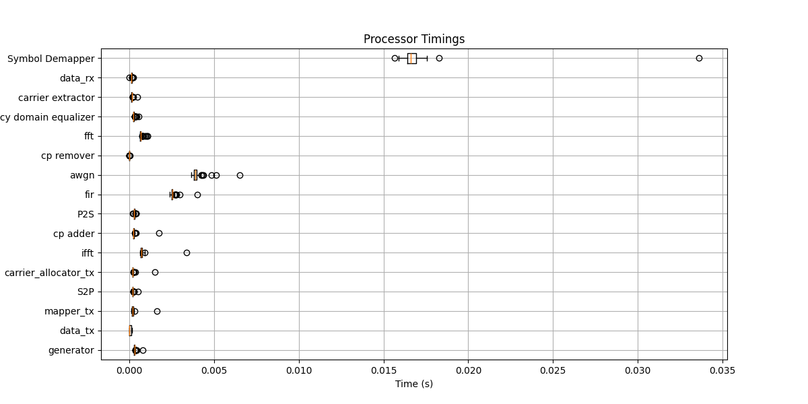

Profiling Chain Performance
===========================

Understanding the performance of your communication chain is crucial for optimizing simulations and identifying bottlenecks. This tutorial will guide you through profiling the execution time of each processor in a communication chain using ``comnumpy``.

Introduction
------------

Profiling helps you measure the time each component in your communication chain takes to execute. By identifying the most time-consuming processes, you can optimize your simulations for better performance.

Prerequisites
-------------

Ensure you have the following Python libraries installed:
- ``numpy``
- ``matplotlib``
- ``comnumpy``

You can install any missing libraries using pip:

.. code-block:: bash

    pip install numpy matplotlib

Profiling Example
-----------------

Let's walk through an example of profiling an OFDM communication chain. This example will demonstrate how to set up the chain, run the profiling, and visualize the results.

Step 1: Import Libraries
^^^^^^^^^^^^^^^^^^^^^^^^

Begin by importing the necessary libraries:

.. code-block:: python

    import numpy as np
    import matplotlib.pyplot as plt
    from comnumpy.core import Sequential, Recorder
    from comnumpy.core.generators import SymbolGenerator
    from comnumpy.core.mappers import SymbolMapper, SymbolDemapper
    from comnumpy.core.channels import AWGN, FIRChannel
    from comnumpy.core.processors import Serial2Parallel, Parallel2Serial
    from comnumpy.core.utils import get_alphabet
    from comnumpy.core.metrics import compute_ser
    from comnumpy.core.visualizers import plot_chain_profiling
    from comnumpy.ofdm.processors import (
        CarrierAllocator, FFTProcessor, IFFTProcessor,
        CyclicPrefixer, CyclicPrefixRemover, CarrierExtractor
    )
    from comnumpy.ofdm.compensators import FrequencyDomainEqualizer
    from comnumpy.ofdm.utils import get_standard_carrier_allocation

Step 2: Define Parameters
^^^^^^^^^^^^^^^^^^^^^^^^^

Set the parameters for the simulation:

.. code-block:: python

    M = 16  # Modulation order
    N_h = 5  # Number of channel taps
    N_cp = 10  # Cyclic prefix length
    N = 100000  # Number of symbols
    sigma2 = 0.01  # Noise variance
    alphabet = get_alphabet("QAM", M)  # Get alphabet for QAM modulation
    carrier_type = get_standard_carrier_allocation("802.11ah_128")  # Standard carrier allocation

Step 3: Extract Carrier Information
^^^^^^^^^^^^^^^^^^^^^^^^^^^^^^^^^^^

Determine the number of carriers and their types:

.. code-block:: python

    N_carriers = len(carrier_type)
    N_carrier_data = np.sum(carrier_type == 1)  # Number of data carriers
    N_carrier_pilots = np.sum(carrier_type == 2)  # Number of pilot carriers

Step 4: Generate Channel
^^^^^^^^^^^^^^^^^^^^^^^^

Create a random channel impulse response:

.. code-block:: python

    h = 0.1 * (np.random.randn(N_h) + 1j * np.random.randn(N_h))
    h[0] = 1
    pilots = 10 * np.ones(N_carrier_pilots)  # Pilot values

Step 5: Create Communication Chain
^^^^^^^^^^^^^^^^^^^^^^^^^^^^^^^^^^

Define the OFDM communication chain using the ``Sequential`` class:

.. code-block:: python

    chain = Sequential([
        SymbolGenerator(M),
        Recorder(name="data_tx"),
        SymbolMapper(alphabet, name="mapper_tx"),
        Serial2Parallel(N_carrier_data),
        CarrierAllocator(carrier_type=carrier_type, pilots=pilots, name="carrier_allocator_tx"),
        IFFTProcessor(),
        CyclicPrefixer(N_cp),
        Parallel2Serial(),
        FIRChannel(h),
        AWGN(sigma2),
        Serial2Parallel(N_carriers + N_cp),
        CyclicPrefixRemover(N_cp),
        FFTProcessor(),
        FrequencyDomainEqualizer(h=h),
        CarrierExtractor(carrier_type),
        Recorder(name="data_rx"),
        Parallel2Serial(),
        SymbolDemapper(alphabet)
    ])

Step 6: Profile the Chain
^^^^^^^^^^^^^^^^^^^^^^^^^

Run the profiling and visualize the execution time of each processor:

.. code-block:: python

    plot_chain_profiling(chain, input=N)
    plt.show()

Interpreting the Results
------------------------

The ``plot_chain_profiling`` function generates a box plot showing the execution time of each processor in the chain. By analyzing this plot, you can identify which components are the most time-consuming and may require optimization.

Conclusion
----------

Profiling your communication chain is an essential step in optimizing performance. By understanding the execution time of each component, you can make informed decisions to improve the efficiency of your simulations.

 