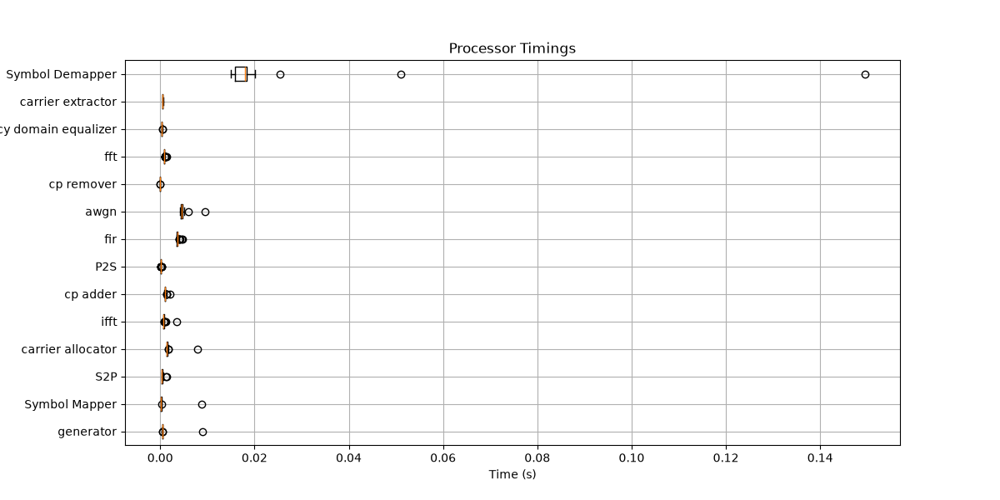

Profiling a Communication Chain
===============================

In this tutorial, you will learn how to **profile** a communication chain using **comnumpy**.
Profiling measures the computational cost of each processor, helping you identify performance bottlenecks in complex simulations.

You will build an **OFDM communication chain** with channel effects, run the simulation, and visualize the profiling results.

**What you'll learn:**

- How to build an OFDM communication chain with channel effects.
- How to use ``plot_chain_profiling`` to measure per-processor execution time.
- How to identify computational bottlenecks in a simulation chain.

Introduction
^^^^^^^^^^^^

Import Libraries
""""""""""""""""

We start by importing the necessary libraries:

.. literalinclude:: ../../examples/simple/profiling_awgn_ofdm.py
   :language: python
   :lines: 1-14

Define Parameters
"""""""""""""""""

Next, we define the communication and channel parameters:

.. literalinclude:: ../../examples/simple/profiling_awgn_ofdm.py
   :language: python
   :lines: 16-32

OFDM Communication Chain
^^^^^^^^^^^^^^^^^^^^^^^^

Define the Chain
""""""""""""""""

We build a complete OFDM chain using the ``Sequential`` object.
This chain includes mapping, carrier allocation, IFFT/FFT processing, cyclic prefix handling, channel effects, equalization, and demapping.

.. literalinclude:: ../../examples/simple/profiling_awgn_ofdm.py
   :language: python
   :lines: 34-51

The chain is composed of the following processors:

- ``SymbolGenerator``  
  Generates a sequence of integer-valued symbols to transmit.

- ``SymbolMapper``  
  Maps integers to QAM constellation points.

- ``Serial2Parallel`` / ``Parallel2Serial``
  Reshape data between serial and parallel streams, as required by OFDM processing.

- ``CarrierAllocator``  
  Assigns data and pilot symbols to their designated subcarriers.

- ``IFFTProcessor`` / ``FFTProcessor``  
  Perform the Inverse Fast Fourier Transform and Fast Fourier Transform operations, respectively.

- ``CyclicPrefixer`` / ``CyclicPrefixRemover``
  Add and remove the cyclic prefix to prevent inter-symbol interference.

- ``FIRChannel``  
  Models a frequency-selective multipath channel.

- ``AWGN``  
  Adds white Gaussian noise.

- ``FrequencyDomainEqualizer``
  Compensates for channel distortion in the frequency domain.

- ``CarrierExtractor``  
  Extracts data and pilot carriers after equalization.

- ``SymbolDemapper``  
  Maps received constellation points back to integer symbols.

The chain, as the chain itself describes it:

.. mermaid:: mermaid/profiling_chain.mmd

The diagram above is not drawn by hand. It is what the chain says about
itself -- ``chain.to_mermaid()`` (decision D33c) -- exported by the
script, so the block names are the ones the code uses and a dashed
outline marks a tapped block:

.. literalinclude:: ../../examples/simple/profiling_awgn_ofdm.py
   :language: python
   :lines: 56-59

Profiling the Chain
^^^^^^^^^^^^^^^^^^^

To profile the chain, we use the ``plot_chain_profiling`` function.  
This function measures the execution time of each processor for a given input size
and produces a bar chart of the results.

.. literalinclude:: ../../examples/simple/profiling_awgn_ofdm.py
   :language: python
   :lines: 53-54

The resulting figure shows the time spent in each processor, making it easy to identify which stages dominate the computation.

The time axis is **logarithmic**, and it has to be: a chain spans several
decades. Here the cyclic-prefix remover costs a few microseconds -- it is a
slice -- while the symbol demapper costs some twenty milliseconds, four
decades more, because it computes the distance from every sample to every
constellation point. On a linear axis that single block would fill the figure
and every other one would be a line against zero.

Two things follow from reading it. Optimizing anything but the demapper here
would be wasted work, and the two FFT-based blocks -- which are the ones people
expect to be expensive -- cost about a millisecond for 100 000 symbols.

.. note::

   ``plot_chain_profiling`` repeats the chain ``N_test`` times and shows the
   *distribution*, which is why the boxes have whiskers and outliers: a single
   timing on a shared machine is not a measurement. For a one-shot table of
   what each block hands to the next, with its shape, its dtype and its time,
   use :meth:`~comnumpy.core.generics.Sequential.summary` instead -- it is the
   textual counterpart of this figure.

Conclusion
^^^^^^^^^^

You have successfully profiled an **OFDM communication chain** with **comnumpy**.

Profiling is a powerful tool to:

- Detect computational bottlenecks in complex simulations.
- Compare the efficiency of different processors or chain configurations.
- Optimize large-scale communication scenarios.

From here, you may want to explore:

- Profiling different modulation schemes or OFDM sizes.
- Comparing different equalization techniques.
- Combining profiling with performance metrics such as SER or BER.
