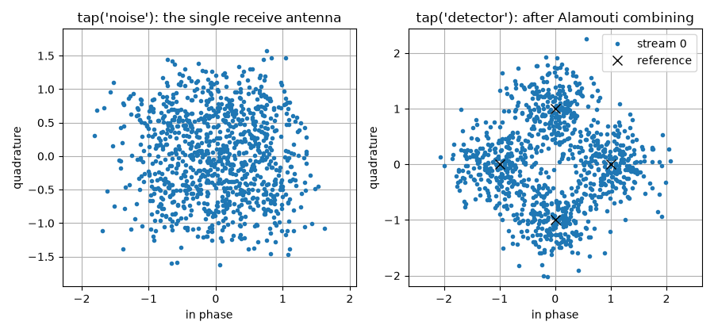
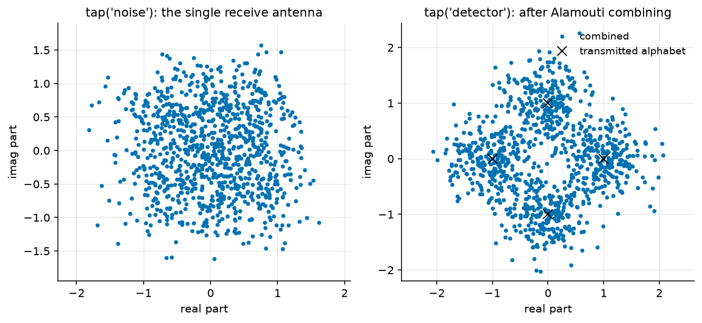
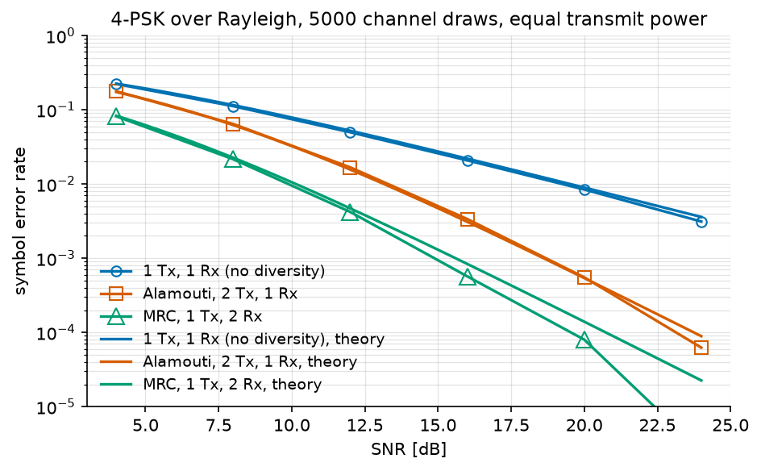

Alamouti Space-Time Coding Tutorial
===================================

This tutorial explains what a space-time code buys, on the simplest and most
widely deployed one: the Alamouti scheme.

.. note::

   **Before you start.** :doc:`mimo` introduced the multi-antenna channel
   and its detectors, all of which assumed the receiver knows the channel
   and the transmitter does not. This tutorial asks what the *transmitter*
   can do without that knowledge.

**What you'll learn:**

- Why a fading channel is limited by its deep fades, not by its average.
- What spatial diversity is, and how maximum ratio combining obtains it.
- How the Alamouti code obtains it from the *transmitter* instead.
- How to measure the diversity gain, and the 3 dB it costs.

This tutorial is suited for engineers and students learning about MIMO
systems, combining practical examples with theoretical background.

The Rayleigh Channel
^^^^^^^^^^^^^^^^^^^^

Over a flat Rayleigh channel, the received signal is

.. math ::

   y[n] = h\,x[n] + b[n], \qquad h \sim \mathcal{CN}(0, 1)

The coefficient :math:`h` is a circularly symmetric complex Gaussian, so its
squared modulus :math:`\gamma = |h|^2` is **exponentially distributed** with
unit mean:

.. math ::

   p_{\gamma}(\gamma) = e^{-\gamma}, \qquad \gamma \geq 0

The instantaneous signal-to-noise ratio is :math:`\gamma \, \bar{\gamma}`
where :math:`\bar\gamma = 1/\sigma^2` is the average one. In other words,
**fading amounts to multiplying the SNR by a random variable**, and the
receiver is limited not by the average of that variable but by the
probability that it is nearly zero:

.. math ::

   \mathbb{P}\left[\gamma < \epsilon\right] = 1 - e^{-\epsilon} \simeq \epsilon

We start with the imports and the parameters, QPSK over a Rayleigh channel:

.. literalinclude:: ../../examples/mimo/one_shot_alamouti.py
   :language: python
   :lines: 1-29

Let us check the law on draws from
:func:`~comnumpy.mimo.utils.rayleigh_channel`:

.. literalinclude:: ../../examples/mimo/one_shot_alamouti.py
   :language: python
   :lines: 31-53

.. code::

   P[|h|^2 < 0.1] = 0.0925  (1 - exp(-0.1) = 0.0952)
   P[|h|^2 < 0.01] = 0.0083  (1 - exp(-0.01) = 0.0100)

The histogram follows the exponential law, and one channel in a hundred is
more than 20 dB below its average. Since the error probability is roughly the
probability of such a fade, it decays only as :math:`1/\mathrm{SNR}` -- one
decade of error rate for ten decibels, which is a poor exchange.

Spatial Diversity
^^^^^^^^^^^^^^^^^

The remedy is to observe the same symbol through :math:`d` **independent**
fading coefficients. All of them must then be small at once for the link to
fail:

.. math ::

   \mathbb{P}\left[\text{all } d \text{ paths weak}\right] \simeq \epsilon^{d}
   \quad \Longrightarrow \quad
   P_e \propto \mathrm{SNR}^{-d}

The exponent :math:`d` is the **diversity order**, and it is the slope of the
error curve on a log-log plot.

Maximum ratio combining (SIMO)
""""""""""""""""""""""""""""""

With one transmit antenna and :math:`N_r` receive antennas, the observation
is :math:`\mathbf{y}[n] = \mathbf{h}\,x[n] + \mathbf{b}[n]` with
:math:`\mathbf{h} \in \mathbb{C}^{N_r}`. The optimal receiver weights each
branch by the conjugate of its own coefficient and sums:

.. math ::

   \widehat{x} = \frac{\mathbf{h}^{H}\mathbf{y}}{\left\|\mathbf{h}\right\|^2},
   \qquad
   \mathrm{SNR}_{\mathrm{out}} = \frac{\left\|\mathbf{h}\right\|^2}{\sigma^2}

This is **maximum ratio combining (MRC)**. The output SNR is proportional to
:math:`\sum_i |h_i|^2`, a sum of :math:`N_r` independent exponentials, hence
a diversity order of :math:`N_r`. Note that the expression above is exactly
the pseudo-inverse of a column vector, so zero forcing on an
:math:`(N_r, 1)` channel *is* MRC -- one detector covers both.

Diversity is easy this way, but it requires antennas at the *receiver*, which
is the expensive side: antennas are cheap on a base station and costly on a
handset.

Space-time coding (MISO)
""""""""""""""""""""""""

Obtaining the same diversity from :math:`N_t` transmit antennas is harder,
because the transmitter has no channel knowledge. Sending the same symbol
from both antennas gives :math:`y = (h_1 + h_2)x + b`, and :math:`h_1 + h_2`
is a single Gaussian coefficient: no diversity at all.

The Alamouti scheme spreads two symbols over two antennas **and** two time
slots:

.. math ::

   \mathbf{G}\left(s_1, s_2\right) =
   \begin{bmatrix} s_1 & -s_2^{*} \\ s_2 & s_1^{*} \end{bmatrix}

the first column being the first time slot and the second column the second.
With one receive antenna and a channel :math:`\mathbf{h} = [h_1, h_2]`
constant over the two slots, the receiver observes :math:`y_1 = h_1 s_1 +
h_2 s_2 + b_1` and :math:`y_2 = -h_1 s_2^{*} + h_2 s_1^{*} + b_2`.
Conjugating the second equation makes the pair *linear* in
:math:`(s_1, s_2)`:

.. math ::

   \begin{bmatrix} y_1 \\ y_2^{*} \end{bmatrix}
   =
   \underbrace{\begin{bmatrix} h_1 & h_2 \\ h_2^{*} & -h_1^{*}\end{bmatrix}}_{\mathbf{H}_{\mathrm{eq}}}
   \begin{bmatrix} s_1 \\ s_2 \end{bmatrix}
   + \begin{bmatrix} b_1 \\ b_2^{*}\end{bmatrix}

and the equivalent channel is **orthogonal**:

.. math ::

   \mathbf{H}_{\mathrm{eq}}^{H}\mathbf{H}_{\mathrm{eq}}
   = \left(\left|h_1\right|^2 + \left|h_2\right|^2\right)\mathbf{I}_2

That single identity is the whole scheme. The two symbols do not interfere,
so the maximum-likelihood detector is not a search but a matched filter, and
each symbol comes out with its SNR multiplied by :math:`|h_1|^2 + |h_2|^2` --
the sum of two independent fadings, hence diversity order 2. The code carries
two symbols in two slots, so its rate is 1 symbol per channel use: **the
diversity costs no bandwidth**, and no feedback.

.. note ::

   ``comnumpy`` stores every space-time code by its *linear dispersion*
   matrices, :math:`\mathbf{G}(\mathbf{s}) = \sum_k \mathbf{A}_k s_k +
   \mathbf{B}_k s_k^{*}`, and builds the equivalent channel from them. The
   orthogonality identity above is checked when the code object is created,
   so a code that declares itself orthogonal and is not cannot be used at
   all.

Implementation
^^^^^^^^^^^^^^

One channel draw, one chain, transmitter to decision. The scaling by
:math:`1/\sqrt{N_t}` matters for the comparison that follows: two antennas
each transmitting :math:`|s|^2` would spend twice the power of a single
antenna, a 3 dB advantage that has nothing to do with coding. Splitting the
power keeps the comparison about diversity alone.

.. literalinclude:: ../../examples/mimo/one_shot_alamouti.py
   :language: python
   :lines: 55-84

.. code::

   one-shot SER: 0.0600
   #    block                        id                   output shape       dtype         time ms
   0    SymbolGenerator              tx                   (1000,)            int64            0.03
   1    SymbolMapper                 symbol_mapper        (1000,)            complex128       0.00
   2    Amplifier                    signal_amplifier     (1000,)            complex128       0.01
   3    SpaceTimeEncoder             space_time_encoder   (2, 1000)          complex128       0.06
   4    FlatMIMOChannel              channel              (1, 1000)          complex128       0.01
   5    AWGN                         noise                (1, 1000)          complex128       0.05
   6    SpaceTimeDecoder             detector             (1000,)            complex128       0.08
   7    Amplifier                    signal_amplifier_2   (1000,)            complex128       0.00
   8    SymbolDemapper               symbol_demapper      (1000,)            int64            0.06

The shape column is the code at work: 1000 symbols enter, the encoder spreads
them over ``(2, 1000)`` -- two antennas, one thousand channel uses, so rate 1
-- one antenna receives, and 1000 symbols come back.

The left panel is what the single receive antenna sees: two superimposed
streams plus noise, with no constellation visible. The right panel is the
same run after combining, and the four QPSK points are back. Nothing was
estimated to get there -- only the two conjugations and the matched filter of
the equations above.

Monte Carlo Evaluation
^^^^^^^^^^^^^^^^^^^^^^

Averaging over fading takes many channel draws, and the draws are a
**batch**: the *same* 5000 realizations serve every SNR point, one draw per
row. Each scheme is one chain, built once with its stack of channels -- the
channel block propagates draw :math:`k` on frame :math:`k`, and the detector
holds the same stack:

.. literalinclude:: ../../examples/mimo/one_shot_alamouti.py
   :language: python
   :lines: 86-126

From there the sweep needs no simulation loop at all:
:func:`~comnumpy.monte_carlo.monte_carlo` moves the noise variance, and
everything else -- the channels, the chains -- is frozen:

.. literalinclude:: ../../examples/mimo/one_shot_alamouti.py
   :language: python
   :lines: 128-143

.. literalinclude:: ../../examples/mimo/one_shot_alamouti.py
   :language: python
   :lines: 145-164

.. code::

   SER
   snr_dB  1 Tx, 1 Rx (no diversity)  Alamouti, 2 Tx, 1 Rx  MRC, 1 Tx, 2 Rx
   ------------------------------------------------------------------------
        4                    0.22261             1.778e-01        8.162e-02
        8                    0.11186             6.430e-02        2.155e-02
       12                    0.04976             1.675e-02        4.200e-03
       16                    0.02082             3.373e-03        5.700e-04
       20                    0.00843             5.525e-04        8.000e-05
       24                    0.00312             6.250e-05        2.500e-06

The three curves are three readings of one closed form,
:func:`~comnumpy.core.metrics.compute_ser_rayleigh_psk`: :math:`L` branches
evaluated at the per-branch SNR, with a transmit scheme dividing that SNR by
:math:`N_t` because it splits its power over the antennas.
``plot_error_rate`` draws measurements as hollow markers and their references
as lines of the same colour, so a pair reads as one statement -- and the two
statements this tutorial is about are on the figure:

**The slope.** The single-antenna curve loses one decade of error rate per
10 dB; the two others fall twice as fast. That is diversity order 2, the
whole reason a space-time code exists.

**The 3 dB.** The Alamouti and MRC curves are parallel, separated
horizontally by :math:`10\log_{10} N_t = 3` dB. That is the price of
transmitting *blind*: the receiver knows the channel and weights its
branches by :math:`h_i^{*}`; the transmitter cannot, and splits its power
evenly. Alamouti buys the full diversity order anyway -- it pays only in
array gain, never in slope.

The last MRC point sits on the estimator's floor: 2.5e-6 out of 400 000
symbols is one error, not a rate. ``validation/mimo_diversity_ber.py`` runs
the same three schemes with up to 80 000 draws and lands within 4.4 % of the
closed forms.

Beyond two antennas
^^^^^^^^^^^^^^^^^^^

Alamouti is the only complex orthogonal design of rate 1. Beyond two transmit
antennas, orthogonality survives only at a reduced rate -- ``comnumpy`` ships
the designs of Tarokh, Jafarkhani and Calderbank at rates 1/2 and 3/4 for
three and four antennas -- and above rate 1 nothing is orthogonal at all, so
linear decoding is no longer optimal:

.. code:: python

   from comnumpy.mimo.coding import available_codes, get_code

   for name in available_codes():
       code = get_code(name)
       print(f"{name:22s} Nt={code.n_tx} rate={code.rate:4.2f} "
             f"orthogonal={code.is_orthogonal}")

The Golden code sits at the other end of the same trade: rate 2 on two
antennas *and* full diversity, at the price of a decoder that has to search.
``SpaceTimeDecoder`` refuses it rather than returning a zero-forcing answer
under a name that promises optimality; ``code.equivalent_channel(H)`` builds
the equivalent channel to hand to one of the detectors of
:doc:`../documentation/mimo/detectors`.

Conclusion
^^^^^^^^^^

This tutorial highlighted:

- Why a fading link is limited by its deep fades, and what diversity does
  about it.
- How maximum ratio combining obtains diversity at the receiver.
- How the Alamouti codeword obtains the same diversity from two transmit
  antennas, without any channel knowledge at the transmitter.
- That the measured slope doubles, and that Alamouti pays 3 dB against
  receive diversity for transmitting blind.

Every tutorial so far has accepted the errors its receiver could not avoid.
:doc:`coding` refuses them: redundancy at the transmitter, a trellis search at
the receiver, and an analytical bound where the simulation runs out of
symbols.
