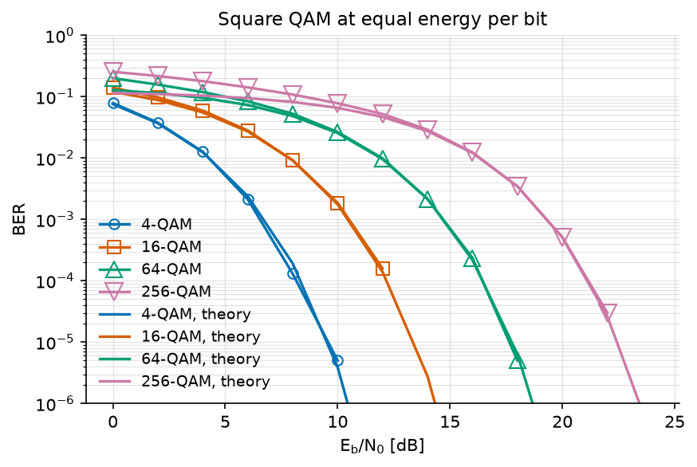

Monte Carlo Simulation over AWGN Channel
========================================

One run of a chain gives one error rate at one SNR. A *performance figure*
needs a curve, so the chain has to be run again at every operating point --
that repetition is what "Monte Carlo simulation" means, and there is nothing
more to it than a loop.

We will write that loop by hand first, because it is worth seeing exactly
what a sweep is made of. Then we will replace it with
:func:`~comnumpy.monte_carlo.monte_carlo`, which does the same four things in
one call, and use *that* in every tutorial that follows.

.. note::

   **Before you start.** This tutorial follows
   :doc:`../getting_started/first_simulation`, which built a chain and ran it
   once. Here we run it many times, which is what a performance figure is
   made of.

**What you'll learn:**

- How to reconfigure a chain between runs with ``set_params``, and make each
  run reproducible with ``seed``.
- How to write a Monte Carlo loop, and then how to replace it with ``monte_carlo``.
- How to write the closed form a measured curve should follow, evaluate it in
  plain NumPy, and then get the same numbers from the constellation itself.
- How to draw the result with ``plot_error_rate``, the figure this library
  uses for every error rate.
- How to compare modulation orders fairly, at equal energy per bit.

Introduction
^^^^^^^^^^^^

Prerequisites
"""""""""""""

Make sure you have the following Python libraries installed:

.. code::

   numpy
   scipy
   matplotlib
   comnumpy

Import Libraries
""""""""""""""""

We start by importing the necessary libraries:

.. literalinclude:: ../../examples/simple/monte_carlo_awgn.py
   :language: python
   :lines: 1-17

Define Parameters
"""""""""""""""""

Next, we set the simulation parameters: the number of transmitted symbols,
the constellation, and the SNR range to sweep. The constellation is one
object -- it carries the alphabet the mapper needs, its order, and the
closed form we compare against below.

.. literalinclude:: ../../examples/simple/monte_carlo_awgn.py
   :language: python
   :lines: 19-22

AWGN Communication Chain
^^^^^^^^^^^^^^^^^^^^^^^^

Define Chain
""""""""""""

We define the communication chain using the ``Sequential`` object.
The chain includes symbol generation, mapping, transmission over an AWGN channel,
and symbol demapping. It is written as a function because the last section of
this page builds one per constellation order.

.. literalinclude:: ../../examples/simple/monte_carlo_awgn.py
   :language: python
   :lines: 25-42

The processors are:

- ``SymbolGenerator``
  Generates a stream of integer-valued symbols to transmit. It is named
  ``"tx"`` so the sweep can compare the chain output against the
  transmitted symbols (see ``reference="tx"`` below).

- ``SymbolMapper``
  Maps integers to QAM constellation points.

- ``AWGN``
  Simulates the effect of noise for a given SNR value (here expressed in dB).

- ``SymbolDemapper``
  Maps received noisy constellation points back to integers.

The chain, as the chain itself describes it:

.. mermaid:: mermaid/awgn_chain.mmd

The diagram above is not drawn by hand. It is what the chain says about
itself -- ``chain.to_mermaid()`` (decision D33c) -- exported by the
script, so the block names are the ones the code uses and a dashed
outline marks a tapped block:

.. literalinclude:: ../../examples/simple/monte_carlo_awgn.py
   :language: python
   :lines: 141-147

Monte Carlo Simulation
""""""""""""""""""""""

Start with the loop you would write yourself. At each SNR value there are
exactly four things to do: **reseed** the chain so the run is reproducible,
**reconfigure** the block that has to change, **run** it, and **measure**
against the transmitted symbols.

.. literalinclude:: ../../examples/simple/monte_carlo_awgn.py
   :language: python
   :lines: 44-51

Three chain services appear there, and they are the ones every study is made
of.

``seed`` gives each stochastic block its own child seed, so the same seed
always gives the same signal -- a curve you cannot reproduce is a curve you
cannot debug. ``set_params`` addresses a block by the name it was given at
construction, with the dotted notation ``"awgn_channel.snr_dB"``; this is why
blocks are named. And the tap returns what the transmitter produced, so the
metric has something to compare against -- after the run, never before.

Now the same thing in one call. :func:`~comnumpy.monte_carlo.monte_carlo` takes
the chain, the dotted name of what varies, the values it takes, and the metrics
to collect -- and does the reseed, the reconfigure, the run and the measurement
at every point:

.. literalinclude:: ../../examples/simple/monte_carlo_awgn.py
   :language: python
   :lines: 53-64

.. code::

   SER
   SNR [dB]     loop  monte_carlo
   ------------------------------
          0  0.74057      0.74105
          8  0.35345      0.35331
         16  0.00724      0.00712

The two are the same computation. They do not print the same digits because
``monte_carlo`` gives each point its own child seed rather than reseeding every
point to the same value, so the noise realizations differ; the gap is the
Monte Carlo error of a million symbols, not a difference of method.

**From here on, the other tutorials use** ``monte_carlo`` **without rewriting the
loop.** When you see it sweeping a channel matrix rather than an SNR (in
:doc:`mimo` and :doc:`alamouti`), it is still these four steps -- only the
parameter that varies has changed.

Theoretical SER
^^^^^^^^^^^^^^^

A measured curve is worth little on its own. What makes it a result is the
curve it is supposed to lie on.

The closed form
"""""""""""""""

A square :math:`M`-QAM constellation is the Cartesian product of two
independent :math:`\sqrt{M}`-PAM constellations, one on each quadrature. With
:math:`k = \log_2 M` bits per symbol, the signal-to-noise ratio per bit
:math:`\gamma_b = E_b/N_0` and the Gaussian tail function

.. math::

   Q(x) = \frac{1}{\sqrt{2\pi}} \int_x^{\infty} e^{-t^2/2}\, dt

the error probability of one PAM component is

.. math::

   P_{\sqrt{M}} = 2 \left(1 - \frac{1}{\sqrt{M}}\right)
                  Q\!\left(\sqrt{\frac{3 k \gamma_b}{M-1}}\right)

A symbol is received correctly only when **both** components are, so the
symbol error probability is

.. math::

   P_s = 1 - \left(1 - P_{\sqrt{M}}\right)^2

This is the standard result; see Proakis and Salehi [Proakis2008]_, Section 4.3.
Note which SNR parameterizes it: the expression is written against
:math:`\gamma_b`, the ratio per *bit*, whereas ``AWGN(snr_dB=)`` takes a symbol
SNR :math:`\gamma_s = k\gamma_b`. Getting that wrong moves the curve by
:math:`10\log_{10} k` dB -- 6 dB for 16-QAM -- with nothing to signal it.

In NumPy, written out
"""""""""""""""""""""

There is no machinery in this. ``scipy.special.erfc`` gives :math:`Q`, and the
two expressions above transcribe line for line:

.. literalinclude:: ../../examples/simple/monte_carlo_awgn.py
   :language: python
   :lines: 67-80

From the constellation
""""""""""""""""""""""

The same expression is already in the library, and the constellation knows
which one applies to it: it carries its family and its order, so the theory
cannot end up describing a modulation other than the one the chain transmits.
``per="symbol"`` says that the swept SNR is the symbol SNR, and the division
by :math:`k` above happens inside.

.. literalinclude:: ../../examples/simple/monte_carlo_awgn.py
   :language: python
   :lines: 82-87

.. code::

   largest gap between the two closed forms: 3.331e-16

Machine precision -- they are the same formula. From here on we call the
method, which is one line instead of five and cannot describe the wrong
modulation.

Results and Visualization
"""""""""""""""""""""""""

An error rate curve is always drawn the same way, so the library draws it for
you: ``plot_error_rate`` puts the measurements as hollow markers and the
closed form as a line of the same colour, on a logarithmic ordinate with a
grid on both decades. A measurement and the theory it is being compared with
share a colour, so a pair reads as one statement.

.. literalinclude:: ../../examples/simple/monte_carlo_awgn.py
   :language: python
   :lines: 89-95

.. image:: img/monte_carlo_awgn.png
   :width: 100%
   :align: center

The markers sit on the line over five decades. The last point, at 21 dB, is an
SER of :math:`10^{-6}` measured from :math:`10^6` symbols -- one error. It is
on the curve by luck as much as by physics, and it is the point at which this
sweep has run out of samples rather than out of accuracy.

Comparing modulation orders
^^^^^^^^^^^^^^^^^^^^^^^^^^^

One constellation against its own theory says the simulation is right. It does
not say what a constellation is *worth*. For that, several orders have to be
put on the same axes -- and the choice of that axis is the whole question.

At equal :math:`E_s/N_0`, a dense constellation is unduly favoured: it spends
the same energy per symbol while carrying more bits. The fair comparison is at
equal energy per **bit**, :math:`E_b/N_0`, which is why
:func:`~comnumpy.core.utils.ebn0_to_snr_dB` exists. The conversion needs
:math:`k` -- chain-level knowledge the channel block does not have and should
not guess (decision D41), so it happens at the call site:

.. literalinclude:: ../../examples/simple/monte_carlo_awgn.py
   :language: python
   :lines: 97-127

The metric changes with the axis. Against :math:`E_b/N_0` the natural quantity
is the bit error rate, and ``compute_ber`` needs the symbol width, which
``functools.partial`` supplies once per order.

The reference curve is no longer exact here, and the figure shows it. The BER
of the closed form is the Gray-mapping approximation
:math:`P_b \simeq P_s / k`, which assumes a symbol error corrupts exactly one
bit out of :math:`k` -- true when the wrong decision is a nearest neighbour,
false when the noise is large enough to reach further. So the markers sit
**above** the line at the left of the figure, by 17 % for 16-QAM and by a
factor 2.2 for 256-QAM at 0 dB, and settle onto it as the error rate falls:
below :math:`10^{-2}` the two agree to within a few percent for every order.
This is an approximation behaving as documented, not a simulation
disagreeing with theory.

.. code::

   QAM order  bits per symbol  Eb/N0 at BER=1e-3 [dB]
   --------------------------------------------------
           4                2                    6.79
          16                4                   10.52
          64                6                   14.77
         256                8                   19.38

.. literalinclude:: ../../examples/simple/monte_carlo_awgn.py
   :language: python
   :lines: 129-139

Going from 2 to 8 bits per symbol costs **12.6 dB** of energy per bit at
:math:`10^{-3}`, spent in three roughly equal steps -- 3.7, 4.3 then 4.6 dB
per doubling of :math:`k`, the price rising slowly with the order. That is
what the rest of
a communication system is built to negotiate: coding buys some of it back
(:doc:`coding`), shaping buys a little more (:doc:`shaping`), and a channel
that is not simply AWGN changes the terms entirely (:doc:`ofdm`).

The measured curves stop where the estimator does. Each point here is 100 000
symbols, so a 4-QAM run has 200 000 bits and cannot resolve a BER below about
:math:`5 \times 10^{-6}`; ``plot_error_rate`` drops the points where no error
was seen rather than drawing them at zero, and the axis stops at
:math:`10^{-6}` for the same reason. Reading a curve past its own floor is the
most common way to publish a wrong figure.

Conclusion
^^^^^^^^^^

You have turned one run into a curve, checked it against a closed form you
wrote yourself, and used it to price four modulation orders against each
other.

You have learned how to:

- Reconfigure and reseed a chain between runs.
- Collect a metric over a range of parameter values, by hand and with
  ``monte_carlo``.
- Write a theoretical error rate in NumPy, and get the same numbers from the
  constellation.
- Read a measured curve against a closed form, and know where it stops being
  readable.
- Compare modulations at equal energy per bit.

From here, :doc:`ofdm` keeps the chain and changes the channel: instead of one
noise term, the signal arrives several times, and the receiver has to undo
that. Two ways of doing so, at very different prices.

References
^^^^^^^^^^

.. [Proakis2008] J. G. Proakis and M. Salehi, *Digital Communications*,
   5th ed., McGraw-Hill, 2008. Section 4.3, symbol and bit error
   probabilities for PAM, PSK and QAM over the AWGN channel.
