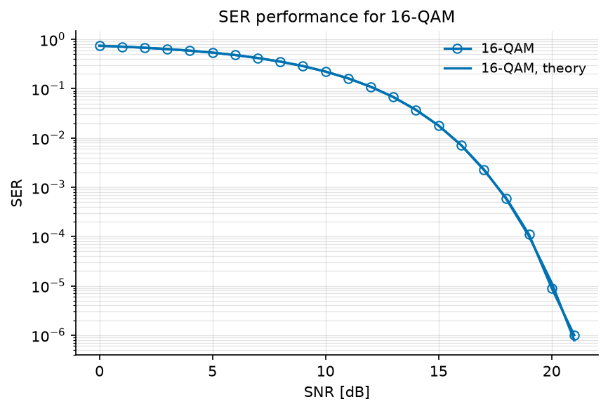

Monte Carlo Simulation over AWGN Channel
========================================

One run of a chain gives one error rate at one SNR. A *performance figure*
needs a curve, so the chain has to be run again at every operating point --
that repetition is what "Monte Carlo simulation" means, and there is nothing
more to it than a loop.

We will write that loop by hand first, because it is worth seeing exactly
what a sweep is made of. Then we will replace it with :func:`~comnumpy.sweep.sweep`,
which does the same four things in one call, and use *that* in every tutorial
that follows.

.. note::

   **Before you start.** This tutorial follows
   :doc:`../getting_started/first_simulation`, which built a chain and ran it
   once. Here we run it many times, which is what a performance figure is
   made of.

**What you'll learn:**

- How to reconfigure a chain between runs with ``set_params``, and make each
  run reproducible with ``seed``.
- How to write a Monte Carlo loop, and then how to replace it with ``sweep``.
- How to compare a measured curve with the closed form it should follow.
- How to draw the result with ``plot_error_rate``, the figure this library
  uses for every error rate.

Introduction
^^^^^^^^^^^^

Prerequisites
"""""""""""""

Make sure you have the following Python libraries installed:

.. code::

   numpy
   matplotlib
   comnumpy

Import Libraries
""""""""""""""""

We start by importing the necessary libraries:

.. literalinclude:: ../../examples/simple/monte_carlo_awgn.py
   :language: python
   :lines: 1-10

Define Parameters
"""""""""""""""""

Next, we set the simulation parameters: modulation order, number of transmitted symbols,
and the SNR range to sweep.

.. literalinclude:: ../../examples/simple/monte_carlo_awgn.py
   :language: python
   :lines: 13-18

AWGN Communication Chain
^^^^^^^^^^^^^^^^^^^^^^^^

Define Chain
""""""""""""

We define the communication chain using the ``Sequential`` object.
The chain includes symbol generation, mapping, transmission over an AWGN channel,
and symbol demapping.

.. literalinclude:: ../../examples/simple/monte_carlo_awgn.py
   :language: python
   :lines: 19-26

The processors are:

- ``SymbolGenerator``  
  Generates a stream of integer-valued symbols to transmit. It is named
  ``"tx"`` so the sweep can compare the chain output against the
  transmitted symbols (see ``reference="tx"`` below).

- ``SymbolMapper``  
  Maps integers to QAM constellation points.

- ``AWGN``  
  Simulates the effect of noise for a given SNR value (here expressed in dB).

- ``SymbolDemapper``  
  Maps received noisy constellation points back to integers.

The chain, as the chain itself describes it:

.. mermaid:: mermaid/awgn_chain.mmd

The diagram above is not drawn by hand. It is what the chain says about
itself -- ``chain.to_mermaid()`` (decision D33c) -- exported by the
script, so the block names are the ones the code uses and a dashed
outline marks a tapped block:

.. literalinclude:: ../../examples/simple/monte_carlo_awgn.py
   :language: python
   :lines: 62-68

Monte Carlo Simulation
""""""""""""""""""""""

Start with the loop you would write yourself. At each SNR value there are
exactly four things to do: **reseed** the chain so the run is reproducible,
**reconfigure** the block that has to change, **run** it, and **measure**
against the transmitted symbols.

.. literalinclude:: ../../examples/simple/monte_carlo_awgn.py
   :language: python
   :lines: 28-36

Three chain services appear there, and they are the ones every study is made
of.

``seed`` gives each stochastic block its own child seed, so the same seed
always gives the same signal -- a curve you cannot reproduce is a curve you
cannot debug. ``set_params`` addresses a block by the name it was given at
construction, with the dotted notation ``"awgn_channel.snr_dB"``; this is why
blocks are named. And the tap returns what the transmitter produced, so the
metric has something to compare against -- after the run, never before.

Now the same thing in one call. :func:`~comnumpy.sweep.sweep` takes the chain,
the dotted name of what varies, the values it takes, and the metrics to
collect -- and does the reseed, the reconfigure, the run and the measurement
at every point:

.. literalinclude:: ../../examples/simple/monte_carlo_awgn.py
   :language: python
   :lines: 38-50

.. code::

   loop  : 7.406e-01 3.535e-01 7.237e-03
   sweep : 7.410e-01 3.533e-01 7.117e-03

The two are the same computation. They do not print the same digits because
``sweep`` gives each point its own child seed rather than reseeding every
point to the same value, so the noise realizations differ; the gap is the
Monte Carlo error of a million symbols, not a difference of method.

**From here on, the other tutorials use** ``sweep`` **without rewriting the
loop.** When you see it sweeping a channel matrix rather than an SNR (in
:doc:`mimo` and :doc:`alamouti`), it is still these four steps -- only the
parameter that varies has changed.

Theoretical SER
"""""""""""""""

For comparison, we also compute the theoretical SER curve for QAM modulation over AWGN.

.. literalinclude:: ../../examples/simple/monte_carlo_awgn.py
   :language: python
   :lines: 52-54

Results and Visualization
"""""""""""""""""""""""""

An error rate curve is always drawn the same way, so the library draws it for
you: ``plot_error_rate`` puts the measurements as hollow markers and the
closed form as a line of the same colour, on a logarithmic ordinate with a
grid on both decades. A measurement and the theory it is being compared with
share a colour, so a pair reads as one statement.

.. literalinclude:: ../../examples/simple/monte_carlo_awgn.py
   :language: python
   :lines: 56-61

Conclusion
^^^^^^^^^^

You have turned one run into a curve, and you have seen that ``sweep`` is not
a new concept but the loop you already wrote, packaged.

You have learned how to:

- Reconfigure and reseed a chain between runs.
- Collect a metric over a range of parameter values, by hand and with
  ``sweep``.
- Read a measured curve against a closed form.

From here, :doc:`ofdm` keeps the chain and changes the channel: instead of one
noise term, the signal arrives several times, and the receiver has to undo
that. Two ways of doing so, at very different prices.

