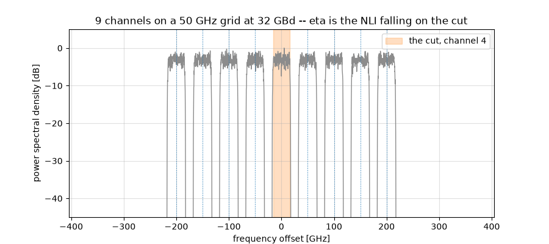

Nonlinear Performance and the Gaussian Noise Model
==================================================

In this tutorial we answer the question every optical link designer has to
answer -- **how much power should I launch?** -- twice, in that order. First
with closed-form expressions that take microseconds and propagate nothing at
all. Then by actually simulating the fibre, at about a second per point, to
find out whether the first answer was any good.

That order matters. The GN model is a *prediction*, and a prediction has to
be stated before it is checked; otherwise the check is a curve fit with extra
steps.

.. note::

   **Before you start.** This is the first of two tutorials on the optical
   fibre, and the only channel of the series that is *nonlinear*. It asks
   how much damage the nonlinearity does and what launch power minimizes
   it; :doc:`optical_fiber_nonlinearity` then asks how to repair that
   damage rather than budget for it.

**What you'll learn:**

- Why an optical link has an *optimum* launch power, and why turning the
  laser up eventually makes things worse.
- What the Gaussian Noise (GN) model is, in one equation, and how to use it
  without simulating anything.
- Where the factor of two lives in a dual-polarization link -- in the launch
  power, in the amplifier noise, and in the model's own coefficient.
- How well a closed form replaces a split-step simulation -- measured, on
  the same axes.
- The one thing the model cannot see, and how big it is.

Introduction
^^^^^^^^^^^^

A fibre span attenuates. An amplifier puts the power back and adds
spontaneous-emission noise, so over :math:`N_s` spans the receiver sees a
fixed noise power :math:`P_{\mathrm{ASE}}`. That alone would say: launch as
much power as the laser can give, since the signal grows and the noise does
not.

The fibre disagrees. Its refractive index depends on the intensity travelling
through it -- the Kerr effect -- so the signal distorts *itself*, and the
distortion grows faster than the signal does. After enough uncompensated
dispersion the propagating waveform looks like Gaussian noise to itself, and
the distortion it produces behaves like one more additive noise. That is the
whole content of the **GN model**, and it makes the link an additive-noise
channel with two terms:

.. math::

   \mathrm{SNR}(P) = \frac{P}{P_{\mathrm{ASE}} + \eta P^3}

The numerator is linear in the launch power and the second term of the
denominator is *cubic*, so there is a best :math:`P` and it is not the
largest one. Everything below follows from that single expression.

Prerequisites
"""""""""""""

Make sure you have the following Python libraries installed:

.. code::

   numpy
   matplotlib
   comnumpy

Import Libraries
""""""""""""""""

.. literalinclude:: ../../examples/optical/gn_model.py
   :language: python
   :lines: 1-20

Define Parameters
"""""""""""""""""

Five 100 km spans of standard single-mode fibre, PM-16QAM at 32 GBd on a
50 GHz grid.

.. literalinclude:: ../../examples/optical/gn_model.py
   :language: python
   :lines: 22-35

Part 1: the prediction
^^^^^^^^^^^^^^^^^^^^^^

Nothing in this part propagates a sample. Three closed forms answer the
design question, and each is a function the library already provides.

.. literalinclude:: ../../examples/optical/gn_model.py
   :language: python
   :lines: 39-69

Three things deserve a word.

``comb`` returns a :class:`~comnumpy.optical.wdm.WDMGrid` rather than an
array of frequencies. A grid is an object that can be asked questions -- its
guard band, the sampling rate a simulation of it would need -- and the rest
of this page asks it several.

``comb_eta`` passes **channel** powers, not per-polarization powers. That is
the GN model's convention, and the first of three places a factor of two
hides in this tutorial.

``analytic_ase`` is the second. It calls
:func:`~comnumpy.optical.utils.compute_erbium_doped_fiber_N_ase`, which is
*the same function* :class:`~comnumpy.optical.links.FiberLink` uses to
generate the noise it adds during propagation. That is deliberate: in Part 2
this prediction is compared against a measurement through the whole chain,
and had the prediction used a formula retyped from a textbook, the comparison
would only be checking the transcription. Using the library's own function
makes the comparison test the *chain* instead -- the spectral density, the
bandwidth, the two polarizations, the matched filter.

The factor two in ``analytic_ase`` is the polarization: the function returns
the density for one, and an amplifier emits into both, each with its own
independent noise.

.. warning::

   **The 3 dB that becomes 9 dB.** ``power_W`` is the power of the
   *channel*, summed over both polarizations, because that is the convention
   the GN model uses. Each polarization therefore carries half of it, which
   is what ``launch_gain`` is for in Part 2. Give each polarization the full
   ``power_W`` instead and you launch 3 dB more than you think; since the
   nonlinear interference goes as the cube of the power, your simulation
   then reports **9 dB** more of it than the model predicts, and the model
   looks broken when it is not.

   The same trap has a third door, the model's own coefficient.
   :class:`~comnumpy.optical.FiberLink` reads the *shape* of the field to
   decide which equation to integrate: a field ``(..., 2, N)`` gets the
   Manakov equation, which is what a real fibre with random birefringence
   does and what the model's 16/27 coefficient assumes; a one-dimensional
   field gets the scalar equation instead, which produces 27/8 -- **5.3 dB**
   -- more interference at the same total power. If you must compare against
   a scalar simulation, tell the model so with
   ``gn_model_nli_power(..., polarizations=1)``.

What the model is looking at
""""""""""""""""""""""""""""

A grid is a layout, so :meth:`~comnumpy.optical.wdm.WDMGrid.plot` draws it
directly -- no signal synthesised, no spectrum estimated, and no pulse-shape
roll-off smearing the very guard band the figure exists to show.

.. literalinclude:: ../../examples/optical/gn_model.py
   :language: python
   :lines: 71-86

.. image:: img/gn_model_fig1.png
   :width: 100 %

.. code::

   comb: 9 channels, 14.8 GHz of guard, 435 GHz to simulate

   eta      = 1223 /W^2      (GN model, one channel)
   P_ASE    = -20.88 dBm     (5 spans, NF = 6 dB, both polarizations)
   optimum  = +1.74 dBm      SNR = 20.86 dB
   check    : eta P^3 / (P_ASE/2) = 1.000000

Two things read off the figure. The **cut** is the filled channel: the one
whose noise :math:`\eta` counts. Every other one is an *interferer*, and the
model adds up what each deposits on the cut -- so the weights of
:func:`~comnumpy.optical.gn_model.gn_model_nli_power` are one per pair
visible here. The cut is the middle channel because that is the worst case,
neighbours on both sides.

The second is the **guard**: 14.8 GHz separates the boxes, so no channel
overlaps its neighbour and nothing linear crosses between them. Everything
the model computes is therefore *nonlinear* leakage -- the fibre mixing
channels that never touched in frequency, which is the whole reason a closed
form for it is worth having.

The design point falls out of the same expression. Setting the derivative of
:math:`P/(P_{\mathrm{ASE}} + \eta P^3)` to zero gives a rule worth
remembering in words -- **the optimum is where the fibre's noise is half the
amplifiers'**:

.. math::

   \eta P_{\mathrm{opt}}^3 = \frac{P_{\mathrm{ASE}}}{2},
   \qquad
   P_{\mathrm{opt}} = \left(\frac{P_{\mathrm{ASE}}}{2\eta}\right)^{1/3},
   \qquad
   \mathrm{SNR}_{\mathrm{max}} = \frac{2}{3}\frac{P_{\mathrm{opt}}}
                                                 {P_{\mathrm{ASE}}}

The last printed line is that rule checked rather than asserted. Two
consequences fall out of it. The peak is **asymmetric** -- one side governed
by a linear term, the other by a cubic one -- so missing the optimum by 1 dB
costs 0.24 dB of SNR upwards but only 0.21 dB downwards, and by 3 dB it is
2.20 dB against 1.50 dB. Operators consequently run slightly *under* the
optimum, where a power error is the cheaper kind. And since
:math:`P_{\mathrm{opt}}` grows only as the cube root of the accumulated ASE,
ten times the spans moves the optimum by 3.3 dB, not by 10.

Filling the band
""""""""""""""""

Here is a question a simulation cannot afford. What happens when the channel
is not alone, but sits in the middle of a comb filling the amplifier band?

.. literalinclude:: ../../examples/optical/gn_model.py
   :language: python
   :lines: 88-100

.. code::

   channels   NLI at 0 dBm   optimum   peak SNR   fs to simulate it
          1     -29.12 dBm    +1.74 dBm    20.86 dB          0.04 THz
          3     -26.52 dBm    +0.88 dBm    20.00 dB          0.14 THz
          9     -24.83 dBm    +0.31 dBm    19.43 dB          0.44 THz
         27     -23.60 dBm    -0.10 dBm    19.02 dB          1.34 THz
         81     -22.65 dBm    -0.42 dBm    18.71 dB          4.04 THz

The last column is why this part exists. It is
:attr:`~comnumpy.optical.wdm.WDMGrid.min_fs`, the sampling rate a split step
would need for that very comb -- so the grid prices its own simulation.
Eighty-one channels would need **4.04 THz**, a hundred times the single
channel, and hours of computation. The closed form answers in microseconds.

Note also how gently the damage grows: eighty times the interferers costs
**2.2 dB**. Eight neighbours hurting the cut as much as it hurts itself
would cost :math:`10\log_{10}(1 + 2 \times 8) = 12.3` dB; the
:math:`\mathrm{asinh}` in the model turns that into a few tenths. Nonlinear
interference accumulates logarithmically in the number of channels, which is
the single most useful thing the GN model has to say.

.. literalinclude:: ../../examples/optical/gn_model.py
   :language: python
   :lines: 102-112

.. image:: img/gn_model_fig2.png
   :width: 100 %

Part 2: the check
^^^^^^^^^^^^^^^^^

Everything above is a prediction. Now we propagate samples and find out.

.. literalinclude:: ../../examples/optical/gn_model.py
   :language: python
   :lines: 115-153

.. mermaid:: mermaid/gn_model.mmd

``launch_gain`` is the factor of two of the warning above, made explicit:
:math:`\sqrt{P/2}` per polarization for a channel power :math:`P`.

``name="launch"`` and ``name="fibre"`` are what let the rest of the page
*reconfigure* the link instead of rebuilding it: ``chain.set_params`` reaches
a block by its identifier and re-runs its precomputation (decision D34), and
:func:`~comnumpy.sweep` drives ``"launch.gain"`` over a list of values the
same way. One chain, built once, answers every question below.

``taps=["tx"]`` marks the mapper output as readable from outside the chain --
the dashed box in the diagram, decision D33c. The transmitted symbols are
what every measurement compares against.

"How much noise is there?" has a subtle answer when part of the damage is a
phase rotation. The Kerr effect rotates the constellation by the mean
nonlinear phase, and a real receiver removes that with its carrier-phase
estimator -- so counting it as noise would be charging the link for an
impairment nobody suffers.
:class:`~comnumpy.core.compensators.DataAidedComplexGainCompensator` fits
exactly one complex scalar against the reference, which absorbs the rotation
and any gain; :func:`~comnumpy.core.metrics.compute_effective_snr` then lumps
everything left over into one equivalent additive term.

``shared=True`` is not a detail. The nonlinear phase comes from the *total*
intensity, so it is common to the two polarizations -- a **shared** estimand
in the sense of decision D49, which is why one gain is fitted jointly over
both rather than one per row. Fitted per row it would be two estimates of the
same number, each seeing half the data. Without the keyword the compensator
refuses a two-path signal outright, so the choice has to be made on purpose
rather than settled by broadcasting.

Does the amplifier noise match?
"""""""""""""""""""""""""""""""

Before testing the nonlinear prediction, test the linear one. Setting
``fibre.use_only_linear`` removes the Kerr term and leaves loss and
amplifiers, so the only noise left is the one Part 1 predicted in closed
form. At 0 dBm launch the measured SNR *is* :math:`-P_{\mathrm{ASE}}` in dBm.

.. literalinclude:: ../../examples/optical/gn_model.py
   :language: python
   :lines: 155-165

.. code::

   P_ASE  predicted -20.88 dBm   measured -20.95 dBm   gap -0.07 dB

**0.07 dB**, and the script asserts it. That number is worth more than it
looks. The prediction is a spectral density times a bandwidth times two
polarizations; the measurement is a full chain -- pulse shaping, five spans
of split-step propagation, back-propagation, matched filtering, sampling and
a least-squares gain fit. They agree to two hundredths of a decibel, which
says the polarization convention is the same on both sides, that the matched
filter really does collect the symbol-rate bandwidth, and that no factor of
two got lost between the two.

It is also what makes the nonlinear comparison below meaningful. If
:math:`P_{\mathrm{ASE}}` were wrong by a factor of two, the optimum would
move by :math:`2^{1/3}`, a full decibel, and the model would look
mis-calibrated for a reason having nothing to do with the fibre.

The expensive way
"""""""""""""""""

Now the nonlinear term, at fourteen launch powers.

.. literalinclude:: ../../examples/optical/gn_model.py
   :language: python
   :lines: 166-193

.. code::

   optimum +1.74 dBm predicted, +2.0 dBm measured;
   peak SNR 20.86 dB predicted, 21.07 dB measured

The two curves land on top of each other. The optimum is predicted within
the 1 dB resolution of the sweep, and the peak SNR within **0.21 dB** -- for
a closed form that ran in microseconds against a simulation that took about
a second per point.

The dotted line is the link with the fibre's nonlinearity ignored,
:math:`P/P_{\mathrm{ASE}}`: the answer you get by trusting the amplifiers
alone. It keeps climbing forever. Everything between it and the measured
points is what the Kerr effect costs, and the gap only opens past the
optimum -- which is exactly the regime an operator has to avoid, and exactly
the one the closed form was built to describe.

What the model cannot see
^^^^^^^^^^^^^^^^^^^^^^^^^

The GN model assumes the propagating signal has become Gaussian. Real
modulation formats are not, and the model is blind to the difference.

.. literalinclude:: ../../examples/optical/gn_model.py
   :language: python
   :lines: 195-204

.. code::

   The GN model predicts 29.12 dB of nonlinear SNR at 0 dBm, whatever is modulated.
   stimulus     nonlinear SNR   above the model
   QPSK              30.65 dB        +1.53 dB
   16QAM             30.14 dB        +1.01 dB
   64QAM             29.87 dB        +0.74 dB
   256QAM            29.83 dB        +0.71 dB
   Gaussian          28.48 dB        -0.65 dB

The ordering is the whole story. QPSK suffers **1.53 dB less** nonlinear
interference than the model predicts, and the advantage shrinks monotonically
as the constellation grows: 16QAM 1.01 dB, 64QAM 0.74 dB, 256QAM 0.71 dB. A
genuinely Gaussian stimulus lands 0.65 dB on the *other* side, which is the
model's own assumption measured against itself.

So the GN model is pessimistic for real formats, and predictably so. The
enhanced GN model exists to recover that gap; this library does not implement
it, and the table above is the honest statement of what that costs -- about a
decibel for 16QAM, less as the format grows.

.. literalinclude:: ../../examples/optical/gn_model.py
   :language: python
   :lines: 206-210

Going further
^^^^^^^^^^^^^

The closed form implemented here is eq. 120 and 123 of the extended version
of Poggiolini's GN model paper (arXiv:1209.0394); the published paper numbers
its equations differently, and its compact single-span form is Eq. (15). Both
numberings are in the module's reference block, because a reader following
one will not find the other.

That paper also bounds its own formula -- span loss at least 7 dB,
:math:`|\beta_2|` at least 4 ps²/km, symbol rate at least 28 GBaud, and
channel bandwidth at least a quarter of the spacing. Calling
:func:`~comnumpy.optical.gn_model.gn_model_nli_power` outside those bounds
logs a warning naming the one that was crossed. It still returns a number:
the model stays defined there and is often still usable, but silence would be
a guarantee the paper does not give.

Everything above **budgets** for the nonlinearity: it says how much there
will be and picks the launch power that minimizes it. :doc:`optical_fiber_nonlinearity`
asks the other question -- whether the receiver can undo it instead, and by
how many decibels.
