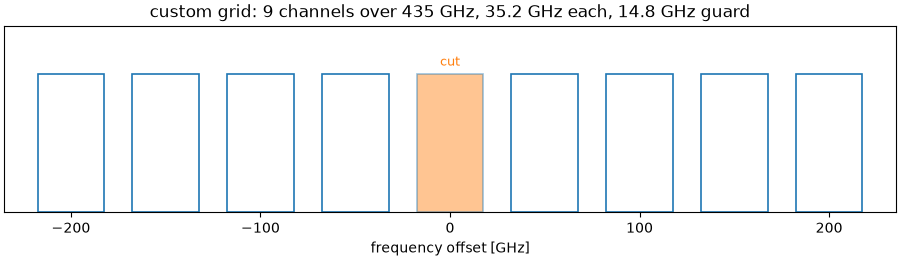
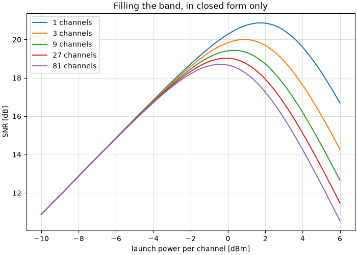

The Gaussian Noise Model
========================

In this tutorial we answer the question every optical link designer has to
answer -- **how much power should I launch?** -- twice. Once by simulating
the fibre, which takes a second per point, and once with a closed-form
expression that takes microseconds. Then we put the two on the same axes and
look at how close they land.

.. note::

   **Before you start.** :doc:`optical_fiber_nonlinearity` propagated a
   signal through fibre with the split-step method and undid the damage with
   digital back-propagation. This tutorial keeps the same propagation and
   asks a different question: not *how do I repair the nonlinearity*, but
   *how much of it will there be*, and what launch power minimizes the total
   damage.

**What you'll learn:**

- Why an optical link has an *optimum* launch power, and why turning the
  laser up eventually makes things worse.
- What the Gaussian Noise (GN) model is, in one equation, and how to use it.
- How to read the model's three characteristic behaviours: the cube law, the
  half-the-ASE rule, and the logarithmic price of bandwidth.
- How well a closed form can replace a split-step simulation -- measured, on
  the same figure.
- The one thing the model cannot see, and how big it is.

Introduction
^^^^^^^^^^^^

A fibre span attenuates. An amplifier puts the power back and adds
spontaneous-emission noise, so over :math:`N_s` spans the receiver sees a
fixed noise power :math:`P_{\mathrm{ASE}}`. That alone would say: launch as
much power as the laser can give, since the signal grows and the noise does
not.

The fibre disagrees. Its refractive index depends on the intensity travelling
through it -- the Kerr effect -- so the signal distorts *itself*, and the
distortion grows faster than the signal does. After enough uncompensated
dispersion the propagating waveform looks like Gaussian noise to itself, and
the distortion it produces behaves like one more additive noise. That is the
whole content of the **GN model**, and it makes the link an additive-noise
channel with two terms:

.. math::

   \mathrm{SNR}(P) = \frac{P}{P_{\mathrm{ASE}} + \eta P^3}

The numerator is linear in the launch power and the second term of the
denominator is *cubic*, so there is a best :math:`P` and it is not the
largest one. Everything below follows from that single expression.

Prerequisites
"""""""""""""

Make sure you have the following Python libraries installed:

.. code::

   numpy
   matplotlib
   comnumpy

Import Libraries
""""""""""""""""

.. literalinclude:: ../../examples/optical/gn_model.py
   :language: python
   :lines: 1-18

Define Parameters
"""""""""""""""""

Five 100 km spans of standard single-mode fibre, PM-16QAM at 32 GBd. The
stimulus is ``(2, N_SYM)``: two polarizations, one row each. That is not
decoration -- it is the case the model is written for, and the warning below
says what happens if you forget it.

.. literalinclude:: ../../examples/optical/gn_model.py
   :language: python
   :lines: 21-32

The chain
^^^^^^^^^

The whole link is one :class:`~comnumpy.core.Sequential`: source, mapper,
pulse shaping, launch amplifier, fibre, linear back-propagation, matched
filter, sampler. Nothing in it is specific to this tutorial -- it is the
chain of :doc:`optical_fiber_nonlinearity` with two blocks named so that the
rest of the page can reach them.

.. literalinclude:: ../../examples/optical/gn_model.py
   :language: python
   :lines: 35-56

.. mermaid:: mermaid/gn_model.mmd

Three things in that builder are doing work.

``name="launch"`` and ``name="fibre"`` are what let the rest of the tutorial
*reconfigure* the link instead of rebuilding it: ``chain.set_params`` reaches
a block by its identifier and re-runs its precomputation (decision D34), and
:func:`~comnumpy.sweep` drives ``"launch.gain"`` over a list of values the
same way. One chain, built once, answers every question below.

``taps=["tx"]`` marks the mapper output as readable from outside the chain --
the dashed box in the diagram, decision D33c. The transmitted symbols are
what every measurement compares against, and declaring a tap is how you get
them without breaking the chain in two.

``order=None`` swaps :class:`~comnumpy.core.generators.SymbolGenerator` and
:class:`~comnumpy.core.mappers.SymbolMapper` for
:class:`~comnumpy.core.generators.GaussianGenerator`. The last section needs
a stimulus that really is Gaussian, and the library has one.

.. warning::

   **The 3 dB that becomes 9 dB.** ``power_W`` is the power of the *channel*,
   summed over both polarizations, because that is the convention the GN
   model uses. Each polarization therefore carries half of it, which is what
   ``launch_gain`` is for. Give each polarization the full ``power_W``
   instead and you launch 3 dB more than you think; since the nonlinear
   interference goes as the cube of the power, your simulation then reports
   **9 dB** more of it than the model predicts, and the model looks broken
   when it is not.

   The same trap has a second door. :class:`~comnumpy.optical.FiberLink`
   reads the *shape* of the field to decide which equation to integrate: a
   field ``(..., 2, N)`` gets the Manakov equation, which is what a real
   fibre with random birefringence does and what the model's 16/27
   coefficient assumes; a one-dimensional field gets the scalar equation
   instead, which produces 27/8 -- **5.3 dB** -- more interference at the
   same total power. If you must compare against a scalar simulation, tell
   the model so with ``gn_model_nli_power(..., polarizations=1)``.

Before running anything, ``chain.summary`` (decision D33b) says what the
chain will do to a stimulus, and what each block costs:

.. literalinclude:: ../../examples/optical/gn_model.py
   :language: python
   :lines: 85-86

.. code::

   #    block                        id                   output shape       dtype         time ms
   -----------------------------------------------------------------------------------------------
   0    SymbolGenerator              source               (2, 4096)          int64            0.11
   1    SymbolMapper                 tx                   (2, 4096)          complex128       0.11
   2    Upsampler                    upsampler            (2, 16384)         complex128       0.74
   3    SRRCFilter                   srrcfilter           (2, 16384)         complex128       4.31
   4    Amplifier                    launch               (2, 16384)         complex128       0.10
   5    FiberLink                    fibre                (2, 16384)         complex128    1173.90
   6    DBP                          dbp                  (2, 16384)         complex128      12.81
   7    SRRCFilter                   srrcfilter_2         (2, 16384)         complex128       2.21
   8    Downsampler                  downsampler          (2, 4096)          complex128       0.05

The fibre is 98 % of the run time, which is the entire reason the closed form
below is worth having.

Measuring the SNR
^^^^^^^^^^^^^^^^^

.. literalinclude:: ../../examples/optical/gn_model.py
   :language: python
   :lines: 59-69

"How much noise is there?" has a subtle answer when part of the damage is a
phase rotation. The Kerr effect rotates the constellation by the mean
nonlinear phase, and a real receiver removes that with its carrier-phase
estimator -- so counting it as noise would be charging the link for an
impairment nobody suffers.
:class:`~comnumpy.core.compensators.DataAidedComplexGainCompensator` fits
exactly one complex scalar against the reference, which absorbs the rotation
and any gain; :func:`~comnumpy.core.metrics.compute_effective_snr` then lumps
everything left over into one equivalent additive term. Whatever remains is
noise, and the model does not get to argue about where it came from.

It is fair to ask why the gain is estimated at all rather than divided out,
since the link's linear gain is known: run the same chain with the fibre
linearized and it is right there. Measured against that known value, the
fitted modulus is it, to within 0.5 % at the worst power below -- so on
amplitude alone, dividing by a constant would indeed do. It is the argument
that cannot be:

.. code::

     P (dBm)   |g| fitted  arg g (deg)   |g| linear     ratio
        -8.0     0.008885        1.757     0.008885  1.000004
        -2.0     0.017742        6.638     0.017745  0.999833
         2.0     0.028099       16.503     0.028133  0.998789
         5.0     0.039547       32.874     0.039746  0.994970

Freezing the *whole* complex gain charges the link for that rotation, and the
bill grows with exactly the quantity the tutorial is here to measure: 0.08 dB
of SNR at -8 dBm, 3.01 dB at -2, 10.79 dB at +2, **14.39 dB at +5**. The curve
would bend down in the nonlinear regime for a reason that has nothing to do
with the fibre. Freezing the modulus and fitting only the argument, on the
other hand, lands within 0.04 dB of the full fit everywhere -- so the second
degree of freedom is not what earns its place, the first one is. One
component that fits both is simply the shortest way to get the one that
matters, without having to look the link gain up.

That 0.5 % is not bookkeeping either. The nonlinear phase varies from symbol
to symbol, so :math:`\mathbb{E}[e^{j\varphi}] = e^{j\bar{\varphi}}
e^{-\sigma_\varphi^2/2}` and the least-squares modulus shrinks accordingly;
the 0.4970 % at +5 dBm gives :math:`\sigma_\varphi \approx 0.1` rad, about
6 degrees of spread around a 33 degree mean rotation.

The ``ravel`` is not a detail either. The nonlinear phase comes from the
*total* intensity, so it is common to the two polarizations -- a **shared**
estimand in the sense of decision D49, which is why it is fitted jointly on
the flattened pair rather than once per row. The compensator refuses a
two-path signal outright, precisely so that this choice has to be made on
purpose.

With the metric written, ``measure`` is a one-liner: :func:`~comnumpy.sweep`
sets ``launch.gain``, reseeds the chain, runs it, and hands the tapped
symbols and the output to the metric -- the same ``sweep`` introduced in
:doc:`awgn`, pointed at a different chain.

One number for the whole link
^^^^^^^^^^^^^^^^^^^^^^^^^^^^^

:func:`~comnumpy.optical.gn_model.gn_model_nli_power` collapses the fibre,
the span count and the comb into a single coefficient :math:`\eta`, defined
by :math:`P_{\mathrm{NLI}} = \eta P^3`.

.. literalinclude:: ../../examples/optical/gn_model.py
   :language: python
   :lines: 72-83

The model predicts the *fibre's* noise. The amplifiers' noise is not its
business, so we measure that -- with the same chain, linearized by one call
to ``set_params``, which is why the fibre was given a name:

.. literalinclude:: ../../examples/optical/gn_model.py
   :language: python
   :lines: 88-91

.. code::

   GN model: eta = 1223 /W^2
   measured ASE, 5 spans at NF = 6 dB: -20.95 dBm

With both numbers in hand the design point is a one-liner. Setting the
derivative of :math:`P/(P_{\mathrm{ASE}} + \eta P^3)` to zero gives a rule
worth remembering in words -- **the optimum is where the fibre's noise is
half the amplifiers'**:

.. math::

   \eta P_{\mathrm{opt}}^3 = \frac{P_{\mathrm{ASE}}}{2},
   \qquad
   P_{\mathrm{opt}} = \left(\frac{P_{\mathrm{ASE}}}{2\eta}\right)^{1/3},
   \qquad
   \mathrm{SNR}_{\mathrm{max}} = \frac{2}{3}\frac{P_{\mathrm{opt}}}
                                                 {P_{\mathrm{ASE}}}

.. literalinclude:: ../../examples/optical/gn_model.py
   :language: python
   :lines: 93-97

.. code::

   optimum: +1.72 dBm, SNR = 20.91 dB
   check: eta P^3 / (P_ASE/2) = 1.000000

The last line is the rule checked rather than asserted. Two consequences fall
out of the same expression. The peak is **asymmetric** -- one side of it is
governed by a linear term, the other by a cubic one -- so missing the optimum
by 1 dB costs 0.24 dB of SNR upwards but only 0.21 dB downwards, and by 3 dB
it is 2.20 dB against 1.50 dB. Operators consequently run slightly *under*
the optimum, where a power error is the cheaper kind. And since
:math:`P_{\mathrm{opt}}` grows only as the cube root of the accumulated ASE,
ten times the spans moves the optimum by 3.3 dB, not by 10.

Now the expensive way
^^^^^^^^^^^^^^^^^^^^^

None of the above propagated a single sample. Let us do that too, at fourteen
launch powers. The fibre goes back to nonlinear, and the same ``measure``
runs the sweep.

.. literalinclude:: ../../examples/optical/gn_model.py
   :language: python
   :lines: 99-110

A few of the fourteen points, and the line that follows the sweep:

.. code::

     -8.0 dBm -> SNR 13.13 dB
     -5.0 dBm -> SNR 15.93 dB
     -2.0 dBm -> SNR 18.83 dB
     +1.0 dBm -> SNR 20.87 dB
     +2.0 dBm -> SNR 21.07 dB
     +3.0 dBm -> SNR 20.79 dB
     +5.0 dBm -> SNR 18.93 dB
   optimum: +1.72 dBm predicted, +2.0 dBm measured; peak SNR 20.91 dB predicted, 21.07 dB measured

And the two on the same axes:

.. literalinclude:: ../../examples/optical/gn_model.py
   :language: python
   :lines: 112-130

Three things to read off it. The dotted line is what the link would do if the
fibre were linear -- straight, rising for ever, which is the answer that made
the question interesting. The measured points leave it at around -2 dBm and
turn over. And the solid line, computed in microseconds from four fibre
parameters, passes through the measured points: the predicted optimum is
+1.72 dBm and the simulated curve peaks at +2.0 dBm, the nearest point of a
1 dB grid, with **0.16 dB** between the two peak SNRs.

That is the whole value proposition of the model. It is not a substitute for
the split step when you need waveforms, constellations or a bit error rate.
It is what lets you ask a thousand *design* questions before you simulate
one.

What the closed form buys
^^^^^^^^^^^^^^^^^^^^^^^^^

Here is a question the simulation cannot afford: what happens when the
channel is not alone, but sits in the middle of a comb filling the amplifier
band? Eighty-one channels at 32 GBd is 4 THz of bandwidth; simulating that
means a sample rate in the terahertz, and the split step would run for hours.
The closed form does not care.

.. literalinclude:: ../../examples/optical/gn_model.py
   :language: python
   :lines: 133-143

.. code::

   channels   NLI at 0 dBm   optimum   peak SNR
          1     -29.12 dBm    +1.72 dBm    20.91 dB
          3     -26.52 dBm    +0.85 dBm    20.05 dB
          9     -24.83 dBm    +0.29 dBm    19.48 dB
         27     -23.60 dBm    -0.12 dBm    19.07 dB
         81     -22.65 dBm    -0.44 dBm    18.75 dB

.. literalinclude:: ../../examples/optical/gn_model.py
   :language: python
   :lines: 145-153

Read the first column carefully: eighty-one times the bandwidth costs
**6.5 dB** of nonlinear interference, not the 19 dB that a proportional
penalty would give. The reason is one function. The GN model's kernel
integrates to an :math:`\mathrm{asinh}`, and :math:`\mathrm{asinh}` grows
logarithmically, so each doubling of the comb costs a bounded and shrinking
amount. The whole viability of wideband optical transmission is in that
:math:`\mathrm{asinh}`, and the peak SNR falls by only 2.2 dB while the link
carries eighty-one times as many channels.

What the model cannot see
^^^^^^^^^^^^^^^^^^^^^^^^^

The GN model has one assumption in its name: it treats the transmitted signal
as Gaussian. A real constellation is not Gaussian. Its fourth moment is
smaller, and a signal with a smaller fourth moment generates *less* nonlinear
interference -- so the model is systematically **pessimistic** for a
modulated signal, and the smaller the constellation the more pessimistic it
is.

The model cannot tell us by how much, since it never sees the constellation.
So we measure it: the same link with the amplifiers' noise switched off, so
that only the fibre contributes, and five different things modulated onto the
carrier.

.. literalinclude:: ../../examples/optical/gn_model.py
   :language: python
   :lines: 156-165

.. code::

   The GN model predicts 29.12 dB of nonlinear SNR at 0 dBm, whatever is modulated.
   stimulus     nonlinear SNR   above the model
   QPSK              30.65 dB        +1.53 dB
   16QAM             30.14 dB        +1.01 dB
   64QAM             29.87 dB        +0.74 dB
   256QAM            29.83 dB        +0.71 dB
   Gaussian          28.48 dB        -0.65 dB

That table is the assumption made visible. Every QAM constellation suffers
*less* nonlinear interference than the model predicts, and the penalty
shrinks monotonically as the constellation grows and starts to resemble the
Gaussian the model assumes: 1.53 dB for QPSK, 0.71 dB by 256QAM.

The last row is the control. A genuinely Gaussian stimulus does not land
above the model -- it lands 0.65 dB *below*, which is the model's **other**
approximation showing through: spans are assumed to accumulate incoherently,
and over five spans they do not quite. Taken together the two rows bracket
the model honestly. It under-predicts the interference of a Gaussian signal
by about half a decibel, and over-predicts that of a real constellation by
one to one and a half.

Closing the constellation half of that gap is the job of the **EGN model**
(Carena *et al.*, 2014; Serena and Bononi, 2015), which carries the fourth
and sixth moments of the constellation through the same perturbation
analysis. It is **not implemented in this library**, and the table above is
the honest substitute: the effect measured rather than predicted, so that
nobody reads the GN curve as an exact answer for a modulated signal. Read it
as what it is -- a pessimistic bound that tightens as the constellation
grows.

Is it right?
^^^^^^^^^^^^

A closed form that agrees with the simulation in the same library proves less
than it looks: both could share a mistake. ``validation/optical_gn_model.py``
therefore confronts it with things outside the library, and prints what it
finds:

- Serena and Bononi (JLT 33(7), 2015) published the normalized NLI
  coefficient of a 15-channel, 5 x 100 km link, measured with *their*
  split-step simulator: :math:`a_{\mathrm{NL}} = -23.5` dB. This module
  returns **-23.30 dB** for the same link.
- The same closed form re-transcribed from GNPy -- the Telecom Infra
  Project's open-source planning tool, which works in metres and s²/m where
  this library works in kilometres and ps²/km -- agrees to **twelve digits**
  (``tests/optical/test_gn_model.py``).
- This library's own split-step solver, on a five-channel WDM link where
  cross-phase modulation dominates, agrees to **0.01 dB**.
- The 27/8 polarization factor of the warning above, measured by simulating
  the same link twice, comes out at **5.29 dB** against the 5.28 dB of
  Table I of the paper.

.. literalinclude:: ../../examples/optical/gn_model.py
   :language: python
   :lines: 167-171

Conclusion
^^^^^^^^^^

You have designed an optical link twice, and the two answers agree.

You have learned how to:

- Turn a fibre link into one coefficient :math:`\eta` with
  :func:`~comnumpy.optical.gn_model.gn_model_nli_power`, and read an SNR off
  :func:`~comnumpy.optical.gn_model.gn_model_snr`.
- Find the optimal launch power in closed form with
  :func:`~comnumpy.optical.gn_model.optimal_launch_power`, and remember the
  rule behind it -- the fibre's noise is half the amplifiers'.
- Reconfigure one chain instead of building several, with ``set_params`` on
  named blocks, and sweep a parameter of it with :func:`~comnumpy.sweep`.
- Measure an SNR the way a receiver would, by removing one complex gain with
  a data-aided compensator and lumping the rest into
  :func:`~comnumpy.core.metrics.compute_effective_snr`.
- Keep the polarization and power conventions straight, which is worth 9 dB
  and 5.3 dB of not being confused.
- Recognize where the model is a bound rather than an answer.

From here, you can:

- Put digital back-propagation back in the receiver (:doc:`the previous
  tutorial <optical_fiber_nonlinearity>`) and watch the optimum move to
  higher power as the nonlinearity is partly undone.
- Sweep the span length at fixed total distance: the GN model will tell you,
  in milliseconds, why shorter spans buy reach.
- Add a Raman amplifier and recompute :math:`P_{\mathrm{ASE}}`: the optimum
  moves as its cube root, and no fibre needs to be re-simulated.

This is the last tutorial of the course. If you have read them in order you
have built, measured and validated a chain in every regime the library
covers -- additive noise, multipath, multiple antennas, coding, shaping and
nonlinear fibre -- and each time against something that could have said no.
