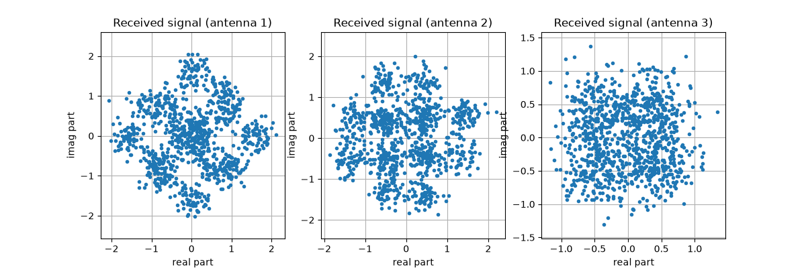
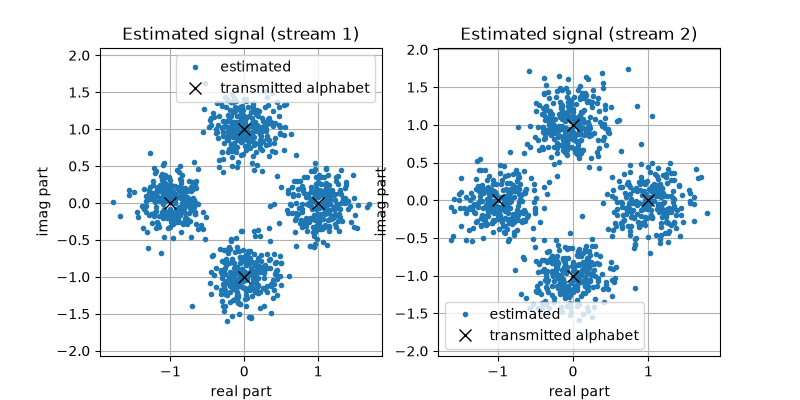
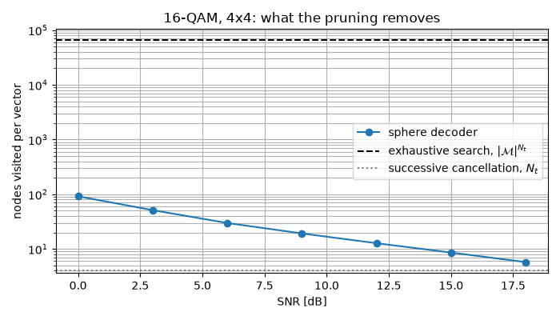

MIMO Chain Tutorial
===================

This tutorial shows how to simulate a MIMO (Multiple-Input Multiple-Output)
communication system with ``comnumpy``, and how the classical detectors
compare on it.

.. note::

   **Before you start.** :doc:`awgn` introduced ``monte_carlo``. Here the
   averaging over fading is a *batch*: a fixed stack of channel draws is
   built into each chain, and the sweep only moves the noise. The chain
   is the same object; only the number of antennas changes.

**What you'll learn:**

- How to build a MIMO simulation chain with Rayleigh fading.
- What the equalization problem looks like on the received constellations.
- How ZF, MMSE, OSIC, ML and sphere decoding differ, and what each one costs.
- How to run a Monte Carlo evaluation of the Symbol Error Rate (SER).

This tutorial is suited for engineers and students learning about MIMO
systems, combining practical examples with theoretical background.

System Model
^^^^^^^^^^^^

A MIMO link transmits :math:`N_t` symbol streams from :math:`N_t` antennas
and receives them on :math:`N_r` antennas. Over a flat-fading channel, the
received vector at time :math:`n` is

.. math ::

   \mathbf{y}[n] = \mathbf{H}\mathbf{x}[n] + \mathbf{b}[n]

where :math:`\mathbf{x}[n] \in \mathcal{M}^{N_t}` holds the transmitted
symbols, :math:`\mathbf{H} \in \mathbb{C}^{N_r \times N_t}` is the channel
matrix, and :math:`\mathbf{b}[n]` is a circular Gaussian noise of variance
:math:`\sigma^2` per antenna.

Every receive antenna therefore observes a **mixture** of all the streams.
Recovering :math:`\mathbf{x}[n]` from :math:`\mathbf{y}[n]` is the detection
problem, and it is what the rest of this tutorial is about.

Implementation
""""""""""""""

We start with the imports and the parameters:

.. literalinclude:: ../../examples/mimo/one_shot_mimo.py
   :language: python
   :lines: 1-32

The channel is drawn once, with a seed: this first half of the tutorial is
about **one** realization, so it must be the same one on every run. One
chain, transmitter to decision, closed by the most direct detector -- zero
forcing:

.. literalinclude:: ../../examples/mimo/one_shot_mimo.py
   :language: python
   :lines: 34-47

.. code::

   ZF, one channel draw: SER = 0.0025

Received Constellations
"""""""""""""""""""""""

Let us look at what each receive antenna sees, read from the ``"noise"`` observation:

.. literalinclude:: ../../examples/mimo/one_shot_mimo.py
   :language: python
   :lines: 49-56

No constellation is visible on any antenna: each one observes a mixture of
the two streams. The ZF estimator inverts that mixture:

.. literalinclude:: ../../examples/mimo/one_shot_mimo.py
   :language: python
   :lines: 58-65

The estimated points now cluster around the ideal constellation points (black
crosses), but the residual noise is **larger** than the channel noise:
inverting a badly conditioned matrix amplifies it. How to avoid paying that
price is what separates the detectors below.

Detection Strategies
^^^^^^^^^^^^^^^^^^^^

The five detectors are five answers to one question: what to do with the
interference that the other streams put on top of the one being read. One
channel realization proves nothing about them -- over fading, the error rate
is an *average*, dominated by the rare draws where the matrix is nearly
singular -- so each answer is judged over the **same** 200 channel draws,
stacked into a batch: one draw is one row (D51), the channel block
propagates draw :math:`k` on frame :math:`k`, and each detector holds the
same stack. The draws and the sweep are set up once:

.. literalinclude:: ../../examples/mimo/one_shot_mimo.py
   :language: python
   :lines: 67-81

Each technique is then three things -- an idea, one chain, one sweep.

Zero forcing (ZF)
"""""""""""""""""

The most direct answer is to invert the channel. With :math:`N_r \geq N_t`,
the pseudo-inverse :math:`\mathbf{H}^{\dagger} =
(\mathbf{H}^H\mathbf{H})^{-1}\mathbf{H}^H` is a left inverse, so

.. math ::

   \mathbf{z}[n] = \mathbf{H}^{\dagger}\mathbf{y}[n]
   = \mathbf{x}[n] + \mathbf{H}^{\dagger}\mathbf{b}[n]

and the interference is removed **exactly**, whatever the SNR. The price is
the second term: the noise on stream :math:`i` comes out with variance
:math:`\sigma^2 [(\mathbf{H}^H\mathbf{H})^{-1}]_{ii}`, which explodes when
two columns of :math:`\mathbf{H}` are nearly parallel. This is **noise
enhancement**. It also costs diversity: each stream spends :math:`N_t-1` of
its :math:`N_r` degrees of freedom cancelling the others, leaving a diversity
order of :math:`N_r - N_t + 1` instead of :math:`N_r`.

.. literalinclude:: ../../examples/mimo/one_shot_mimo.py
   :language: python
   :lines: 83-94

Minimum mean square error (MMSE)
""""""""""""""""""""""""""""""""

If exact cancellation is what costs, then buy less of it. The MMSE receiver
minimizes :math:`\mathbb{E}[\|\mathbf{x} - \mathbf{W}\mathbf{y}\|^2]` rather
than the interference alone:

.. math ::

   \mathbf{z}[n] = \left(\mathbf{H}^H\mathbf{H}
   + \sigma^2 \mathbf{I}_{N_t}\right)^{-1}\mathbf{H}^H\mathbf{y}[n]

The only difference is the :math:`\sigma^2 \mathbf{I}` added before
inverting, which keeps the inverse bounded when the channel is ill
conditioned. As :math:`\sigma^2 \to 0` it *is* zero forcing; as
:math:`\sigma^2 \to \infty` it becomes the matched filter
:math:`\mathbf{H}^H`. In between it accepts a little residual interference in
exchange for much less amplified noise. It does not buy diversity, which is
why the ZF and MMSE curves run parallel. Because the detector *weights by*
:math:`\sigma^2`, the sweep zips the noise variance into it, one pair of
dotted parameters per point:

.. literalinclude:: ../../examples/mimo/one_shot_mimo.py
   :language: python
   :lines: 96-107

Ordered successive interference cancellation (OSIC)
"""""""""""""""""""""""""""""""""""""""""""""""""""

Detect the stream with the best post-detection SNR, subtract its contribution
:math:`\mathbf{h}_i \widehat{x}_i` from the observation, and repeat on a
channel with one column fewer. The second stream is then detected with one
interferer less, the third with two less, and so on. The last stream enjoys
the full :math:`N_r` diversity, the first only :math:`N_r - N_t + 1`, which
is why the ordering matters and why ``osic_type="sinr"`` sorts by
post-detection SNR (the V-BLAST rule). The price is error propagation: a
wrong decision is subtracted as if it were right.

.. literalinclude:: ../../examples/mimo/one_shot_mimo.py
   :language: python
   :lines: 109-121

Maximum likelihood (ML)
"""""""""""""""""""""""

Both linear detectors treat the streams one at a time. The optimal receiver
refuses that split and scores the candidate vectors jointly:

.. math ::

   \widehat{\mathbf{x}}_{ML}[n] = \arg \min_{\mathbf{x}\in \mathcal{M}^{N_t}}
   \|\mathbf{y}[n] - \mathbf{H}\mathbf{x}\|^2_2

Nothing is inverted, so nothing is amplified, and every receive antenna
contributes to every stream: the diversity order is :math:`N_r`. The cost is
that the minimum is taken over :math:`|\mathcal{M}|^{N_t}` vectors -- 16 here,
but 65 536 for 16-QAM on four streams. ML compares distances and never needs
:math:`\sigma^2`, so its sweep moves the noise alone:

.. literalinclude:: ../../examples/mimo/one_shot_mimo.py
   :language: python
   :lines: 123-133

Sphere decoding (SD)
""""""""""""""""""""

The sphere decoder returns the **same** vector as ML without visiting every
candidate. Writing the thin QR decomposition :math:`\mathbf{H} =
\mathbf{Q}\mathbf{R}` and projecting the observation on :math:`\mathbf{z} =
\mathbf{Q}^H\mathbf{y}`, the metric becomes a sum whose :math:`k`-th layer
only involves the layers already decided:

.. math ::

   \left\|\mathbf{z} - \mathbf{R}\mathbf{x}\right\|^2 =
   \sum_{k=N_t-1}^{0} \left|R_{kk}\right|^2 \left|c_k - x_k\right|^2,
   \qquad
   c_k = \frac{z_k - \sum_{i>k} R_{ki}\, x_i}{R_{kk}}

Every term is non-negative, so a partial sum can only grow. As soon as it
exceeds the best complete metric found so far, the **entire subtree below it
can be discarded**: it cannot contain the minimum. Only the lattice points
inside a shrinking ball are ever visited, and nothing is approximated, so the
decision is exactly the ML one.

.. literalinclude:: ../../examples/mimo/one_shot_mimo.py
   :language: python
   :lines: 135-145

.. note ::

   Diversity orders are claims about a limit, and the SNR range simulated
   here stops at 18 dB, which is not the asymptotic regime. They are
   checked where a limit can be reached: ``validation/mimo_zf_ml_ber.py``
   confirms diversity 1 for zero forcing and 2 for maximum likelihood on a
   2x2 channel, against the closed forms of :mod:`comnumpy.core.metrics`
   (decision D7).

Results
^^^^^^^

The five curves come from the same dictionary, shown twice:

.. literalinclude:: ../../examples/mimo/one_shot_mimo.py
   :language: python
   :lines: 147-157

.. code::

   SER
   snr_dB       ZF     MMSE     OSIC         ML         SD
   -------------------------------------------------------
        0  0.33427  0.28820  0.28735  2.851e-01  2.868e-01
        3  0.21634  0.17955  0.16855  1.613e-01  1.620e-01
        6  0.11209  0.09271  0.07311  6.785e-02  6.871e-02
        9  0.04911  0.04034  0.02546  2.057e-02  2.095e-02
       12  0.01876  0.01570  0.00779  4.700e-03  4.950e-03
       15  0.00719  0.00583  0.00243  8.125e-04  6.875e-04
       18  0.00286  0.00196  0.00100  1.000e-04  2.500e-05

.. image:: img/monte_carlo_mimo_fig3.png
   :width: 100%
   :align: center

The ordering is the textbook one and it holds at every SNR: ML is the best,
OSIC follows, MMSE beats ZF everywhere, and the gap widens with the SNR --
at 18 dB, ML is an order of magnitude below ZF. The reason is the slope:
with :math:`N_r = 3` receive antennas and :math:`N_t = 2` streams, ML enjoys
the full receive diversity while a linear detector spends part of it
cancelling the other stream. The ML and SD rows differ only by their noise
draws (each sweep reseeds its own chain): where they share a seed they are
digit for digit the same decision, which is the sphere decoder's claim.

The last rows sit near the estimator's floor: 2.5e-05 out of 40 000 symbols
per point is one error, not a rate.

Computational Cost
^^^^^^^^^^^^^^^^^^

Since ML and SD return the same decision, what separates them is their cost.
The 4-PSK link above has only 16 candidates, where an exhaustive search is a
single matrix product; the regime the sphere decoder exists for is the one
where that product no longer fits. We therefore time both detectors on
16-QAM over four streams, i.e. 65 536 candidates per vector:

.. literalinclude:: ../../examples/mimo/one_shot_mimo.py
   :language: python
   :lines: 159-223

.. code::

     ML  0 dB    176.7 ms    65536 nodes   SER 0.7900
     ML  9 dB    113.7 ms    65536 nodes   SER 0.5044
     ML 18 dB    119.0 ms    65536 nodes   SER 0.0112
     SD  0 dB    163.4 ms     91.8 nodes   SER 0.7900
     SD  9 dB     33.3 ms     19.2 nodes   SER 0.5044
     SD 18 dB     10.8 ms      5.8 nodes   SER 0.0112

The ML cost is flat: it scores the same 65 536 candidates whatever the noise.
The sphere decoder's cost is **data dependent**, and it falls with the SNR --
92 nodes per vector at 0 dB, 5.8 at 18 dB, where four of those nodes are the
single path down the tree that successive cancellation would have taken. At
18 dB it is seven times faster than ML for exactly the same decisions.

At 0 dB it is *slower*, and that is worth reading rather than hiding: the
sphere is then wide, and a tree walked in Python costs far more per node than
a BLAS call costs per candidate. The crossing point here is near 3 dB.

Its worst case *is* the exhaustive search, but its expected complexity is
polynomial over the range of SNRs where a link is actually operated (Hassibi
and Vikalo, 2005) -- which is why 64-QAM on four streams, 16.7 million
candidates, is out of reach for the exhaustive detector and costs this one
about 5 nodes per vector at 25 dB.

Conclusion
^^^^^^^^^^

This tutorial highlighted:

- How to simulate a MIMO transmission with ``comnumpy``, as a chain whose
  last block is the receiver.
- What the equalization problem looks like, and what ZF costs in noise.
- How the five detectors compare, on one realization and on average.
- Why ML and OSIC outperform linear detection, why that difference grows with
  the SNR, and why a sphere decoder reaches the ML decision without paying
  the ML price.

Every detector here assumed that the *receiver* knows the channel and the
transmitter knows nothing. :doc:`alamouti` asks what the transmitter can do
anyway -- and answers with a code that buys diversity without a single bit of
feedback.
