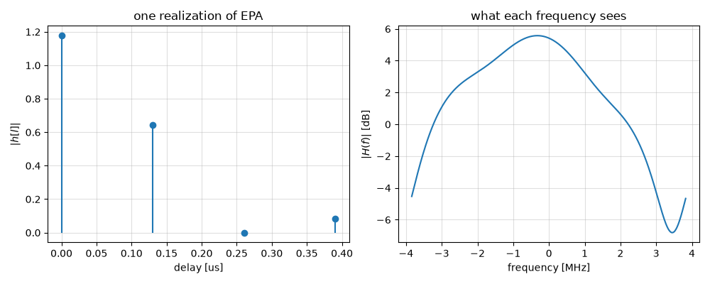
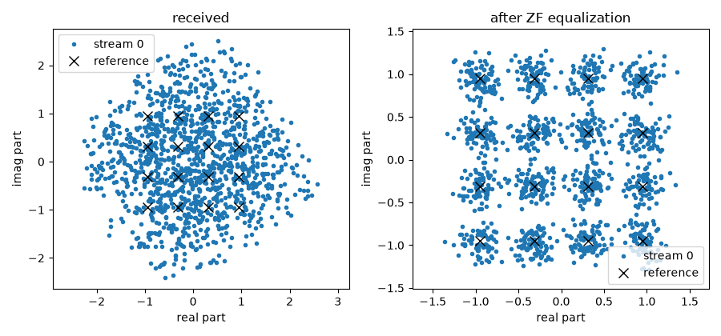
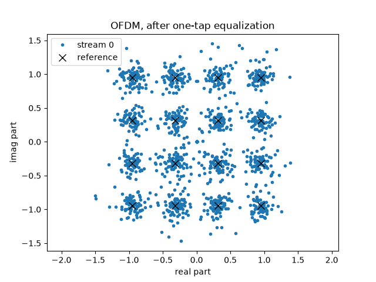
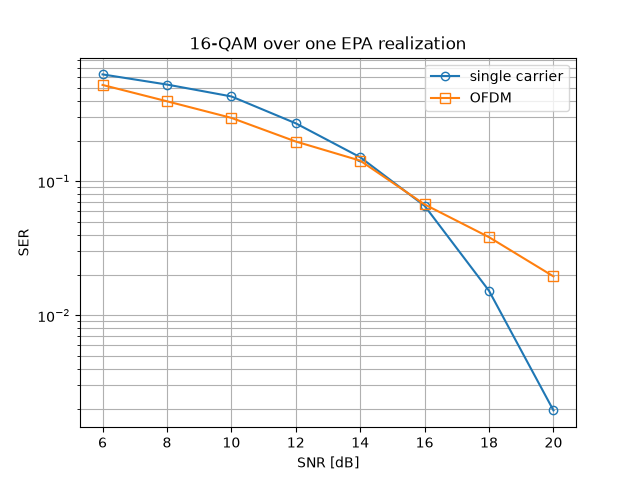
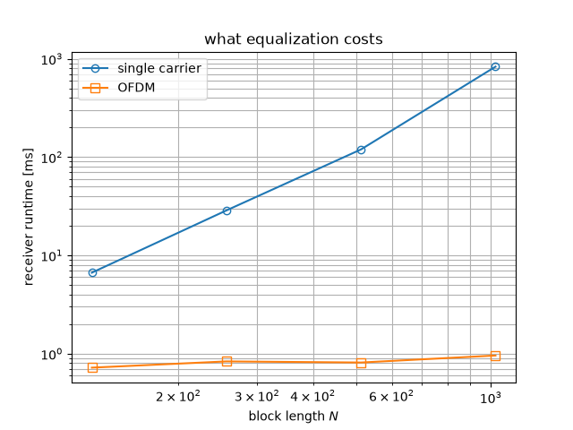

OFDM Tutorial
=============

A radio signal usually arrives several times: once by the direct path, and
again by every reflection, each with its own delay and attenuation. Each
symbol then lands on top of the tails of the previous ones -- **inter-symbol
interference (ISI)** -- and the receiver has to undo it.

There are two classical ways of doing this, and this tutorial applies both to
the same channel: invert the channel as one large matrix (**single carrier**),
or split the band into subcarriers narrow enough that each one sees a flat
channel (**OFDM**).

.. note::

   **Before you start.** :doc:`awgn` introduced the chain, ``seed``,
   ``sweep`` and ``plot_error_rate``; they are used here without being
   re-explained. What is new is the channel: it is no longer a single
   coefficient.

**What you'll learn:**

- How to define a multipath channel, and how to ask it what it is.
- How single-carrier equalization and OFDM differ, in error rate and in cost.
- Why wideband receivers are built the second way.

This tutorial is suitable for engineers and students interested in digital
communications, combining practical examples with theoretical insights.

Channel Model
^^^^^^^^^^^^^

Two models are involved, and they describe the same channel at two levels.

The **environment** is a set of echoes with random gains -- a power delay
profile and a fading process. This is the tapped delay line model:

.. math::

   y[n] = \sum_{l=0}^{L-1} a_l[n]\, x[n - d_l]

where :math:`d_l` is the delay of path :math:`l` in samples and
:math:`a_l[n]` its random gain.

Drawing from this model once freezes the gains, and what remains is a tap
vector :math:`h[l]`, i.e. a **finite impulse response (FIR)** channel:

.. math::

   z[n] = \sum_{l=0}^{L-1} h[l]\, x[n-l] + b[n]

where :math:`b[n]` is the noise. Stacking :math:`N` samples in vector form
gives

.. math::

   \mathbf{z} = \mathbf{H}\mathbf{x} + \mathbf{b}

where :math:`\mathbf{H}` is the Toeplitz convolution matrix built from the
taps. This matrix is **not diagonal**, and that is precisely what ISI is.
Both receivers below are given :math:`h`, so this tutorial is about
equalization, not about channel estimation.

Implementation
""""""""""""""

We start with the imports and the parameters of the simulation: 16-QAM,
1280 symbols, and a sampling frequency of 7.68 MHz.

.. literalinclude:: ../../examples/ofdm/one_shot_ofdm.py
   :language: python
   :lines: 1-30

We then use **EPA**, the 3GPP Extended Pedestrian A profile, one of the
standardized tables shipped with the library.
:class:`~comnumpy.core.channels.TappedDelayLineChannel` draws one realization
of it, and ``info()`` returns what the channel is:

.. literalinclude:: ../../examples/ofdm/one_shot_ofdm.py
   :language: python
   :lines: 36-54

.. code::

   kind: tapped delay line
   standard: EPA
   n_paths: 7
   delays_ns: [0.0, 30.0, 70.0, 90.0, 110.0, 190.0, 410.0]
   powers_dB: [0.0, -1.0, -2.0, -3.0, -8.0, -17.2, -20.8]
   rms_delay_spread_ns: 43.12922598416199
   coherence_bandwidth_Hz: 4637226.739785324
   fs_Hz: 7680000.0
   n_taps: 4
   resolvable_delays_samples: [0, 1, 3]

The profile has seven arrivals within 410 ns, but at :math:`f_s = 7.68` MHz
the receiver can only distinguish **4 taps**: two echoes separated by less
than one sample period are merged into one. ``plot()`` draws either reading
of the same vector, the impulse response or the frequency response, on a
linear or a decibel scale:

.. code::

   |H| spans 12.4 dB across 7.68 MHz

The channel varies by 12 dB between its best and its worst frequency. No
subcarrier is annihilated, but the channel is clearly not flat, and the
receiver has to deal with it.

.. note::

   :doc:`multipath` introduces the catalogue properly: where these delays
   and powers come from, what a delay spread is, and how it sizes the cyclic
   prefix used below.

Single-Carrier Communication Chain
^^^^^^^^^^^^^^^^^^^^^^^^^^^^^^^^^^

We first send 16-QAM symbols through the channel and equalize them with a
**Zero-Forcing (ZF) equalizer**. Since :math:`\mathbf{H}` is known, the
estimate is the least-squares solution

.. math::

   \widehat{\mathbf{x}} = \mathbf{H}^{\dagger}\mathbf{z}
   = \mathbf{x} + \mathbf{H}^{\dagger}\mathbf{b}

where :math:`\mathbf{H}^{\dagger}` is the pseudo-inverse of
:math:`\mathbf{H}`. The interference is removed exactly. What remains is the
noise, amplified where the channel is weak and spread over the whole block.
The cost is the pseudo-inverse of an :math:`(N+L-1) \times N` matrix, i.e.
:math:`O(N^3)`.

Implementation
""""""""""""""

.. literalinclude:: ../../examples/ofdm/one_shot_ofdm.py
   :language: python
   :lines: 58-79

Results
"""""""

.. code::

   single carrier: SER 0.0117, 1979 ms

On the left, the constellation has disappeared: each sample is a mixture of
four consecutive symbols, and no decision region survives this. On the right,
the equalizer has restored the sixteen clusters. Note the second number:
nearly two seconds for 1280 symbols.

OFDM Communication Chain
^^^^^^^^^^^^^^^^^^^^^^^^

Rather than inverting :math:`\mathbf{H}`, OFDM **diagonalizes** it. A
circulant matrix is diagonalized by the DFT, and a cyclic prefix -- the last
:math:`N_{cp}` samples of each block, repeated in front of it -- is what
turns the linear convolution of the channel into a circular one. In the
frequency domain the channel is then one complex number per subcarrier:

.. math::

   Z[k] = H[k]\, X[k] + B[k], \qquad k = 0, \dots, N_{sub}-1

so that equalization is a single division per subcarrier,
:math:`\widehat{X}[k] = Z[k]/H[k]`. No matrix is inverted, and the two
transforms cost :math:`O(N \log N)`.

This requires :math:`H(f)` to be constant across one subcarrier. The channel
tells us whether it is: its coherence bandwidth is 4.6 MHz, against a
subcarrier spacing of :math:`7.68\,\text{MHz}/128 = 60` kHz, seventy times
narrower. The prefix must also be longer than the channel,
:math:`N_{cp} \geq L`: here :math:`N_{cp} = 10` for 4 taps.

Implementation
""""""""""""""

The OFDM chain is the single-carrier one with a transmitter block added
before the channel and a receiver block after it:

.. literalinclude:: ../../examples/ofdm/one_shot_ofdm.py
   :language: python
   :lines: 82-105

.. mermaid:: mermaid/ofdm_chain.mmd

The diagram is not drawn by hand. It is what the chain says about itself --
``ofdm_chain.to_mermaid()`` (decision D33c) -- exported by the script, so
the block names are the ones the code uses and a dashed outline marks a
tapped block:

.. literalinclude:: ../../examples/ofdm/one_shot_ofdm.py
   :language: python
   :lines: 150-153

``OFDMTransmitter`` and ``OFDMReceiver`` are themselves chains:
serial-to-parallel conversion, subcarrier allocation, IFFT and cyclic prefix
on one side; the same in reverse, closed by a one-tap
``FrequencyDomainEqualizer``, on the other.

Results
"""""""

.. code::

   OFDM          : SER 0.0406, 1.11 ms (1791 times faster)

The two numbers point in opposite directions: three and a half times as many
errors, in a thousandth of the time.

Monte Carlo Evaluation
^^^^^^^^^^^^^^^^^^^^^^

A single operating point is not a conclusion, so we run both chains over a
range of SNR values:

.. literalinclude:: ../../examples/ofdm/one_shot_ofdm.py
   :language: python
   :lines: 107-126

.. code::

   SNR [dB]  single carrier      OFDM
          6          0.6273    0.5234
          8          0.5270    0.3953
         10          0.4297    0.2973
         12          0.2707    0.1980
         14          0.1512    0.1426
         16          0.0656    0.0672
         18          0.0152    0.0383
         20          0.0020    0.0195

The two curves **cross** near 15 dB, and the reason is structural rather than
numerical. Both receivers are zero forcing, so both divide by :math:`|H|`;
what differs is where the amplified noise goes.

The single-carrier equalizer inverts a **linear** convolution: :math:`N+L-1`
observations for :math:`N` unknowns, an overdetermined system whose residual
noise is spread over every symbol of the block. OFDM inverts a **circular**
one: exactly :math:`N` equations for :math:`N` unknowns, one per subcarrier,
so a subcarrier that falls low is divided by a small number and nothing else
can compensate for it.

Spreading the damage is the better strategy at high SNR, and the worse one at
low SNR. Above the crossing point, the single carrier is about 2 dB better at
a given error rate. OFDM also spends 7 % of its channel uses on the cyclic
prefix (10 samples per block of 128), which accounts for 0.3 dB of that gap.

**Uncoded, OFDM is therefore the worse receiver.** In practice this is never
the operating condition: because the damage is concentrated on a few
subcarriers instead of being spread, a code applied *across* subcarriers
repairs exactly the ones the channel put in a hole. This is why no real OFDM
system is uncoded, and why the comparison above is its worst case.

Computational Cost
^^^^^^^^^^^^^^^^^^

The case for OFDM is in the other column. We measure both receivers as the
block length grows:

.. literalinclude:: ../../examples/ofdm/one_shot_ofdm.py
   :language: python
   :lines: 128-148

.. code::

        N   single carrier      OFDM     ratio
      128           6.7 ms    0.72 ms        9
      256          28.7 ms    0.83 ms       34
      512         119.6 ms    0.81 ms      147
     1024         831.8 ms    0.96 ms      868

The single-carrier receiver grows with the block length; the OFDM one does
not move, since its work per symbol is one FFT and one division whatever the
block size. At :math:`N = 1024` the ratio is already three orders of
magnitude, and it widens with every doubling. A 20 MHz LTE carrier equalizes
1200 subcarriers every 70 µs; no version of that pseudo-inverts a matrix.

Conclusion
^^^^^^^^^^

This tutorial compared the two ways of undoing a multipath channel, on one
realization of a standardized profile.

You have learned how to:

- Model a multipath channel, and read its properties from ``info()`` and
  ``plot()`` instead of recomputing them.
- Simulate both receivers on the same channel realization.
- Apply ZF equalization (SC) and one-tap equalization (OFDM).
- Compare them in symbol error rate **and** in computational cost.

Key takeaway:
**OFDM turns a frequency-selective channel into a set of flat subchannels, so
that equalization becomes one complex division per subcarrier instead of a
matrix inversion. Uncoded, it is the worse receiver; it is also the only one
that scales, and coding across the subcarriers gives back what it gave up.**

Two questions remain open, and they are the next two tutorials.
:doc:`ofdm_papr` asks what this waveform costs at the *transmitter*: summing
128 subcarriers produces peaks that an amplifier must survive. And
:doc:`multipath` asks where :math:`N_{cp} = 10` came from: the cyclic prefix
has to cover the channel, so its length is a property of the environment, and
the environments are tabulated.
