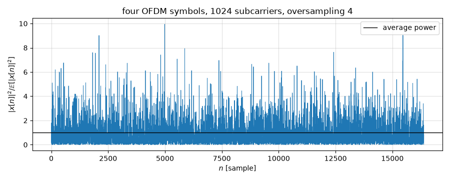
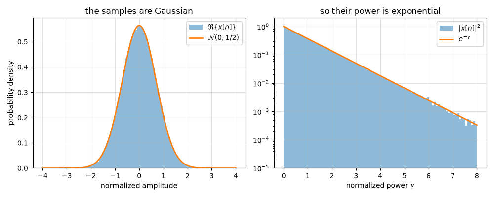
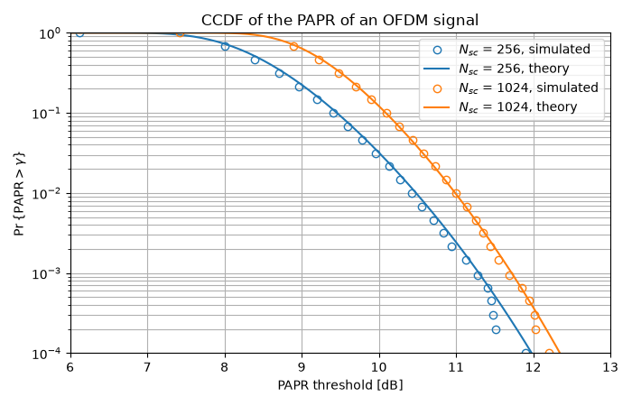

PAPR in OFDM Communication
==========================

The previous tutorial ended well for OFDM: one complex division per
subcarrier instead of a matrix inversion, and a receiver whose cost does not
grow with the bandwidth. This tutorial is the bill.

The problem is at the *transmitter*. An OFDM symbol is the sum of :math:`N`
independently modulated subcarriers, and nothing in the format controls the
amplitude of that sum: most of the time the subcarriers interfere every which
way and the waveform stays moderate, but occasionally they align and produce
a peak far above the average power. Every element that is not perfectly
linear -- the power amplifier first of all, but also the converters -- then
either clips the peak, which spreads the spectrum into the neighbouring
bands, or is sized for it, which means being paid for the average while
paying for the peak.

.. note::

   **Before you start.** :doc:`ofdm` built the OFDM transmitter this
   tutorial reuses. Here we do not look at the error rate at all, but at the
   shape of the waveform itself.

**What you'll learn:**

- Why the amplitude of an OFDM waveform is not controlled, and what law it
  follows.
- How to compute the PAPR of an OFDM signal.
- How to estimate the **Complementary Cumulative Distribution Function
  (CCDF)** of the PAPR, and compare it with theory.

We reproduce the first figure of "An overview of peak-to-average power ratio
reduction techniques for multicarrier transmission", by Han and Lee (2005).

The OFDM Transmitter
^^^^^^^^^^^^^^^^^^^^

The transmitter is the one of the previous tutorial, up to the IFFT: symbols
are mapped, grouped into blocks of :math:`N_{sc}`, allocated to subcarriers,
and transformed. Oversampling is obtained by zero padding -- the data occupy
:math:`N_{sc}` of the :math:`4 N_{sc}` bins -- so that the IFFT interpolates
between the Nyquist samples. Without it, peaks that fall between two samples
are simply not seen.

.. literalinclude:: ../../examples/ofdm/monte_carlo_ofdm_papr.py
   :language: python
   :lines: 1-48

Let us generate four OFDM symbols and look at the instantaneous power,
normalized by its own mean:

.. literalinclude:: ../../examples/ofdm/monte_carlo_ofdm_papr.py
   :language: python
   :lines: 51-67

The waveform spends most of its time below its average power and occasionally
reaches eight or ten times it. This is not a property of the modulation --
QPSK has a constant modulus -- but of the **sum**.

The distribution of the samples
"""""""""""""""""""""""""""""""

Each time sample is a sum of :math:`N_{sc}` independent terms, so for
:math:`N_{sc}` large the central limit theorem applies: :math:`x[n]` is
asymptotically a circular complex Gaussian, and its power is therefore
**exponentially distributed**,

.. math::

   p_{\gamma}(\gamma) = e^{-\gamma},
   \qquad \gamma = \frac{|x[n]|^2}{\mathbb{E}\left[|x[n]|^2\right]}

which is a law with no upper bound: arbitrarily large peaks have small but
non-zero probability.

.. literalinclude:: ../../examples/ofdm/monte_carlo_ofdm_papr.py
   :language: python
   :lines: 73-99

The left panel confirms the Gaussian law on the real part; the right one, on
a logarithmic ordinate, follows :math:`e^{-\gamma}` over four decades.

The PAPR Metric
^^^^^^^^^^^^^^^

The quantity an amplifier is sized on is the **Peak-to-Average Power Ratio**
of one OFDM symbol,

.. math::

   \mathrm{PAPR} = \frac{\max_n |x[n]|^2}{\mathbb{E}\left[|x[n]|^2\right]}

usually quoted in decibels. :func:`~comnumpy.ofdm.metrics.compute_papr`
reduces along the axis it is given, so one call returns one value per OFDM
symbol:

.. literalinclude:: ../../examples/ofdm/monte_carlo_ofdm_papr.py
   :language: python
   :lines: 102-106

.. code::

   PAPR of the four symbols above: 9.55 9.98 8.29 9.56 dB
   PAPR of the whole record      : 9.98 dB

Note that the four values differ by more than 1.5 dB. The PAPR is itself a
random variable, so a single number does not characterize the waveform: what
matters is **how often** a given level is exceeded.

The CCDF of the PAPR
^^^^^^^^^^^^^^^^^^^^

That question is answered by the complementary cumulative distribution
function,

.. math::

   \mathrm{CCDF}(\gamma) = \Pr\left\{\mathrm{PAPR} > \gamma\right\}

If the :math:`N` samples of an OFDM symbol were independent, each with the
exponential law above, the maximum would exceed :math:`\gamma` unless all of
them stayed below it:

.. math::

   \mathrm{CCDF}(\gamma) = 1 - \left(1 - e^{-\gamma}\right)^{N}

Oversampled samples are not independent, but the same expression still fits
the measurement with an **effective** number of samples :math:`\alpha N_{sc}`
with :math:`\alpha \simeq 2.8` (van Nee and Prasad, 2000), which is the form
used below.

Implementation
""""""""""""""

We estimate the CCDF over 20 000 OFDM symbols, for 256 and 1024 subcarriers:

.. literalinclude:: ../../examples/ofdm/monte_carlo_ofdm_papr.py
   :language: python
   :lines: 111-147

Results
"""""""

.. literalinclude:: ../../examples/ofdm/monte_carlo_ofdm_papr.py
   :language: python
   :lines: 149-152

.. code::

   N_sc =  256: PAPR exceeded once in a thousand symbols above 11.30 dB
   N_sc = 1024: PAPR exceeded once in a thousand symbols above 11.72 dB

The measured points sit on the closed form over the whole range. As expected,
the probability of a large PAPR grows with the number of subcarriers -- but
slowly: four times as many subcarriers cost only 0.4 dB, because the number
of samples enters through a logarithm. The peak of a sum of many independent
terms grows very slowly with how many there are.

Conclusion
^^^^^^^^^^

This tutorial highlighted:

- Why an OFDM waveform has an uncontrolled amplitude, and why its samples are
  Gaussian and their power exponential.
- How to compute the PAPR of an OFDM symbol.
- How to estimate the CCDF of the PAPR and compare it with its closed form.

Key takeaway:
**An OFDM signal exhibits a PAPR of the order of 11 to 12 dB at the**
:math:`10^{-3}` **level, whatever the system size, which is what forces
either an amplifier backoff or a PAPR reduction technique.** The library
ships several of the latter, in
``examples/ofdm/one_shot_ofdm_papr_reduction.py``.

Next, :doc:`multipath` goes back to the channel and settles the number the
OFDM tutorial took for granted: how long the cyclic prefix has to be.
