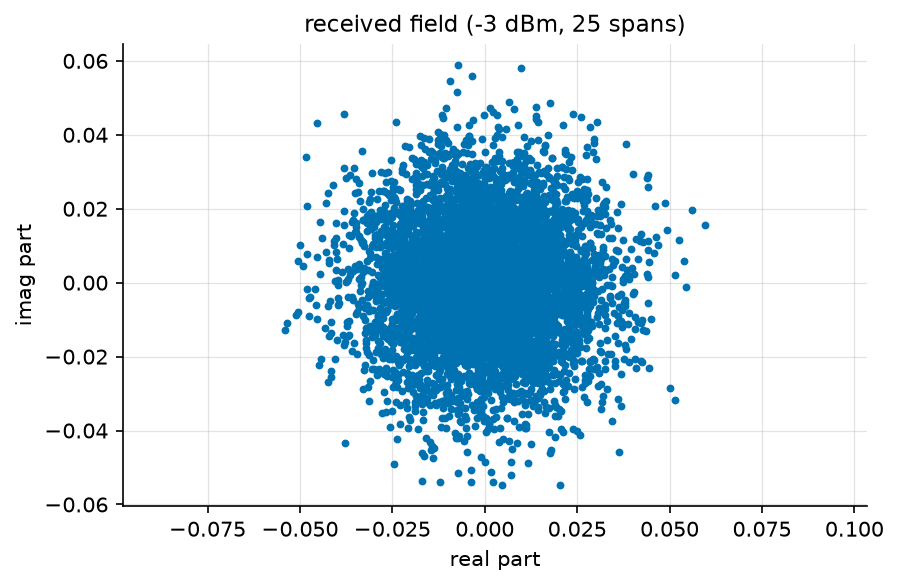
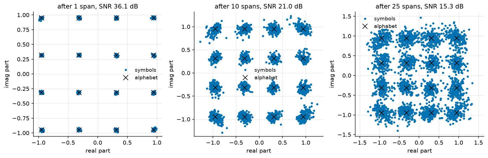
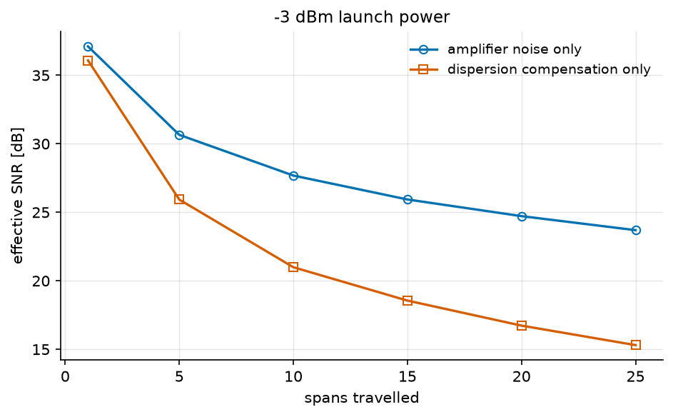
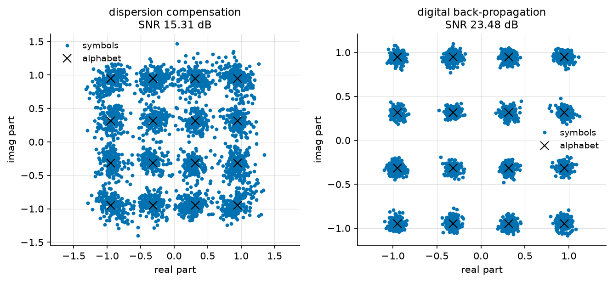
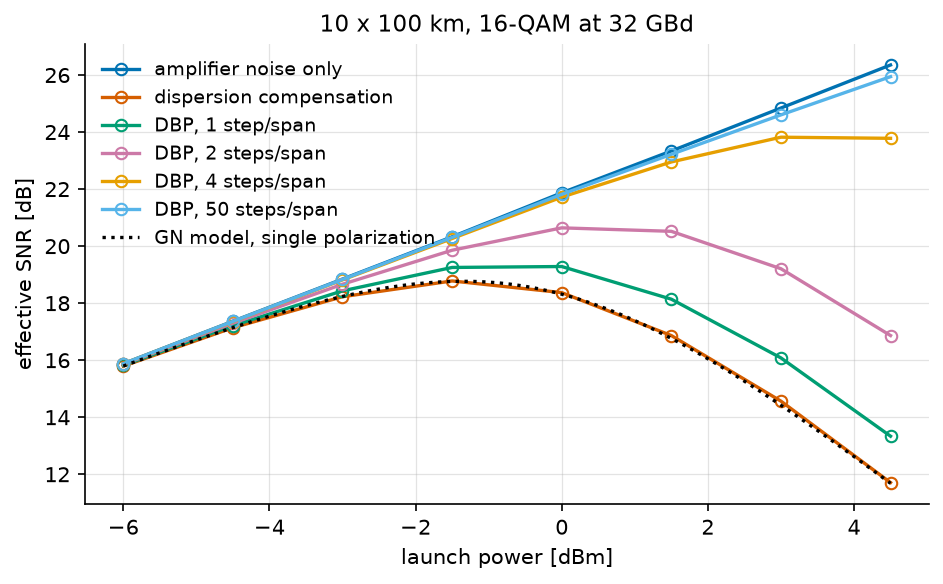
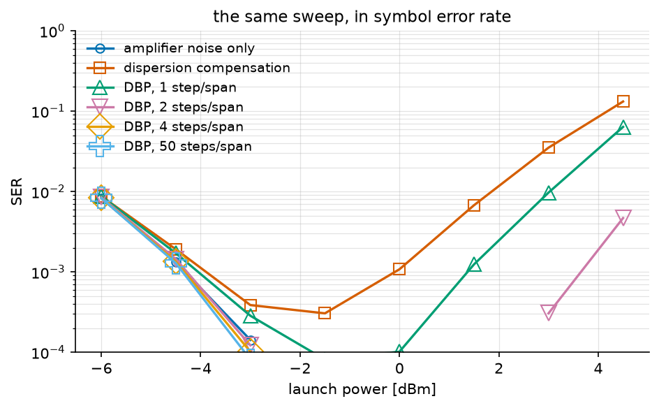

Digital Back-Propagation
========================

The previous tutorial *budgeted* for the fibre nonlinearity: it predicted how
much nonlinear noise a link makes and chose the launch power that minimizes
the total. This tutorial asks the other question -- whether the receiver can
**undo** the nonlinearity instead, and what that is worth.

.. note::

   **Before you start.** :doc:`gn_model` introduced the fibre, the
   split-step propagation and the launch-power trade-off. They are used here
   without being re-explained. Everything below is single-polarization.

**What you'll learn:**

- How to write a link as one chain whose span count is an argument, and how
  a data-aided phase correction is wired into it.
- How a signal degrades span after span, and why a linear receiver cannot
  follow it.
- What digital back-propagation is, in one equation.
- What it buys in effective SNR and in symbol error rate, what it costs in
  computation, and where to cut the chain so that cost is paid once.

This tutorial is suited for engineers and students interested in optical
communications and nonlinear fiber effects.

Channel Model
^^^^^^^^^^^^^

Propagation along a single-mode fibre is governed by the nonlinear
Schrödinger equation, which for one polarization reads

.. math::

   \frac{\partial u}{\partial z} =
   \underbrace{-\frac{\alpha}{2}\, u
   - j\frac{\beta_2}{2}\frac{\partial^2 u}{\partial t^2}}_{\text{linear}}
   + \underbrace{j \gamma \left|u\right|^2 u}_{\text{nonlinear}}

where :math:`\alpha` is the attenuation, :math:`\beta_2` the group-velocity
dispersion and :math:`\gamma` the Kerr coefficient. The two terms are the
whole difficulty: the linear one is diagonal in frequency, the nonlinear one
is diagonal in time, and no basis diagonalizes both.

The **split-step Fourier method** exploits exactly that. Over a step short
enough, the two act almost independently, so each is applied where it is
diagonal:

.. math::

   u(z + \delta) \simeq
   \mathcal{F}^{-1}\!\left\{ e^{\left(-\frac{\alpha}{2}
   + j\frac{\beta_2}{2}\omega^2\right)\delta}\,
   \mathcal{F}\!\left\{ e^{j\gamma\left|u(z)\right|^2\delta}\, u(z)\right\}\right\}

one FFT pair per step. A link is :math:`N_{sp}` spans of that, each followed
by an amplifier which restores the power and adds spontaneous-emission noise
of variance :math:`N_{ase} = (G-1)h\nu\,n_{sp}`, with
:math:`n_{sp} = \mathrm{NF}/\left(2(1 - 1/G)\right)`.

.. note::

   The factor two in :math:`n_{sp}` is the definition of the optical noise
   figure, :math:`\mathrm{NF} = 2 n_{sp}(1 - 1/G)`, not a modelling choice.
   A fully inverted amplifier has :math:`n_{sp} = 1` and therefore
   :math:`\mathrm{NF} = 3` dB: that is the quantum limit of a
   phase-insensitive amplifier, and no EDFA does better.

Implementation
""""""""""""""

We follow the setup of Häger and Pfister: 25 spans of 80 km, 16-QAM at
10.7 GBd, root-raised-cosine pulses, and 50 split steps per span. Their own
reproduction, with a Gaussian stimulus and the paper's 500 steps, is in
``validation/optical_dbp_hager.py``; this page carries a constellation so
it can also show an error rate.

Fifty steps is not a guess. The step-size error is worst where the
nonlinearity is strongest, so it is measured there -- at the highest launch
power of the sweep on the next page -- by refining until the answer stops
moving:

.. code::

   StPS = 200   SNR = 11.758 dB   +0.000 dB   38.0 s
   StPS = 100   SNR = 11.759 dB   +0.001 dB   19.3 s
   StPS =  50   SNR = 11.763 dB   +0.005 dB    9.4 s
   StPS =  25   SNR = 11.776 dB   +0.018 dB    5.0 s
   StPS =  12   SNR = 11.845 dB   +0.087 dB    2.5 s

Fifty steps sit **0.005 dB** from the converged answer and cost a quarter of
what two hundred cost. Every number this page reports is quoted to a
hundredth of a decibel at best, so the discretization is two orders of
magnitude below what is claimed from it -- which is the only sense in which
a step count is ever "enough".

The whole system is one chain, and the number of spans is an argument:

.. literalinclude:: ../../examples/optical/one_shot_NLI.py
   :language: python
   :lines: 1-90

Two things in that chain are worth naming.

The receiver ends with a **data-aided phase correction**. It belongs there:
the nonlinearity turns average power into phase, so what comes out of the
back-propagation carries a rotation of the whole constellation, which a real
receiver removes with a carrier recovery. Its reference is the transmitted
symbol sequence, which the chain produces itself, so the edge is *declared*
-- ``wiring={"phase.reference": "signal_tx"}`` feeds the compensator the
output of the ``signal_tx`` block before it runs, on every pass.

And ``taps`` names the four signals the figures need. ``rx_field`` is the
field as it comes off the fibre, before any of the DSP; ``phase`` is the
final estimate. Reading them costs nothing and keeps the module list a
description of the system rather than of the plotting.

Degradation, span by span
^^^^^^^^^^^^^^^^^^^^^^^^^

Call that chain once per span count, seeded identically each time, and the
only thing that changes is the distance travelled. Each count is run twice:
the second pass switches the fibre's Kerr term off through the chain, which
leaves the amplifier noise alone and gives every other number something to
be read against.

.. literalinclude:: ../../examples/optical/one_shot_NLI.py
   :language: python
   :lines: 93-129

.. code::

   spans   measured   ASE only   the fibre      SER     phase     time
       1    36.09 dB   37.11 dB     1.02 dB   0.0000    -1.2 deg    0.1 s
       5    25.93 dB   30.65 dB     4.72 dB   0.0000    -7.0 deg    0.4 s
      10    20.99 dB   27.68 dB     6.69 dB   0.0007   -14.8 deg    0.7 s
      15    18.56 dB   25.94 dB     7.38 dB   0.0023   -22.9 deg    1.0 s
      20    16.73 dB   24.72 dB     7.99 dB   0.0091   -31.0 deg    1.4 s
      25    15.31 dB   23.70 dB     8.39 dB   0.0238   -39.2 deg    1.7 s

The third column is the subject of this tutorial. It is the price of the
Kerr effect, measured rather than argued: **1.02 dB after one span, 8.39 dB
after twenty-five**. Nothing else in the chain changed between the two
passes -- same symbols, same amplifiers, same noise realization -- so the
difference is the nonlinearity and only the nonlinearity.

The two accumulations are of different kinds, and separating them is the
point. Over the link the amplifiers alone cost 13.4 dB, which is just
twenty-five of them instead of one. The fibre costs 8.4 dB *on top of
that*, and unlike the noise it is deterministic: it was produced by an
equation the receiver knows.

That reference is worth two checks before any of it is believed, and both
are cheap enough to leave in the script:

.. literalinclude:: ../../examples/optical/one_shot_NLI.py
   :language: python
   :lines: 131-156

.. code::

   distortion floor of the chain, no noise and no fibre: 46.3 dB

   spans   ASE only   P / P_ASE      gap
       1    37.11 dB    37.64 dB    -0.53 dB
       5    30.65 dB    30.65 dB    +0.00 dB
      10    27.68 dB    27.64 dB    +0.04 dB
      15    25.94 dB    25.88 dB    +0.06 dB
      20    24.72 dB    24.63 dB    +0.09 dB
      25    23.70 dB    23.66 dB    +0.04 dB

The first number is the chain talking to itself: noise off, fibre off, so
what comes out is the transmitter and the receiver measured against each
other. **46.3 dB** is twenty-three decibels clear of the worst row in the
table, which is what licenses reading that table as a measurement of the
fibre. A chain whose own filters cost 23 dB would produce a curve of the
same shape and none of it would be physics -- pulse shaping, resampling and
matched filtering are invisible when they are right and indistinguishable
from a fibre when they are wrong.

The second compares the amplifier noise with a closed form that owes the
simulation nothing: :math:`P/P_{\mathrm{ASE}}`, built from the noise figure
and the span loss alone. From five spans on it agrees within **0.09 dB**.
The one-span row is 0.53 dB low, and that is the distortion floor showing
through -- at 37 dB the chain's own 46.3 dB is no longer negligible, and
two noises that close add. The check reports it rather than hiding it.

.. literalinclude:: ../../examples/optical/one_shot_NLI.py
   :language: python
   :lines: 158-165

That is the field the receiver is handed. Nothing is recognizable: the
dispersion has spread each symbol over hundreds of neighbours, so the field
looks Gaussian whatever was transmitted. What the chain makes of it, at
three distances:

.. literalinclude:: ../../examples/optical/one_shot_NLI.py
   :language: python
   :lines: 167-197

**Nearly 21 dB lost over the link**, and the two curves say how it was
lost. They start 1 dB apart and end 8.4 dB apart: the amplifier noise sets
the slope, the fibre bends the measured curve away from it. The
constellations show the difference in kind -- after one span the clusters
are tight, after twenty-five they are smeared, and the smearing is not
noise but a deterministic scatter the dispersion has spread over hundreds
of neighbouring symbols.

The phase column measures a third effect, and it is the one the compensator
absorbs: self-phase modulation rotates the constellation by 1.2 degrees per
span, 39 degrees over the link. Left in, that rotation would dominate the
error rate, which is why the compensator sits in the chain and not in a
comment.

The last column is the one to keep, and it is not the receiver's:
``profile_execution_time`` runs the chain and times each block on the way
through, which says where it all went.

.. literalinclude:: ../../examples/optical/one_shot_NLI.py
   :language: python
   :lines: 199-204

.. code::

   block                    time
   data_tx                     0.1 ms
   signal_tx                   0.0 ms
   upsampler                   0.2 ms
   srrcfilter                  1.9 ms
   signal_amplifier            0.1 ms
   link                     1721.7 ms
   rx_field                    0.9 ms
   dbp                         3.9 ms
   srrcfilter_2                0.5 ms
   downsampler                 0.0 ms
   signal_amplifier_2          0.0 ms
   phase                       0.1 ms
   data_rx                     0.4 ms

Thirteen blocks, and one of them is **99.5 %** of the run. The split-step
propagation is 25 spans of 200 steps, each an FFT pair and a pointwise
rotation; everything else is a handful of milliseconds. Keep that ratio in
mind -- it is what the Monte-Carlo section below has to work around.

Digital Back-Propagation
^^^^^^^^^^^^^^^^^^^^^^^^

The nonlinear Schrödinger equation is deterministic and invertible. In the
absence of noise, propagating the received field back through the same
equation with the signs reversed,

.. math::

   \frac{\partial u}{\partial z} =
   \frac{\alpha}{2}\, u + j\frac{\beta_2}{2}\frac{\partial^2 u}{\partial t^2}
   - j \gamma \left|u\right|^2 u

returns exactly what was transmitted. That is **digital back-propagation**:
the same split-step method the channel was simulated with, run backwards.
Its only approximation is the step size, and its only genuine limit is the
ASE noise, which was added *along* the link and is amplified rather than
removed by the backward pass.

Dispersion compensation alone is the same algorithm with the nonlinear term
switched off -- one step per span instead of :math:`\mathrm{StPS}` -- so the
two strategies are one argument of ``get_chain`` apart.

Results
"""""""

.. literalinclude:: ../../examples/optical/one_shot_NLI.py
   :language: python
   :lines: 206-232

.. code::

   dispersion compensation   SNR=15.31 dB  receiver     3.9 ms
   digital back-propagation  SNR=23.48 dB  SER=0.0000  receiver  1045.1 ms  residual phase=-0.1 deg

The residual phase names the culprit. Dispersion compensation undoes the
dispersion and the loss and leaves a **39 degree** rotation of the whole
constellation: that is self-phase modulation, the Kerr effect turning
average power into phase. Removing that rotation is not enough either --
the remaining scatter still costs 2.4 % of the symbols, because the
nonlinearity acts *along* the fibre, interleaved with the dispersion, and
not as one rotation at the end.

Back-propagation inverts that interleaving. The residual rotation falls to
a tenth of a degree, the effective SNR rises by **8.2 dB**, and no symbol
in the run is decided wrongly -- 512 symbols cannot resolve an error rate
below :math:`2 \times 10^{-3}`, so what the last column says is that the
error rate has left the range this run can measure. The Monte-Carlo section
below is where that question is answered properly.

Read against the reference of the first table, the two receivers are 8.4 dB
and 0.2 dB from a link with no nonlinearity in it. Back-propagation has
recovered essentially all of what the fibre took, and what remains is the
amplifier noise, which no receiver removes.

What it costs
^^^^^^^^^^^^^

The last column of the table is the reason DBP is not simply switched on
everywhere. Dispersion compensation is one FFT pair for the whole link; DBP at
:math:`\mathrm{StPS}` steps per span is :math:`N_{sp} \times \mathrm{StPS}`
FFT pairs plus as many pointwise phase rotations. Here that is 3.9 ms
against 1045 ms -- **268 times** -- for 8.2 dB.

That ratio is what the literature on low-complexity back-propagation exists to
improve, and it is also why the useful question is not "DBP or not" but *how
many steps*.

Monte Carlo Evaluation
^^^^^^^^^^^^^^^^^^^^^^

We therefore sweep the launch power, with one receiver per step count, on the
second link of Häger and Pfister: ten spans of 100 km, 16-QAM at 32 GBd. The
reference curve is the same link with its nonlinearity switched off, i.e. what
the amplifier noise alone would allow.

.. literalinclude:: ../../examples/optical/NLI_simulation.py
   :language: python
   :lines: 1-90

Before propagating anything, the closed form of :doc:`gn_model` says where
the optimum should fall. It describes this link with two changes from the
page it was introduced on -- ten spans instead of five, and one polarization
instead of two, which is what ``polarizations=1`` is for:

.. literalinclude:: ../../examples/optical/NLI_simulation.py
   :language: python
   :lines: 93-109

.. code::

   GN model for this link: P_ASE = -21.88 dBm, optimum -1.35 dBm, peak SNR 18.77 dB

That is the prediction the sweep below has to land on.

.. literalinclude:: ../../examples/optical/NLI_simulation.py
   :language: python
   :lines: 112-227

.. code::

   effective SNR [dB]
   launch power [dBm]       -6.0  -4.5  -3.0  -1.5   0.0   1.5   3.0   4.5
   -----------------------------------------------------------------------
   amplifier noise only     15.9  17.4  18.8  20.3  21.9  23.3  24.8  26.4
   dispersion compensation  15.8  17.1  18.2  18.8  18.4  16.9  14.6  11.7
   DBP, 1 step/span         15.8  17.2  18.4  19.3  19.3  18.1  16.1  13.3
   DBP, 2 steps/span        15.9  17.3  18.7  19.9  20.6  20.5  19.2  16.9
   DBP, 4 steps/span        15.9  17.4  18.8  20.3  21.7  23.0  23.8  23.8
   DBP, 50 steps/span       15.9  17.4  18.8  20.3  21.8  23.2  24.6  25.9

This is the figure the whole subject is about. Every curve rises at low power,
where the amplifier noise dominates and turning the laser up helps; every
curve except the reference then turns over, where the nonlinear interference
grows faster than the signal. The reference does not turn over because it has
nothing to turn it over: it is the same link with the Kerr term switched off,
and it climbs as :math:`P/P_{\mathrm{ASE}}` forever -- 15.9 dB at
:math:`-6` dBm against the 15.88 dB the noise budget predicts, 26.4 dB at
+4.5 dBm against 26.38 dB. A reference that bent would be a reference with a
defect in it.

The maximum of each of the others is the operating point of that receiver,
and back-propagation **moves it to the right**:

.. code::

   receiver                  best SNR   at power    total time
   amplifier noise only      26.35 dB    4.5 dBm       0.4 s
   dispersion compensation   18.78 dB   -1.5 dBm       0.4 s
   DBP, 1 step/span          19.28 dB    0.0 dBm       0.7 s
   DBP, 2 steps/span         20.64 dB    0.0 dBm       1.4 s
   DBP, 4 steps/span         23.82 dB    3.0 dBm       2.6 s
   DBP, 50 steps/span        25.94 dB    4.5 dBm      30.7 s

Start with the second row, because it is the one the closed form claims to
predict:

.. code::

   GN model 18.77 dB at -1.35 dBm, dispersion compensation 18.78 dB at -1.5 dBm

**0.01 dB.** The Gaussian-noise model of the previous tutorial ran in
microseconds and knew nothing of this chain -- not the pulse shaping, not the
split-step integration, not the matched filter. It described the receiver
that leaves the nonlinearity in place, which is exactly the receiver its
assumption is written for, and it landed on it. That agreement is what
licenses the rest of the table: the simulation is measuring the fibre, not
its own numerics.

The closed form has nothing to say about the rows below, and cannot have.
It counts the nonlinear interference as noise; a back-propagating receiver
removes part of it, and a model that calls something noise cannot describe
undoing it.

Read the last two columns of those rows together. Going from one step per
span to four buys **4.5 dB**; going from four to fifty buys **2.1 dB more**
and costs twelve times the computation. The returns collapse because the
step-size error falls with the number of steps while the ASE noise does not:
at fifty steps the receiver is 0.41 dB from the noise-only bound, and no
number of steps will close that last gap.

Against dispersion compensation alone, four steps per span are worth 5.0 dB
of effective SNR **and** 4.5 dB of launch power, which is the number a link
budget actually spends.

The error rate says the same thing in the units a link is specified in, and
adds the shape the SNR curve hides: a bathtub, whose left wall is the
amplifier noise and whose right wall is the nonlinearity. Back-propagation
does not move the left wall -- it cannot -- and pushes the right one out.

The bottom of the figure is the estimator, not the link, and the counters
say so in errors rather than in a caveat:

.. code::

   receiver                  errors at its best power
   amplifier noise only           0 over 49152 symbols
   dispersion compensation       15 over 49152 symbols
   DBP, 1 step/span               5 over 49152 symbols
   DBP, 2 steps/span              0 over 49152 symbols
   DBP, 4 steps/span              0 over 49152 symbols
   DBP, 50 steps/span             0 over 49152 symbols

Four receivers of six saw **no error at all** at their own best power.
Those points are not measurements of an error rate; they are the
statement that it is below one in 49152, i.e. :math:`2 \times 10^{-5}`.
That is why the comparison above is made in effective SNR, which uses
every symbol rather than only the wrong ones -- and why a curve that
stops has to say how many errors it stopped on.

Conclusion
^^^^^^^^^^

This tutorial highlighted:

- How to propagate a signal through a nonlinear fibre with the split-step
  method, and how to watch it degrade span by span by running the same
  chain at several span counts.
- Where the run time of such a chain goes, and why the receiver comparison
  is worth splitting in two.
- Why the damage is of two kinds, and why only one of them is linear.
- What digital back-propagation is, and that it is the channel model run
  backwards.
- What it buys -- 4.9 dB and two decades of error rate -- and what it costs.

Key takeaway:
**The fibre nonlinearity is deterministic, so it can be inverted; what cannot
be inverted is the amplifier noise that was added along the way. Digital
back-propagation buys back most of the nonlinear penalty, at a computational
cost proportional to the number of steps it takes.**

References
^^^^^^^^^^

- C. Häger and H. D. Pfister, "Physics-based deep learning for fiber-optic
  communication systems", *IEEE J. Sel. Areas Commun.*, vol. 39, no. 1,
  pp. 280-294, 2021 (arXiv:2010.14258) -- the link parameters, the noise
  model and the step-count comparison used here.
- E. Ip and J. M. Kahn, "Compensation of dispersion and nonlinear impairments
  using digital backpropagation", *J. Lightwave Technol.*, vol. 26, no. 20,
  pp. 3416-3425, 2008.
- G. P. Agrawal, *Nonlinear Fiber Optics*, 5th ed., Academic Press, 2013,
  Chapter 2 -- the split-step method and its step-size error.
