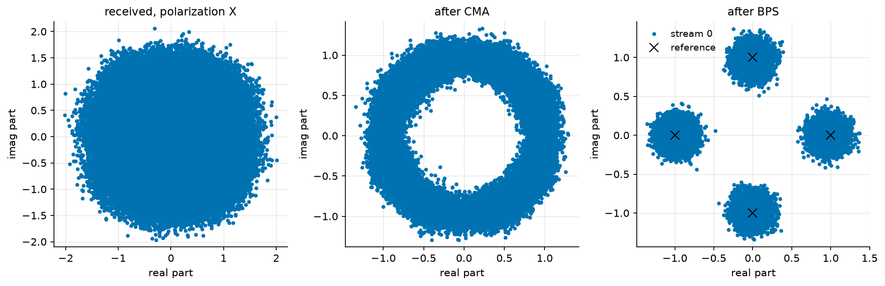

Polarization Demultiplexing: CMA and Blind Phase Search
=======================================================

A coherent optical link transmits on the two polarizations of the fibre
at once. The fibre repays that by mixing them: its random birefringence
rotates the state of polarization by an unknown, wavelength-flat Jones
matrix, and polarization-mode dispersion (PMD) delays the two principal
states against each other, so each received polarization is a filtered
mix of both transmitted ones. On top of it, the transmit laser's phase
noise spins the whole constellation. None of these is known to the
receiver, and none is an obstacle: undoing all three blindly is the
standard coherent DSP chain, and this page builds it.

**What you'll learn:**

- How to emulate a fibre's polarization rotation and first-order PMD
  with ``PMDEmulator``, and a laser's Wiener phase noise with
  ``PhaseNoise``.
- How the blind 2x2 butterfly equalizer (CMA) separates the
  polarizations without training.
- How blind phase search (BPS) tracks the laser phase, and which
  ambiguities every blind receiver leaves behind.

The problem
^^^^^^^^^^^

Two QPSK streams are shaped and sent through one laser, one fibre and
one amplifier. The phase walk is common to the two rows -- one laser --
while the PMD emulator, a cascade of eight random unitary sections with
an RMS DGD of 10 ps (a third of the symbol at 32 GBd -- the section
delays add in quadrature, and the ensemble DGD is Maxwellian around
that value), mixes the rows into each other:

.. literalinclude:: ../../examples/optical/one_shot_pdm.py
   :language: python
   :lines: 1-55

Sampling the received field naively at the symbol rate gives the left
panel of the figure below: a disc. The two polarizations sit on top of
each other with a relative delay, and the laser spins the sum -- there
is no constellation to see, and no error rate worth measuring.

The method
^^^^^^^^^^

Two blind estimators, in the order a receiver runs them.

The **constant modulus algorithm** (CMA) adapts a 2x2 butterfly of FIR
filters by gradient descent on the modulus error
:math:`\left(|y[n]|^2 - R^2\right)^2` (Savory, 2008). QPSK has constant
modulus, so any residual modulus variation is the channel's doing --
the criterion needs no phase reference, which is what lets it converge
while the constellation still spins.

**Blind phase search** (BPS, Pfau et al., 2009) then rotates each
output by a grid of test phases, decides each against the alphabet, and
retains per symbol the test phase of least windowed decision distance.
It is feedforward -- no loop to stabilize -- and estimates the phase
modulo :math:`\pi/2`, the symmetry of the constellation.

The implementation and the measurement
^^^^^^^^^^^^^^^^^^^^^^^^^^^^^^^^^^^^^^

.. literalinclude:: ../../examples/optical/one_shot_pdm.py
   :language: python
   :lines: 57-72

A blind receiver leaves exactly three things unresolved, and it is
worth seeing them listed rather than hidden: which output is which
polarization, a quadrant rotation per output, and the small group delay
of the equalizer. A deployed system resolves them with framing
(:doc:`../documentation/core/frames`); here the known data plays that
role, explicitly:

.. literalinclude:: ../../examples/optical/one_shot_pdm.py
   :language: python
   :lines: 74-118

.. code::

   output 0: polarization 0, rotated 270 deg, delayed -4 symbols
   output 1: polarization 1, rotated 90 deg, delayed -4 symbols
   SER after CMA + BPS: 0.00e+00 over 123072 symbols (0 errors)

The figure is the whole argument, read left to right. The received
polarization is a disc -- two delayed streams plus a spinning phase.
After the CMA it is a ring: the modulus is restored, so the butterfly
has inverted the rotation and the DGD, but the criterion is blind to
phase and the laser still spins the ring. After the BPS the four clouds
sit on the reference crosses.

Zero errors over 123 072 symbols does not measure an error rate -- at
this SNR the closed form predicts :math:`\sim 10^{-8}`, far below what
the run can resolve. What it measures is the claim this page makes:
the blind chain is **transparent**, from a disc to a decided
constellation, at the cost of 4 000 discarded convergence symbols and
three ambiguities resolved by framing.

Conclusion
^^^^^^^^^^

You have learned how to:

- Emulate polarization rotation, first-order PMD and laser phase noise
  with three seeded blocks.
- Separate two polarizations blindly with the CMA butterfly, and read
  its convergence cost.
- Track the carrier phase with BPS, and resolve the permutation,
  quadrant and delay ambiguities a blind receiver always leaves.

The natural next step is :doc:`optical_fiber_nonlinearity`, where the
fibre stops being unitary: attenuation, amplifier noise and the Kerr
effect set the limits this page's channel did not have.

References
^^^^^^^^^^

S. J. Savory, "Digital filters for coherent optical receivers,"
Optics Express, vol. 16, no. 2, pp. 804-817, 2008.

T. Pfau, S. Hoffmann and R. Noe, "Hardware-Efficient Coherent Digital
Receiver Concept With Feedforward Carrier Recovery for M-QAM
Constellations," Journal of Lightwave Technology, vol. 27, no. 8,
pp. 989-999, 2009.

C. D. Poole and R. E. Wagner, "Phenomenological approach to
polarisation dispersion in long single-mode fibres," Electronics
Letters, vol. 22, no. 19, pp. 1029-1030, 1986.
