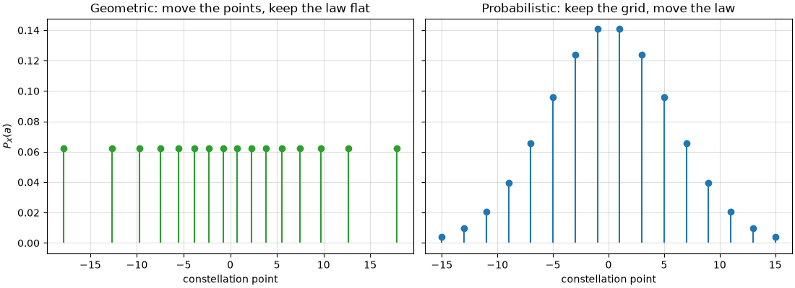
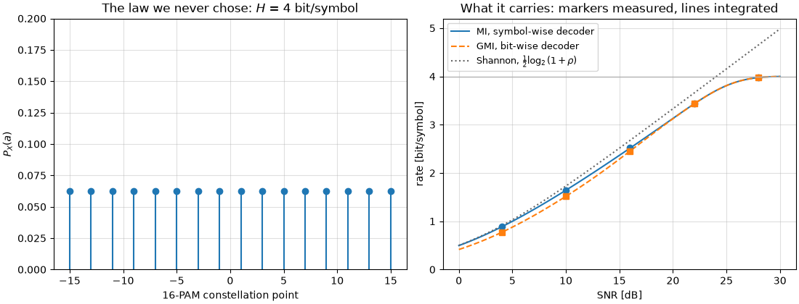
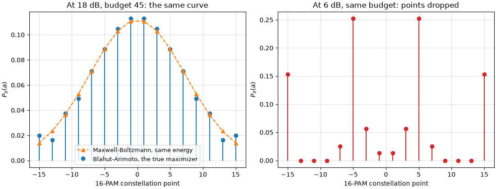
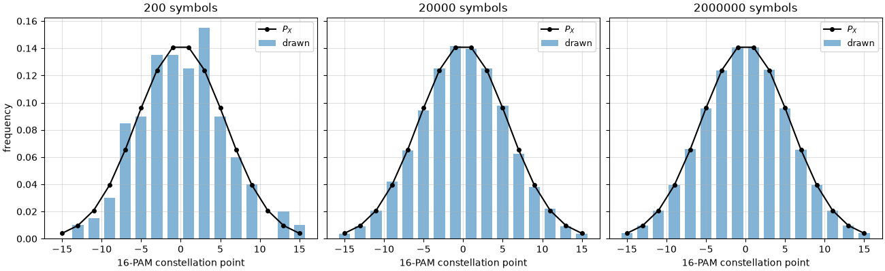
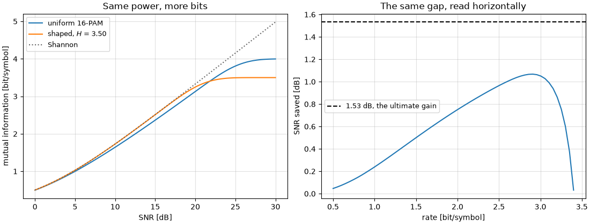
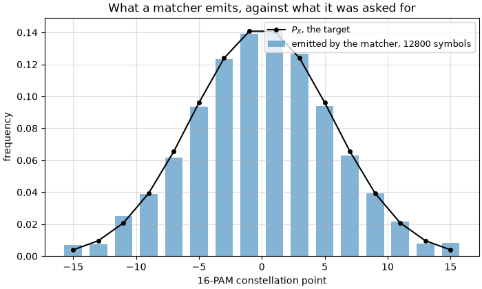

Probabilistic Shaping
=====================

Shannon settled the question in 1948: over an additive white Gaussian
noise channel, the input that achieves capacity is a **Gaussian**. Every
constellation in every earlier tutorial of this series is something else --
a finite set of points, sent equally often -- and a uniform square QAM pays
for that with up to **1.53 dB** of the available SNR. That loss has a name,
the *shaping gap*, and closing it is what this tutorial is about.

There are exactly two ways to make a finite constellation look Gaussian, and
naming both is the right way in:

* **Geometric shaping** moves the *points*, packing them densely near the
  origin and sparsely at the edges, and keeps sending them equally often.
* **Probabilistic shaping** keeps the points on their regular grid and
  changes *how often* each one is sent.

The subject spent twenty-five years going nowhere. Constellation shaping was
worked out between the late 1980s and the early 1990s and found essentially
one deployment, the V.34 voice-band modem of 1994. Two things kept it there:
1.53 dB is not much next to the 10 dB that turbo and LDPC codes started
delivering from 1993 onwards, and nobody had a practical way to build the
shaped transmitter anyway. The unlock came in 2015 with **probabilistic
amplitude shaping** (PAS), which is the architecture Part 5 builds, and
probabilistic shaping went from curiosity to commercial transponders in
about four years.

.. note::

   **Before you start.** This tutorial reads rates rather than error rates,
   so it assumes you are comfortable with a chain
   (:doc:`../getting_started/first_simulation`) and have met mutual
   information somewhere. It sits naturally after :doc:`coding`: shaping and
   coding are the two halves of the same transmitter, which is what the PAS
   architecture in Part 5 is about.

**What you'll learn:**

- The two ways to shape a constellation, and why the probabilistic one is
  the one that got deployed -- measured, not asserted.
- What a constellation actually carries over a noisy channel -- entropy,
  mutual information, and the generalized mutual information a *real*
  receiver is limited by.
- Which law maximizes that rate, computed rather than asserted, and how
  close the closed-form Maxwell-Boltzmann law comes to it.
- How to draw from a law and watch the histogram converge to it.
- Why a distribution matcher is needed at all, and what a finite block costs.
- How one fixed FEC code rate becomes a continuum of information rates,
  which is the benefit that sells shaping in practice.
- How all of this carries over to a complex constellation, and why shaping
  is deployed on 256-QAM and not on QPSK.

Introduction
^^^^^^^^^^^^

Prerequisites
"""""""""""""

Make sure you have the following Python libraries installed:

.. code::

   numpy
   matplotlib
   comnumpy

Import Libraries
""""""""""""""""

.. literalinclude:: ../../examples/simple/probabilistic_shaping.py
   :language: python
   :lines: 1-18

Define Parameters
"""""""""""""""""

We work on **16-PAM**, written on its natural odd-integer grid
:math:`\{\pm 1, \pm 3, \ldots, \pm 15\}`. Shaping is a one-dimensional
operation -- a square QAM constellation is the product of two PAM axes, so
shaping the axis shapes the QAM, which is what Part 7 makes explicit.

The constellation comes from :func:`~comnumpy.core.utils.get_alphabet`
rather than from ``np.arange``, and that matters twice over. Its order is
the **Gray labelling**, which the bit-wise rate of Part 2 depends on; and in
that order the most significant bit is the *sign* while the three others are
the *amplitude*, which is exactly the decomposition PAS needs in Part 5.

What ``get_alphabet`` returns is normalized to unit average energy, which is
the right convention for a link budget and the wrong one for reading a law
off a figure. Dividing by the smallest amplitude puts the constellation back
on the odd integers without touching the order, and doing it in one function
means the same expression works for every size -- writing the scale factor
out by hand would embed the energy of one particular constellation, which is
a bug the day the size changes.

.. literalinclude:: ../../examples/simple/probabilistic_shaping.py
   :language: python
   :lines: 20-45

Part 1: two ways to shape a constellation
^^^^^^^^^^^^^^^^^^^^^^^^^^^^^^^^^^^^^^^^^

Before choosing a law it is worth seeing what the alternative looks like.
Geometric shaping puts the :math:`i`-th of :math:`M` points at the
:math:`(i + \tfrac{1}{2})/M` quantile of a Gaussian and keeps the law flat;
probabilistic shaping keeps the odd-integer grid and bends the law instead.

.. literalinclude:: ../../examples/simple/probabilistic_shaping.py
   :language: python
   :lines: 73-84

.. literalinclude:: ../../examples/simple/probabilistic_shaping.py
   :language: python
   :lines: 92-120

.. code::

     SNR   uniform   geometric   probabilistic   best H
       6    1.1182      1.1513          1.1582     2.65
      12    1.9240      2.0086          2.0372     3.10
      18    2.8200      2.8986          2.9859     3.60
      24    3.7023      3.6551          3.7644     3.95

Both beat the uniform constellation at the same power, which is the point of
shaping at all. But read the last row. **At 24 dB the geometric
constellation is worse than the uniform one** -- 3.6551 against 3.7023 --
while the probabilistic one is still ahead.

Nothing went wrong. The geometric layout was built to look Gaussian, and at
high SNR the noise is small enough that what matters is the *minimum
distance* between points, which a regular grid maximizes. The layout is
right at one SNR and wrong at the others, and moving it means moving every
point. The probabilistic constellation retunes with the single number in the
last column: :math:`H` falls to 2.65 bit at 6 dB and rises to 3.95 at 24 dB,
and the grid never moves.

That is the first of three reasons probabilistic shaping is the one that got
deployed, and the other two are practical rather than informational (Cho and
Winzer, 2019):

- **one parameter.** Matching the law to a channel means turning
  :math:`\lambda`, and Part 3 shows that one number is within a hundredth of
  a bit of the true optimum. Matching a geometric layout means solving for
  :math:`M` point locations, with no closed form for an arbitrary channel.
- **the points stay on the square grid.** Every piece of coherent receiver
  DSP -- timing, carrier recovery, equalization -- is built for square QAM
  and keeps working unchanged. Irregular points break those algorithms.
- **Gray labelling survives.** The bit-wise decoder of the next part needs
  it, and a geometrically shaped constellation generally cannot be Gray
  labelled at all.

The rest of this page is therefore about the probabilistic kind, and it
measures the two things it buys: **sensitivity**, the decibels of Part 4,
and **rate adaptability**, the continuum of Part 6.

Part 2: what a constellation carries
^^^^^^^^^^^^^^^^^^^^^^^^^^^^^^^^^^^^

Start with the law nobody chose: the uniform one. Its entropy

.. math::

   H(P) = -\sum_i p_i \log_2 p_i = 4 \ \text{bit/symbol}

is the number of bits a symbol carries when the channel is perfect. It is an
upper bound and nothing more -- add noise and the receiver stops being able
to tell some points apart.

What survives the noise is the **mutual information**

.. math::

   I(X;Y) = \sum_{x} P_X(x) \int f_{Y|X}(y|x)
            \log_2 \frac{f_{Y|X}(y|x)}{f_Y(y)}\, \mathrm{d}y

the rate a decoder working on *symbols* can be driven to. But no practical
receiver works on symbols: a soft-decision system wraps a binary code around
a demapper that emits one L-value per bit, so the decoder sees :math:`m`
parallel binary channels. The rate *that* structure reaches is the
**generalized mutual information**,

.. math::

   \mathrm{GMI} = \sum_{k=1}^{m} I(B_k; Y) \leq I(X;Y)

and the gap between the two is the price of the bit-wise interface (Alvarado
*et al.*, 2015). It is small for a Gray labelling and large for a bad one,
which is the whole reason Gray labelling is used.

Both are available two ways in the library, and the tutorial uses both on
purpose: :func:`~comnumpy.core.capacity.constellation_capacity` and
:func:`~comnumpy.core.capacity.bicm_capacity` integrate them by quadrature,
while :func:`~comnumpy.core.information.compute_mi` and
:func:`~comnumpy.core.information.compute_gmi` estimate them from received
samples.

.. literalinclude:: ../../examples/simple/probabilistic_shaping.py
   :language: python
   :lines: 48-71

.. warning::

   **The factor of two between a real channel and a complex one.** The
   estimators and the quadrature both use the complex convention, where the
   noise variance :math:`\sigma^2` is split over two dimensions. A *real*
   PAM channel of noise variance :math:`\sigma^2` is therefore passed as
   :math:`\rho = 1/(2\sigma^2)`, and an SNR :math:`s` on a constellation of
   energy :math:`E` as :math:`\rho = s/(2E)`. Get it wrong and every curve
   on the page moves by 3 dB while still looking perfectly plausible.

   Dividing by :math:`E` is not bookkeeping either. It is what makes the
   comparison in Part 3 fair: a shaped law spends less energy, so *at equal
   power* its constellation is wider -- and that extra width is where the
   entire shaping gain comes from.

.. literalinclude:: ../../examples/simple/probabilistic_shaping.py
   :language: python
   :lines: 87-90

.. code::

   16-PAM, uniform law: H = 4.000 bit/symbol, energy 85, shaping gain 0.017 dB

The 0.017 dB is the calibration of :func:`~comnumpy.core.shaping.shaping_gain_dB`:
a uniform law must score essentially zero on any scale of shaping gain worth
having.

.. literalinclude:: ../../examples/simple/probabilistic_shaping.py
   :language: python
   :lines: 92-120

The measurement uses the chain the rest of the page reuses -- a source, a
mapper, a channel -- with the transmitted symbols tapped so every estimator
has its reference:

.. literalinclude:: ../../examples/simple/probabilistic_shaping.py
   :language: python
   :lines: 122-151

.. mermaid:: mermaid/shaping_study.mmd

``noise.sigma2_`` is the variance the run that has just finished actually
applied -- a data-dependent attribute, hence the trailing underscore (D24) --
so the estimator is told the same channel the chain used rather than the one
it was asked for.

.. literalinclude:: ../../examples/simple/probabilistic_shaping.py
   :language: python
   :lines: 154-171

.. literalinclude:: ../../examples/simple/probabilistic_shaping.py
   :language: python
   :lines: 173-180

.. code::

    SNR      MI       GMI    MI-GMI    measured MI   measured GMI
       4   0.8840   0.7695   0.1145        0.8826         0.7669
      10   1.6419   1.5157   0.1262        1.6444         1.5179
      16   2.5151   2.4542   0.0609        2.5180         2.4560
      22   3.4329   3.4324   0.0005        3.4315         3.4309
      28   3.9755   3.9755   0.0000        3.9749         3.9749

Three things to take from this table.

The **markers land on the lines**: an integral over a Gaussian weight and a
mean over 120 000 noisy samples agree to a few thousandths of a bit, which
is the Monte-Carlo error. They share no code path, so this is a real check
of both.

The **bit-wise interface costs about 0.12 bit** at low SNR and nothing at
all above 20 dB. With a Gray labelling the loss vanishes as soon as the
symbol decisions become reliable, because a symbol error then almost always
flips a single bit.

And the curve **saturates at 4 bit/symbol**, the entropy, however clean the
channel gets. That ceiling is the first hint that the law matters: a
constellation cannot carry more than its own entropy, so a law of lower
entropy buys nothing at high SNR -- and, as the next part shows, quite a lot
in the middle.

Part 3: which law maximizes the rate
^^^^^^^^^^^^^^^^^^^^^^^^^^^^^^^^^^^^

Now the design question, and it only has a meaning under a **constraint**.
A transmitter has a power budget. Among all laws on this constellation
spending at most a given energy, which one carries the most bits?

.. math::

   \max_{P_X} \; I(X;Y)
   \quad \text{subject to} \quad \sum_i p_i |a_i|^2 \leq E

Drop the constraint and the question stops being interesting: with energy
free, the best thing to do with the outer points is to *use* them, so the
maximizer spreads outwards and spends more than the uniform law. Everything
below is therefore indexed by the energy budget, never by the multiplier --
comparing two laws that spend different energies compares nothing at all.

The problem has no closed form. It is concave, and the classical way to
solve it is the **Blahut-Arimoto** algorithm (Blahut, 1972; Arimoto, 1972):
alternate between the posterior :math:`q(i \mid y)` implied by the current
law and the law implied by that posterior,

.. math::

   q(i \mid y) = \frac{p_i f(y|a_i)}{\sum_j p_j f(y|a_j)},
   \qquad
   p_i \;\leftarrow\; \frac{e^{D_i - \lambda |a_i|^2}}
                           {\sum_j e^{D_j - \lambda |a_j|^2}},
   \qquad
   D_i = \int f(y|a_i) \log q(i \mid y)\, \mathrm{d}y

with :math:`\lambda` the Lagrange multiplier of the energy constraint. That
multiplier is an internal variable: :func:`~comnumpy.core.shaping.blahut_arimoto`
takes ``energy=`` and finds it by a root-find, because the budget is what an
engineer actually has. The Gaussian integral is done by Gauss-Hermite
quadrature rather than sampled, so the answer is deterministic.

Against it stands the law this library uses everywhere else. Among all laws
of a given energy, the one of maximum **entropy** is the Maxwell-Boltzmann
family

.. math::

   p_i = \frac{e^{-\lambda |a_i|^2}}{\sum_j e^{-\lambda |a_j|^2}},
   \qquad \lambda \geq 0

which :func:`~comnumpy.core.shaping.maxwell_boltzmann` computes in closed
form. Note carefully that this answers a *different question*: maximum
entropy at a given energy, not maximum rate over a given channel. The two
coincide only in the limit of a Gaussian channel with a Gaussian input. How
much the difference costs is a number, and the point of this part is to
measure it rather than cite it (Kschischang and Pasupathy, 1993).

Matching the closed form to a budget is a bisection on a formula, so it is
free -- and it must refuse a budget it cannot meet, or the comparison would
silently be against the wrong law:

.. literalinclude:: ../../examples/simple/probabilistic_shaping.py
   :language: python
   :lines: 186-211

.. literalinclude:: ../../examples/simple/probabilistic_shaping.py
   :language: python
   :lines: 213-227

.. code::

   At 18 dB on the uniform law, sigma^2 = 1.347. The uniform law spends 85.

     budget   backoff   H(best)  H(MB)   MI(best)   MI(MB)      gap
         85    0.00 dB    3.953  4.000     2.8340   2.8200   0.0139
         70    0.84 dB    3.943  3.970     2.7730   2.7647   0.0083
         45    2.76 dB    3.755  3.762     2.5347   2.5326   0.0021
         25    5.31 dB    3.367  3.367     2.1440   2.1439   0.0001

Read the first row first, because it is the one that justifies the whole
subject. The budget there is the uniform law's own energy, so
Maxwell-Boltzmann at that budget *is* the uniform law -- and it is beaten.
**At exactly the same power, the uniform 16-PAM is not the best law**: its
entropy is the full 4 bit but it carries 2.8200, where a law of entropy
3.953 carries 2.8340. Spending entropy to buy rate is the whole idea, and
it already pays at zero backoff.

Then read down the last column. **The closed form is worth using**: the gap
is at most 0.014 bit and it collapses as the budget tightens. That is the
result Kschischang and Pasupathy proved, and the reason the rest of this
module never mentions Blahut-Arimoto again -- one line of closed form buys
99.5 % of an iterative solver.

.. literalinclude:: ../../examples/simple/probabilistic_shaping.py
   :language: python
   :lines: 229-239

.. literalinclude:: ../../examples/simple/probabilistic_shaping.py
   :language: python
   :lines: 241-260

.. literalinclude:: ../../examples/simple/probabilistic_shaping.py
   :language: python
   :lines: 262-276

.. code::

   At 6 dB, on the uniform law's own budget, 6 of the 16 points hold less
   than 1e-6 of the mass and the entropy is down to 2.731 bit -- while
   Maxwell-Boltzmann at that budget is the uniform law itself, at H = 4.000.
   Both numbers keep falling as the tolerance is tightened, and that is the
   point: the maximizer's limit sits on the *boundary* of the simplex, so
   the iteration only ever approaches it. No Maxwell-Boltzmann law goes
   there at all -- at lambda = 0.5 the outermost point still keeps 1.1e-49.

   And a budget that does not bind is refused rather than answered:
     got energy=254.99999999999994, expected a value in
     [0.9999999999999998, 96.62517172622793] for this alphabet and
     sigma2=1.3471592135919461. The upper end is what the maximizer spends
     when nothing constrains it, which on a noisy channel is more than the
     uniform law's 84.99999999999999: asking for more than that is asking
     for a constraint that does not bind.

The right-hand panel is the one worth staring at. Same constellation, same
power budget, a noisier channel -- and the optimal law does something no
Maxwell-Boltzmann law can: it **abandons points**. Two points the receiver
cannot tell apart are worth less than one point used twice as often, so the
maximizer thins the constellation out and spends the freed energy separating
what is left.

Note what is *not* claimed there. The count and the entropy are quoted at a
stated tolerance and both keep moving as it is tightened, because the answer
lives on the boundary of the simplex and an alternating maximization only
approaches a boundary asymptotically. That is also why
:func:`~comnumpy.core.shaping.blahut_arimoto` reports the distance it may
still be from the maximum instead of returning a half-converged law in
silence -- Blahut's bound is a certificate, and quoting a converged "exactly
zero" count here would be inventing precision the iteration never delivered.

The refusal at the end is the same discipline applied to the budget. Above
the unconstrained maximizer's own energy a budget constrains nothing, so
asking for one is a mistake worth naming rather than answering.

Part 4: drawing from the law, and what it buys
^^^^^^^^^^^^^^^^^^^^^^^^^^^^^^^^^^^^^^^^^^^^^^

Take the Maxwell-Boltzmann law at :math:`H = 3.5` bit/symbol -- half a bit
of backoff from the uniform 4 -- and simply *draw* from it.
``SymbolGenerator(16, distribution=...)`` is that draw: an i.i.d. source, the
idealization a real matcher approaches.

.. literalinclude:: ../../examples/simple/probabilistic_shaping.py
   :language: python
   :lines: 283-286

.. code::

   target law: H = 3.500 bit/symbol, energy 30.20 against 85, shaping gain 1.501 dB

Half a bit of entropy bought a factor 85/30.2 = 2.8 in energy -- **4.5 dB**
of raw power, of which 1.5 dB survives the equal-rate accounting that
:func:`~comnumpy.core.shaping.shaping_gain_dB` performs. The rest pays for
the half bit given up.

.. literalinclude:: ../../examples/simple/probabilistic_shaping.py
   :language: python
   :lines: 288-305

.. code::

     symbols   empirical H   empirical energy   total variation
         200        3.4172             29.280            0.0790
       20000        3.4958             30.043            0.0094
     2000000        3.5005             30.223            0.0011

The histogram converges to the law, and the last column says how fast: the
total variation distance falls as :math:`1/\sqrt{n}`, a factor ten for every
hundredfold in symbols. Two hundred symbols already look like the right
shape and are 8 % away from it; two million are a part in a thousand.

Keep that number in mind for Part 5. A distribution matcher does **not**
produce this: it maps uniform bits onto a finite set of sequences, so its
output is neither independent nor exactly :math:`P_X` on a finite block. The
i.i.d. draw is what a matcher is trying to imitate, which is why it is the
right thing to use here -- it isolates what the *law* is worth from what a
finite block costs.

And what the law is worth is this:

.. literalinclude:: ../../examples/simple/probabilistic_shaping.py
   :language: python
   :lines: 307-333

.. literalinclude:: ../../examples/simple/probabilistic_shaping.py
   :language: python
   :lines: 335-339

.. code::

   rate 1.5 bit/symbol: uniform needs  8.96 dB, shaped  8.46 dB -- +0.50 dB saved
   rate 2.0 bit/symbol: uniform needs 12.53 dB, shaped 11.78 dB -- +0.75 dB saved
   rate 2.5 bit/symbol: uniform needs 15.90 dB, shaped 14.94 dB -- +0.96 dB saved
   rate 3.0 bit/symbol: uniform needs 19.17 dB, shaped 18.12 dB -- +1.05 dB saved

The gain is read **horizontally**, and that is the only reading an engineer
can budget: at a fixed rate, how much less SNR does the shaped system need?
Up to 1.05 dB here, growing with the rate, and short of the 1.53 dB
:math:`10\log_{10}(\pi e/6)` that Forney and Wei (1989) showed is the
supremum over all one-dimensional distributions. Sixteen points cannot get
there; Part 7 shows what does.

The gain also **vanishes at both ends**, which the right-hand panel makes
plain. At low rate there is little to gain, and as the rate approaches
4 bit/symbol the only law carrying it is the uniform one, so the shaped
curve must come back to meet it.

Part 5: data is uniform, so the law has to be built
^^^^^^^^^^^^^^^^^^^^^^^^^^^^^^^^^^^^^^^^^^^^^^^^^^^

Everything above assumed a source that emits symbols with probabilities
:math:`p_i`. No such source exists. Data is compressed, encrypted, or simply
arbitrary: it is a stream of **uniform, independent bits**, and a code
downstream will assume exactly that. Something has to convert one into the
other, invertibly, and that something is a **distribution matcher**.

The conversion is not statistical, it is combinatorial. Both constructions
below are *enumerative codes*: they rank and unrank a finite set of blocks
with integer arithmetic, so ``decode(encode(bits)) == bits`` holds by
construction rather than by tolerance.

First, the split PAS is built on. The sign of a PAM symbol is equiprobable,
so it costs nothing in shaping:

.. math::

   P_Y(\pm a_i) = \tfrac{1}{2} P_A(a_i)

The matcher therefore shapes the eight **amplitudes** only, and the sign is
left for a systematic FEC encoder to fill with its parity bits -- which are
uniform, so the composite constellation keeps the symmetric law at the same
energy and gains exactly one bit per symbol (Böcherer, Steiner and Schulte,
2015). Our target of 3.5 bit/symbol is a target of 2.5 bit/amplitude:

.. literalinclude:: ../../examples/simple/probabilistic_shaping.py
   :language: python
   :lines: 346-348

**CCDM** fixes the composition. Every output block holds exactly :math:`n_i`
copies of amplitude :math:`i`, and there are

.. math::

   N = \binom{n}{n_1, \ldots, n_M} = \frac{n!}{n_1! \, n_2! \cdots n_M!}

such blocks, so the matcher carries :math:`k = \lfloor \log_2 N \rfloor`
bits (Schulte and Böcherer, 2016). Every block has the target empirical
distribution *exactly*, at any blocklength. What a finite block costs is
rate:

.. math::

   R_{\mathrm{loss}} = H\!\left(\frac{n_i}{n}\right) - \frac{k}{n}
   \;\xrightarrow[n \to \infty]{}\; 0

**ESS** fixes an energy budget instead (Gültekin *et al.*, 2020). With an
integer energy :math:`e_i` per amplitude, the code is

.. math::

   \mathcal{C} = \Big\{ (s_1, \ldots, s_n) :
   \sum_{j=1}^{n} e_{s_j} \leq E_{\max} \Big\}

and counting it is a one-dimensional recursion over the remaining budget,

.. math::

   N_t(E) = \sum_{i} N_{t-1}\!\left(E - e_i\right), \qquad
   N_0(E) = 1 \;\; \text{for } E \geq 0

from which unranking follows as for CCDM.

The comparison between them is not a benchmark, it is an inclusion. Every
CCDM block costs exactly :math:`E = \sum_i n_i e_i`, so given
:math:`E_{\max} = E` the sphere **contains every CCDM block** and more
besides -- the ones that spend less. It therefore carries at least as many
bits at the same energy, always.

.. literalinclude:: ../../examples/simple/probabilistic_shaping.py
   :language: python
   :lines: 353-364

.. code::

   n =   16   composition (5, 4, 3, 2, 1, 1, 0, 0)   rate 1.8125 vs 2.1875 bit/amplitude
   n =   32   composition (9, 8, 6, 4, 3, 1, 1, 0)   rate 2.0938 vs 2.3750 bit/amplitude
   n =   64   composition (18, 16, 12, 8, 5, 3, 1, 1)   rate 2.2656 vs 2.4688 bit/amplitude
   n =  128   composition (36, 32, 25, 17, 10, 5, 2, 1)   rate 2.3281 vs 2.4453 bit/amplitude

At :math:`n = 16` the sphere carries 21 % more bits than the constant
composition; by :math:`n = 128` both are closing on the entropy of the law,
2.5 bit/amplitude. That is the whole reason ESS exists: CCDM needs thousands
of symbols to be efficient, ESS is already good at a few dozen, which is the
regime of a short packet. What ESS gives up is the exact per-block
distribution -- it reproduces the law only on average.

Note also the two zeros in the composition at :math:`n = 16`: rounding a law
onto sixteen slots simply cannot represent an amplitude of probability
below :math:`1/32`, so the two outermost points are dropped. A finite block
loses rate twice -- once quantizing the law, once taking the floor of
:math:`\log_2 N`.

.. literalinclude:: ../../examples/simple/probabilistic_shaping.py
   :language: python
   :lines: 366-378

.. image:: img/probabilistic_shaping_fig6.png
   :width: 100%
   :align: center

The transmitter
"""""""""""""""

As a chain, PAS is six blocks, and the receiver is the transmitter read
backwards:

.. literalinclude:: ../../examples/simple/probabilistic_shaping.py
   :language: python
   :lines: 380-397

.. mermaid:: mermaid/shaping_pas.mmd

.. code::

   145 bits -> 64 amplitudes per block, recovered exactly: True
   #    block                        id                   output shape       dtype         time ms
   -----------------------------------------------------------------------------------------------
   0    SymbolGenerator              bits                 (29000,)           int64            0.16
   1    DistributionMatcher          matcher              (12800,)           int64           47.00
   2    AmplitudeMapper              mapper               (12800,)           float64          0.18
   3    AWGN                         channel              (12800,)           float64          0.31
   4    AmplitudeDemapper            amplitude_demapper   (12800,)           int64            0.94
   5    DistributionDematcher        distribution_dematcher (29000,)           int64           34.85

``summary()`` shows where the rate conversion happens -- 29 000 bits in,
12 800 amplitudes out -- and where the time goes. The enumerative code costs
some hundred times the channel it feeds, because ranking and unranking are
exact big-integer arithmetic done one symbol at a time. That is the real
price of a matcher, and it is why hardware implementations of CCDM are a
research topic of their own.

.. literalinclude:: ../../examples/simple/probabilistic_shaping.py
   :language: python
   :lines: 399-411

Compare this histogram with the one in Part 4. Both approximate the same
law, but for different reasons: there it was sampling error, shrinking as
:math:`1/\sqrt{n}`; here it is the *quantization* of the law onto a
composition of 64 slots, which does not shrink at all as more blocks are
sent -- every block carries the same rounded composition. More symbols make
this histogram converge to the composition, not to :math:`P_X`.

Where the FEC decoder goes
""""""""""""""""""""""""""

A matcher is a code, and that has a consequence worth meeting head on. Lower
the SNR and a symbol error takes the received block **outside** the code: it
is no longer a permutation of the composition, so there is no index to read
back, and the dematcher says so rather than returning silent nonsense.

.. literalinclude:: ../../examples/simple/probabilistic_shaping.py
   :language: python
   :lines: 413-417

.. code::

   at 20 dB -- the block has composition (16, 21, 10, 6, 6, 3, 0, 2) but this
   matcher enumerates (18, 16, 12, 8, 5, 3, 1, 1). A detector error can
   produce such a block: it is not in the code, so there is no index to read.

This is not a limitation of the implementation, it is the reason PAS is
built the way it is. In a real receiver the FEC decoder sits **between** the
demapper and the dematcher, and the dematcher only ever sees corrected
amplitudes. It also explains why shaping and coding cannot be designed
separately: an uncorrected error does not cost one symbol, it costs the
whole block.

Part 6: rate adaptation, from one code rate
^^^^^^^^^^^^^^^^^^^^^^^^^^^^^^^^^^^^^^^^^^^

The decibels of Part 4 are only half of what shaping is deployed for. The
other half is that it makes the rate **continuously adjustable**, and that
turns out to matter more in practice.

A system without shaping adapts its rate by changing the FEC code rate, and
the available code rates are a short list: an ASIC carries a handful of
matrices, so :math:`R_c` comes from something like
:math:`\{1/2, 2/3, 3/4, 5/6, 9/10\}`. With a uniform constellation carrying
:math:`m` bits per symbol the information rate is :math:`m R_c` -- five
values, and nothing in between. With PAS the rate is

.. math::

   \mathrm{IR} = H(P_X) - m\left(1 - R_c\right)

-- the matcher writes :math:`H` bits into each symbol and the code takes
:math:`m(1 - R_c)` of them back for its parity. Since :math:`H` is
continuous, **so is the rate, at a fixed code rate**.

.. literalinclude:: ../../examples/simple/probabilistic_shaping.py
   :language: python
   :lines: 424-437

.. literalinclude:: ../../examples/simple/probabilistic_shaping.py
   :language: python
   :lines: 440-462

.. code::

   uniform 16-PAM, one fixed-rate code per row:
     Rc = 0.500  ->  2.00 bit/symbol, from 12.8 dB
     Rc = 0.667  ->  2.67 bit/symbol, from 17.2 dB
     Rc = 0.750  ->  3.00 bit/symbol, from 19.2 dB
     Rc = 0.833  ->  3.33 bit/symbol, from 21.6 dB
     Rc = 0.900  ->  3.60 bit/symbol, from 23.2 dB

.. literalinclude:: ../../examples/simple/probabilistic_shaping.py
   :language: python
   :lines: 464-488

.. image:: img/probabilistic_shaping_fig8.png
   :width: 100%
   :align: center

.. literalinclude:: ../../examples/simple/probabilistic_shaping.py
   :language: python
   :lines: 490-494

.. code::

   with the single code rate Rc = 0.75:
       8.0 dB   H = 2.40 bit  ->  1.40 bit/symbol
      12.0 dB   H = 3.00 bit  ->  2.00 bit/symbol
      16.0 dB   H = 3.65 bit  ->  2.65 bit/symbol
      20.0 dB   H = 3.95 bit  ->  2.95 bit/symbol
      24.0 dB   H = 3.95 bit  ->  2.95 bit/symbol

The left panel is the whole argument in one picture. The red steps are the
uniform system: five rates, and between two of them the link either runs
below what the channel would support or does not close at all. Add 2 dB of
margin at 17 dB and nothing changes until 17.2 dB, where the rate jumps by
0.67 bit at once. The blue line is a **single** code rate, :math:`R_c = 3/4`,
with the matcher's entropy turned to suit -- and it tracks the channel
continuously.

The right panel is the knob that does it: :math:`H` climbing from 1 bit at
2 dB to the full 4 at 20 dB. Above 20 dB it saturates, and so does the rate,
at :math:`4 - 4 \times 1/4 = 3` bit/symbol -- the ceiling of this code rate
on this constellation. Past that point a real system changes code rate or
constellation, and the staircase reappears, one step higher.

.. note::

   This section reads the achievable rate with
   :func:`~comnumpy.core.capacity.constellation_capacity`, the *symbol-wise*
   rate, on both curves. A real bit-metric decoder is limited by the GMI
   instead, and :func:`~comnumpy.core.capacity.bicm_capacity` computes it --
   for a uniform input only, which is why it is not used here: the two
   curves have to be read with the same instrument or the comparison means
   nothing. The GMI is the smaller of the two, so both curves would move
   down together; the staircase and the continuum would not change places.

Part 7: complex constellations
^^^^^^^^^^^^^^^^^^^^^^^^^^^^^^^

Everything so far has been one-dimensional, and that was not a
simplification. A square QAM constellation *is* the product of two
independent PAM axes -- the in-phase and quadrature components are shaped
separately and their probabilities multiply:

.. math::

   P_{X}(a + jb) = P_{I}(a)\, P_{Q}(b),
   \qquad
   H(X) = H(I) + H(Q),
   \qquad
   E[|X|^2] = E[I^2] + E[Q^2]

So shaping a 256-QAM is shaping a 16-PAM axis and taking the product. The
entropy doubles, the energy doubles, and the gain in **dB** -- being a ratio
of energies -- is unchanged.

.. literalinclude:: ../../examples/simple/probabilistic_shaping.py
   :language: python
   :lines: 501-509

.. code::

   256-QAM as a product of two shaped 16-PAM axes: H = 7.000 bit/symbol, 7.000 expected

.. literalinclude:: ../../examples/simple/probabilistic_shaping.py
   :language: python
   :lines: 511-519

.. image:: img/probabilistic_shaping_fig8.png
   :width: 70%
   :align: center

That figure is the picture everyone has seen of probabilistic shaping: a
square grid whose points fade towards the corners. It is worth knowing that
it is nothing more than an outer product of the one-dimensional law of
Part 4 with itself.

Why high-order formats
""""""""""""""""""""""

The last question is why shaping is deployed on 64-QAM and 256-QAM and never
on QPSK. The answer is not that the gain formula changes -- it is that a
small constellation has nothing to redistribute.

.. literalinclude:: ../../examples/simple/probabilistic_shaping.py
   :language: python
   :lines: 521-538

.. code::

      M   best SNR saved   at rate   still short of 1.53 dB
      4          0.218 dB      1.00                 1.315 dB
      8          0.601 dB      1.71                 0.932 dB
     16          0.896 dB      2.45                 0.637 dB
     32          1.112 dB      3.12                 0.421 dB
     64          1.260 dB      3.83                 0.273 dB

Each row shapes its own PAM to a fixed backoff of a quarter of its entropy
and reports the best SNR it saves. **4-PAM saves 0.22 dB, 64-PAM saves
1.26 dB**, and the trend towards 1.53 dB is clear and slow. A 4-PAM has two
amplitudes to play with; a 64-PAM has thirty-two, and can approximate the
Gaussian envelope that the bound assumes.

A square QAM is two of these axes, so it inherits its axis's row directly:
256-QAM the 16-PAM one at 0.90 dB, 4096-QAM the 64-PAM one at 1.26 dB. The
rate doubles, the gain in dB does not -- it is a ratio of energies, and both
the energy and the rate double together. That is why every recent optical or
DOCSIS system reaching for a high-order format reaches for shaping at the
same time, and why nobody bothers on QPSK.

.. literalinclude:: ../../examples/simple/probabilistic_shaping.py
   :language: python
   :lines: 540-543

Conclusion
^^^^^^^^^^

You have chosen a constellation's *law* rather than accepting the uniform
one, and measured what that is worth at every step.

You have learned how to:

- Read what a constellation carries with
  :func:`~comnumpy.core.capacity.constellation_capacity` and
  :func:`~comnumpy.core.capacity.bicm_capacity`, and check it against
  :func:`~comnumpy.core.information.compute_mi` and
  :func:`~comnumpy.core.information.compute_gmi` on real samples.
- Compute the rate-maximizing law with
  :func:`~comnumpy.core.shaping.blahut_arimoto`, and see how little the
  closed-form :func:`~comnumpy.core.shaping.maxwell_boltzmann` gives up
  against it.
- Draw from a law with ``SymbolGenerator(distribution=...)`` and watch the
  histogram converge.
- Build the law from uniform bits with
  :class:`~comnumpy.core.shaping.ConstantCompositionMatcher` or
  :class:`~comnumpy.core.shaping.SphereShaper`, assemble a PAS transmitter,
  and place the FEC decoder where it belongs.
- Turn one fixed code rate into a continuum of information rates, and read
  the entropy the matcher must be set to for each of them.
- Carry all of it to a square QAM, and say why the format has to be
  high-order for any of it to pay.

From here, you can:

- Put a real code in the loop: :mod:`comnumpy.fec` provides the systematic
  encoder whose parity bits PAS spends on the signs.
- Replace the i.i.d. source of Part 4 by the matcher itself and measure how
  much of the shaping gain a finite blocklength gives back.
- Move the whole thing onto a fibre: :doc:`optical_fiber_nonlinearity` and
  :doc:`gn_model` describe a channel where the *power* is what hurts, which
  is exactly what shaping reduces.

References
""""""""""

- C. E. Shannon, "A mathematical theory of communication", *Bell Syst. Tech.
  J.*, vol. 27, pp. 379-423, 1948.
- R. E. Blahut, "Computation of channel capacity and rate-distortion
  functions", *IEEE Trans. Inf. Theory*, vol. 18, no. 4, pp. 460-473, 1972;
  S. Arimoto, "An algorithm for computing the capacity of arbitrary discrete
  memoryless channels", *IEEE Trans. Inf. Theory*, vol. 18, no. 1,
  pp. 14-20, 1972.
- G. D. Forney and L.-F. Wei, "Multidimensional constellations -- Part I",
  *IEEE J. Sel. Areas Commun.*, vol. 7, no. 6, pp. 877-892, 1989 -- the
  1.53 dB ultimate shaping gain.
- F. R. Kschischang and S. Pasupathy, "Optimal nonuniform signaling for
  Gaussian channels", *IEEE Trans. Inf. Theory*, vol. 39, no. 3,
  pp. 913-929, 1993 -- that Maxwell-Boltzmann is essentially optimal.
- A. Alvarado, E. Agrell, D. Lavery, R. Maher and P. Bayvel, "Replacing the
  soft-decision FEC limit paradigm in the design of optical communication
  systems", *J. Lightwave Technol.*, vol. 33, no. 20, pp. 4338-4352, 2015 --
  MI and GMI as the quantities to report.
- G. Böcherer, F. Steiner and P. Schulte, "Bandwidth efficient and
  rate-matched low-density parity-check coded modulation", *IEEE Trans.
  Commun.*, vol. 63, no. 12, pp. 4651-4665, 2015 -- the PAS architecture.
- P. Schulte and G. Böcherer, "Constant composition distribution matching",
  *IEEE Trans. Inf. Theory*, vol. 62, no. 1, pp. 430-434, 2016.
- Y. C. Gültekin, W. J. van Houtum, A. G. C. Koonen and F. M. J. Willems,
  "Enumerative sphere shaping for wireless communications with short
  packets", *IEEE Trans. Wireless Commun.*, vol. 19, no. 2, pp. 1098-1112,
  2020.
- J. Cho and P. J. Winzer, "Probabilistic constellation shaping for optical
  fiber communications", *J. Lightwave Technol.*, vol. 37, no. 6,
  pp. 1590-1607, 2019 -- the review this page follows: the geometric/
  probabilistic split of Part 1 is its Fig. 1, the three practical reasons
  probabilistic shaping won are its Section I, the PAS architecture of
  Part 5 is its Fig. 5, and the rate equation of Part 6 is its eq. (5).
- T. M. Cover and J. A. Thomas, *Elements of Information Theory*, 2nd ed.,
  Wiley, 2006, Chapters 2, 9 and 10.
